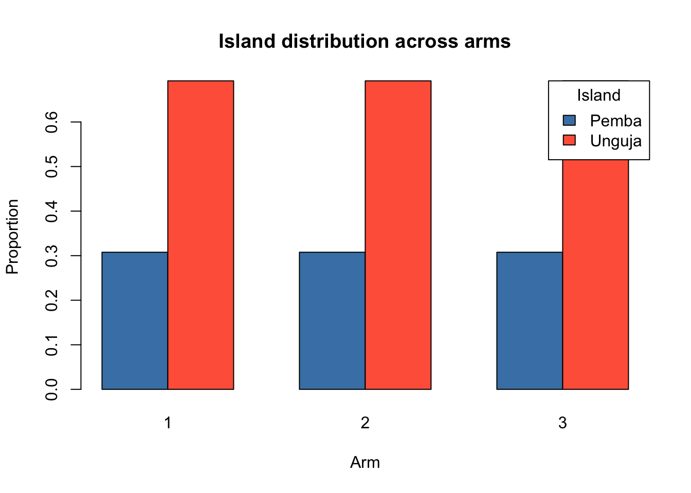

# **DAWA cluster randomized trial (CRT)**

Interventions on the level of health care workers at health facilities (dispensaries) in Zanzibar to reduce antibiotic prescriptions. Multi-arm with 2 interventions:

-   **Control**: Standard of care

-   **Intervention 1**: eHealth tool (CDSS & nudging)

-   **Intervention 2**: eHealth tool (CDSS & nudging) + AMR stewardship clubs

## **Parameters and design considerations**

-   Eligible participants: Patients attending the dispensary with acute infectious illness

-   Power it for subgroup of kids under 5 years (special subgroup of interest), ca. 33% of all attending patients with acute infectious illness

-   Cluster size of eligible overall participants: 80-500 per cluster per month

-   Cluster size of eligible kids under 5 years (special subgroup of interest): 26-165 per cluster per month

-   Max. 39 clusters, i.e. max. 13 clusters per arm, due to feasibility/budget

-   Binary outcome: Proportion of patients prescribed an antibiotic at first presentation

-   Baseline prescription rate (control clusters): 75%, based on existing data

-   Expected delta Control to Intervention 1: 25 percentage points, based on prior evidence

-   Expected delta Control to Intervention 2: 30 percentage points

-   Intervention 1 vs Intervention 2 is not of primary interest

-   Min. desired power 80%

-   ICC for AB prescription: 0.20, based on prior evidence in same setting (but mainland TZ)

-   We expect the intervention effect to manifest 3-4 months after baseline

-   Important feasibility aspect: The primary outcome is collected through routine data, while the key secondary outcomes are collected via phone calls

-   CV (coefficient of variation), ratio of standard deviation of cluster sizes to mean of cluster sizes

-   Since we have flexibility in individual sample size per cluster and need to restrict it anyway to keep the data collection for the key secondary outcomes feasible, we decided to take a random sample from each cluster, same n, which will reduce the CV. Moreover, we will stratify the randomization and adjust the outcome model for actual cluster size (attendance rate)

-   An individual sample size per cluster (i.e. mean cluster size) of n=150 will be feasible to recruit during 2 months (month 4 and 5 after baseline, when effect of intervention kicks in) from each cluster, using a random sampling strategy. N=150/cluster means we will get n=40/cluster kids under 5, for which we power the sample size. And we can safely assume a minimal CV of 0.1

-   Recruitment bias? -\> see protocol how to mitigate

-   Multiplicity? -\> see separate discussion. Decision: No adjustment for multiplicity

**Packages**


::: {.cell}

```{.r .cell-code}
req_pkgs <- c("pwr",
              "dplyr",
              "purrr",
              "ggplot2",
              "lme4",
              "geepack", # for GEE (if needed)
              "MASS", # for GLMM PQL
              "marginaleffects", # for marginal standardization
              
              "future",
              "future.apply",
              "nlme",
              
              "tibble",
              "knitr",
              "kableExtra",
              "splines"
)
install_if_missing <- function(pkgs){
  for(p in pkgs){
    if(!requireNamespace(p, quietly=TRUE)){
      install.packages(p, repos="https://cloud.r-project.org")
    }
    library(p, character.only=TRUE)
  }
}
install_if_missing(req_pkgs)

# set global RNG seed for reproducibility
set.seed(20250809)
```
:::


## **Corresponding individual randomized trial**

Sample size for the individual randomized trial on the same question


::: {.cell}

```{.r .cell-code}
# Parameters
p_C <- 0.75 # Baseline prescription rate (control group)
p_I1 <- 0.50 # int 1: 25pp reduction
p_I2 <- 0.45 # int 2: 30pp reduction
power <- 0.80 # desired power
alpha <- 0.05 # do not apply any (bonferroni) correction for multiplicity (see separate discussion)

# Effect sizes, standardized as Cohen's h
h_I1_C <- ES.h(p1 = p_I1, p2 = p_C)
h_I2_C <- ES.h(p1 = p_I2, p2 = p_C)

cat("Cohen's h for I1 vs Control:", round(h_I1_C, 3), "\n")
```

::: {.cell-output .cell-output-stdout}

```
Cohen's h for I1 vs Control: -0.524 
```


:::

```{.r .cell-code}
cat("Cohen's h for I2 vs Control:", round(h_I2_C, 3), "\n")
```

::: {.cell-output .cell-output-stdout}

```
Cohen's h for I2 vs Control: -0.624 
```


:::

```{.r .cell-code}
# => reduction of mind. 25% is a Cohen's h of over 0.5 -> medium to large effect according to Cohen

# Sample size first pair-wise comparison (I1 vs C)
ss_I1_C <- pwr.2p.test(h = h_I1_C, sig.level = alpha, power = power)
cat("Sample size per arm (I1 vs C):", ceiling(ss_I1_C$n), "\n")
```

::: {.cell-output .cell-output-stdout}

```
Sample size per arm (I1 vs C): 58 
```


:::

```{.r .cell-code}
# Sample size second pair-wise comparison (I2 vs C)
ss_I2_C <- pwr.2p.test(h = h_I2_C, sig.level = alpha, power = power)
cat("Sample size per arm (I2 vs C):", ceiling(ss_I2_C$n), "\n")
```

::: {.cell-output .cell-output-stdout}

```
Sample size per arm (I2 vs C): 41 
```


:::

```{.r .cell-code}
# Use max of the two
n_per_arm <- max(ceiling(ss_I1_C$n), ceiling(ss_I2_C$n))
n_total <- n_per_arm * 3

cat("Sample size per arm:", n_per_arm, "\n")
```

::: {.cell-output .cell-output-stdout}

```
Sample size per arm: 58 
```


:::

```{.r .cell-code}
cat("Total sample size (3-arm trial):", n_total)
```

::: {.cell-output .cell-output-stdout}

```
Total sample size (3-arm trial): 174
```


:::
:::


A reduction of at least 25% percentage points (the smaller delta of the two) represents a Cohen's h of \>0.5 =\> medium to large effect

# **(1) Sample size calculation CRT: formula-based**

Add the design effect (DEFF) to the individual RCT sample size. The usual standard DEFF formula:

DEFF = 1+(m−1)ICC , whereby m = cluster size

However, let's not forget the cluster size variation. The usual conservative adjustment of the DEFF with cluster size variation is (e.g. see here: [https://pmc.ncbi.nlm.nih.gov/articles/PMC7394950/#sup1](#0)):

DEFF_cv = 1+((m(1+CV\^2)−1))ICC , whereby CV is the coefficient of variation (ratio of standard deviation of cluster sizes to mean of cluster sizes)


::: {.cell}

```{.r .cell-code}
# Parameters
p_C <- 0.75 
p_I1 <- 0.50 
p_I2 <- 0.45 
power <- 0.80 
ICC <- 0.20
alpha <- 0.05 # do not apply any (bonferroni) correction for multiplicity (see separate discussion). Bonferroni would be alpha_familywise / number of comparisons (=2)

m <- 40
CV <- 0.1 # minimal CV

deff <- 1+(m-1)*ICC # standard DEFF
deff_cv <- 1+((m*(1+CV^2))-1)*ICC # DEFF with cluster size variation

# Effect sizes
h_I1_C <- ES.h(p1 = p_I1, p2 = p_C)
h_I2_C <- ES.h(p1 = p_I2, p2 = p_C)

# Individual RCT sample sizes for both contrasts
ss1 <- pwr.2p.test(h = h_I1_C, power = 0.80, sig.level = alpha)$n
ss2 <- pwr.2p.test(h = h_I2_C, power = 0.80, sig.level = alpha)$n

# CRT sample sizes for both contrasts
ss1_crt <- ceiling(ss1 * deff_cv)
ss2_crt <- ceiling(ss2 * deff_cv)

# Contrast 1 (smaller Delta/Cohens'd => determines overall cluster number)
n_clusters1 <- ceiling(ss1_crt / m)
cat("Cluster sample size int arm 1:", n_clusters1, "\n")
```

::: {.cell-output .cell-output-stdout}

```
Cluster sample size int arm 1: 13 
```


:::

```{.r .cell-code}
cat("Individual sample size int arm 1:", ss1_crt, "\n")
```

::: {.cell-output .cell-output-stdout}

```
Individual sample size int arm 1: 509 
```


:::

```{.r .cell-code}
# Contrast 2
n_clusters2 <- ceiling(ss2_crt / m)
cat("Cluster sample size int arm 2:", n_clusters2, "\n")
```

::: {.cell-output .cell-output-stdout}

```
Cluster sample size int arm 2: 9 
```


:::

```{.r .cell-code}
cat("Individual sample size int arm 2:", ss2_crt, "\n")
```

::: {.cell-output .cell-output-stdout}

```
Individual sample size int arm 2: 359 
```


:::

```{.r .cell-code}
# Total
tot_clusters <- n_clusters1 * 3
tot_ind <- ss1_crt * 3
cat("Total cluster sample size:", tot_clusters, "\n")
```

::: {.cell-output .cell-output-stdout}

```
Total cluster sample size: 39 
```


:::

```{.r .cell-code}
cat("Total individual sample size:", tot_ind, "\n")
```

::: {.cell-output .cell-output-stdout}

```
Total individual sample size: 1527 
```


:::
:::


## **(1.1) Varying assumptions - Standard sample size calculation**

### **(1.1.1) Varying baseline control rate**

All parameters fixed, except baseline control rate versus number of clusters & individuals needed


::: {.cell}

```{.r .cell-code}
# Define fixed parameters
power <- 0.80
alpha <- 0.05
ICC <- 0.20
CV <- 0.1
m <- 40

# Baseline control rates
p_C_values <- seq(0.60, 0.85, by = 0.05)

results_df <- data.frame(
  p_C = numeric(),
  n_clusters_per_arm = numeric(),
  n_individuals_per_arm = numeric()
)

cohen_h <- function(p1, p2) {
  2 * (asin(sqrt(p1)) - asin(sqrt(p2)))
}

for (p_C in p_C_values) {
  p_I1 <- p_C - 0.25
  p_I2 <- p_C - 0.30
  
  # Skip if intervention rates are invalid (less than 0)
  if (p_I1 < 0 | p_I2 < 0) {
    next
  }

  deff_cv <- 1 + ((m * (1 + CV^2)) - 1) * ICC

  h_I1_C <- cohen_h(p_I1, p_C)
  h_I2_C <- cohen_h(p_I2, p_C)

  ss1 <- pwr.2p.test(h = h_I1_C, power = power, sig.level = alpha)$n
  ss2 <- pwr.2p.test(h = h_I2_C, power = power, sig.level = alpha)$n
  
  # Use max of the two
  n_per_arm_rct <- max(ss1, ss2)
  
  # Individual sample size
  n_per_arm_crt <- ceiling(n_per_arm_rct * deff_cv)
  
  # Cluster sample size
  n_clusters_per_arm <- ceiling(n_per_arm_crt / m)
  
  # Append results
  results_df <- rbind(results_df, data.frame(
    p_C = p_C,
    n_clusters_per_arm = n_clusters_per_arm,
    n_individuals_per_arm = n_per_arm_crt
  ))
}
```
:::


::: {.cell}

```{.r .cell-code}
ggplot(results_df, aes(x = p_C, y = n_clusters_per_arm * 3)) +
  geom_line(color = "darkgreen", size = 1) +
  geom_point(color = "darkgreen", size = 2) +
  labs(
    title = "Total clusters needed vs. Baseline control rate",
    x = "Baseline control rate",
    y = "Total clusters needed (for 3 arms)"
  ) +
  theme_minimal() +
  scale_x_continuous(labels = scales::percent_format(accuracy = 1),
                     breaks = seq(0.50, 0.85, by = 0.02)) +
  scale_y_continuous(breaks = seq(0, max(results_df$n_clusters_per_arm * 3), by = 1))
```

::: {.cell-output-display}
{width=672}
:::
:::


::: {.cell}

```{.r .cell-code}
ggplot(results_df, aes(x = p_C, y = n_individuals_per_arm * 3)) +
  geom_line(color = "lightgreen", size = 1) +
  geom_point(color = "lightgreen", size = 2) +
  labs(
    title = "Total individuals needed vs. Baseline control rate",
    x = "Baseline control rate",
    y = "Total individuals needed (for 3 arms)"
  ) +
  theme_minimal() +
  scale_x_continuous(labels = scales::percent_format(accuracy = 1),
                     breaks = seq(0.60, 0.85, by = 0.02)) +
  scale_y_continuous(breaks = seq(0, max(results_df$n_individuals_per_arm * 3), by = 50))
```

::: {.cell-output-display}
{width=672}
:::
:::


### **(1.1.2) Varying ICC**

All parameters fixed, except ICC versus number of clusters & individuals needed


::: {.cell}

```{.r .cell-code}
# Define parameters
power <- 0.80
alpha <- 0.05
p_C <- 0.75 
m <- 40
CV <- 0.1

# Range of ICC values to test
ICC_values <- seq(0.05, 0.25, by = 0.01)

results_df <- data.frame(
  ICC = numeric(),
  n_clusters_per_arm = numeric(),
  n_individuals_per_arm = numeric()
)

cohen_h <- function(p1, p2) {
  2 * (asin(sqrt(p1)) - asin(sqrt(p2)))
}

for (icc in ICC_values) {
  p_I1 <- p_C - 0.25
  p_I2 <- p_C - 0.30
  
  deff_cv <- 1 + ((m * (1 + CV^2)) - 1) * icc
  
  h_I1_C <- cohen_h(p_I1, p_C)
  h_I2_C <- cohen_h(p_I2, p_C)
  
  ss1 <- pwr.2p.test(h = h_I1_C, power = power, sig.level = alpha)$n
  ss2 <- pwr.2p.test(h = h_I2_C, power = power, sig.level = alpha)$n
  
  n_per_arm_rct <- max(ss1, ss2)
  
  n_per_arm_crt <- ceiling(n_per_arm_rct * deff_cv)
  
  n_clusters_per_arm <- ceiling(n_per_arm_crt / m)
  
  results_df <- rbind(results_df, data.frame(
    ICC = icc,
    n_clusters_per_arm = n_clusters_per_arm,
    n_individuals_per_arm = n_per_arm_crt
  ))
}
```
:::


::: {.cell}

```{.r .cell-code}
ggplot(results_df, aes(x = ICC, y = n_clusters_per_arm * 3)) +
  geom_line(color = "darkred", size = 1) +
  geom_point(color = "darkred", size = 2) +
  labs(
    title = "Total clusters needed vs. ICC",
    x = "ICC",
    y = "Total clusters needed (for 3 arms)"
  ) +
  theme_minimal() +
  scale_x_continuous(breaks = seq(0.05, 0.25, by = 0.01)) +
  scale_y_continuous(breaks = seq(0, max(results_df$n_clusters_per_arm * 3), by = 2))
```

::: {.cell-output-display}
{width=672}
:::
:::


::: {.cell}

```{.r .cell-code}
ggplot(results_df, aes(x = ICC, y = n_individuals_per_arm * 3)) +
  geom_line(color = "red", size = 1) +
  geom_point(color = "red", size = 2) +
  labs(
    title = "Total individuals needed vs. ICC",
    x = "ICC",
    y = "Total individuals needed (for 3 arms)"
  ) +
  theme_minimal() +
  scale_x_continuous(breaks = seq(0.05, 0.25, by = 0.02)) +
  scale_y_continuous(breaks = seq(0, max(results_df$n_individuals_per_arm * 3), by = 100))
```

::: {.cell-output-display}
{width=672}
:::
:::


# **(2) Sample size calculation CRT: Simulations**

## **(2.1) Parameters**

We follow the simulation setup according to J. Thompson & C. Leyrat, because we have a binary outcome and small-ish cluster sample size (26-30 clusters for the main pair-wise comparison): <https://bmcmedresmethodol.biomedcentral.com/articles/10.1186/s12874-022-01699-2>

Note: We simulate a two-arm trial setup (not three-arm), since power/sample size is based on the main pair-wise comparison (control vs int 1) =\> Max. 26 clusters!

**Data-generating model (per cluster):**

-   For arm i (0=control, 1=intervention) and cluster j: Y_ij ∼ Binomial(m_ij, p_ij), logit⁡(p_ij) = β0 + β1_i + u_j , where u_j is a cluster random effect with mean 0 and variance σ\^2_b

    -   ​Binomial(m_ij, p_ij): Conditional on p_ij, we assume each of the m_ij individuals in that cluster are independent Bernoulli trials with probability p_ij. So Y_ij is a binomial draw with that probability, for the cluster-level.

        -   A Bernoulli trial is a random event with two outcomes (success/failure), with the same, independent, probability of success every time.

        -   Independence assumption (within-cluster): Whether one person gets the prescription doesn’t change the probability for another person in the same cluster (once p_ij is fixed). The correlation between people’s outcomes in the same cluster comes entirely from them sharing the same p_ij.

        -   =\> Y_ij can be any integer from 0 to m_ij. E.g. if m_ij =42 and p_ij =0.50, then Y_ij is the total number of prescriptions in that cluster, drawn from a binomial distribution with 42 trials and 50% success probability.

    -   logit⁡(p_ij) = β0 + β1_i + u_j:

        -   Using the logit link maps probability p ∈ (0,1) to the whole real line, so we can model it as a linear predictor.

        -   β0 is the baseline log-odds (the logit of the control probability for a *typical* cluster, i.e. when u_j = 0), representing the the marginal cluster-specific probability.

        -   β1_i encodes the treatment effect and is a log-odds difference; exp⁡(β1) is the *conditional odds ratio* comparing treatment vs control for the *same cluster* (holding u_j fixed).

        -   u_j is the cluster random intercept (a cluster-level shift on the log-odds scale). It captures unobserved cluster-level factors (e.g. prescriber tendency) that move all individuals in the cluster up/down in log-odds. Typically, u_j has mean 0 and variance σ\^2_b and is independent across clusters (see above). The random intercept does not change the conditional treatment effect, it only shifts the baseline log-odds for that whole cluster. In other words, the *difference in log-odds* between arms for the same cluster is always constant, but the *actual probabilities* shift up/down with u_j. For clusters with positive u_j both arms have higher probabilities; for negative u_j both are lower.

**ICC on log-odds scale:**

-   ICC = *p = rho* = σ\^2_b / (σ\^2_b+(π\^2/3))

-   The ICC consists of individual-level variance (noise) and between-cluster variance (noise), in the sense of: between-cluster variance / total variance. The between-cluster variance approximates the cluster random effect variance (σ\^2_b)

-   In logistic models, the individual level variation is usually fixed at π\^2/3 (3.29)

-   So, focusing on the cluster random effect variance (σ\^2_b), we can derive it from the formula above as: σ_b = *sigma_b* = sqrt((ICC(π\^2/3))/(1−ICC))

-   (If there’s additional within-site variation over time, i.e. baseline period or SW-CRT, we include σ\^2_b_p, typically as a fraction of σ\^2_b, e.g., half the site-level variance).

**Cluster effect distributions:**

-   While ICC is the proportion of the total variance (in the latent scale) that comes from between-cluster differences ("what fraction of the total variability is due to between-cluster differences"), the σ\^2_b is an absolute variance ("How big the cluster intercept spread is in log-odds units" or "how much variation there is in prescription tendency across clusters") and can have different shapes.

-   GLMM assumes normal distribution, but reality is often skewed - esp. with few clusters! Simulate three scenarios including a realistic/skewed/conservative scenario and see if GLMM breaks (as in paper above):

-   a\) Normal: u_j ∼ N(0, σ\^2_b)

    -   Symmetric, bell-shaped, skewness = 0, kurtosis = 0.

-   b\) Gamma (skewed): generate a_j ∼ Gamma(shape=2,scale=1), then set u_j ​= σ_b(​(a_j​−2)/sqrt(2))

    -   A shape parameter of 2 give a distribution with skew 1.4 and kurtosis 3, i.e., positive skew (some clusters much higher tendency than average)

-   c\) Uniform: u_j ∼ Uniform(−sqrt(3)σ_b, sqrt(3)σ_b)

    -   Skewness = 0 (perfectly symmetric), Kurtosis = −6/5 (lighter tails than normal), no extreme values, overall flat, all clusters are evenly spread; to test if GLMMs are sensitive to lack of tail weight, i.e., whether they rely on the normal distribution’s tails to stabilize estimates.

**Cluster sizes** m_ij​:

-   Allow for varying cluster size, i.e. varying coefficient of variation (CV) of cluster sizes, using same approach as they did: They sampled cluster sizes so that m_ij = 2 + δ_ij,​ drawn from a Negative Binomial:

    -   δ_ij ​∼ NegBin(size = (m-2)\^2/(s\^2-(m-2)), p = m-2/s\^2)

    -   where s is the SD of cluster sizes (CV = s/m).

    -   This yields a minimum cluster size of 3. (note: they wrote no.offails and prob.offail; but the above should represent the same).

    -   δ is in a way the random component added to 2 to get the cluster size (of min 3).

## **(2.2) Create main functions and simulate one dataset**


::: {.cell}

```{.r .cell-code}
# 1) compute sigma_b from ICC (on latent logit scale):
icc_to_sigma <- function(rho){
  if(rho<=0) return(0)
  sigma_b <- sqrt( (rho * (pi^2/3)) / (1 - rho) )
  return(sigma_b)
}

# 2) compute beta0 for given control prevalence p0
p_to_beta0 <- function(p0){
  qlogis(p0)
}

# 3) given p0 and p1, compute OR on the cluster-specific log-odds scale
p0_p1_to_OR <- function(p0, p1){
  odds0 <- p0 / (1 - p0)
  odds1 <- p1 / (1 - p1)
  odds1 / odds0
}

# 4) generate random cluster-level u_j for the three distributions
generate_u <- function(n_clusters, sigma_b, dist = c("normal","gamma","uniform")){
  dist <- match.arg(dist)
  if(sigma_b == 0) return(rep(0, n_clusters))
  if(dist == "normal"){
    return(rnorm(n_clusters, mean=0, sd = sigma_b))
  } else if(dist == "gamma"){
    # they used Gamma(shape=2, scale=1) then standardized to mean 0 and sd sigma_b
    a <- rgamma(n_clusters, shape=2, scale=1)
    # a has mean 2, var 2. Standardize: (a - 2)/sqrt(2) then scale to sigma_b
    return(sigma_b * (a - 2)/sqrt(2))
  } else if(dist == "uniform"){
    cut <- sqrt(3) * sigma_b
    return(runif(n_clusters, min = -cut, max = cut))
  }
}

# 5) generate cluster sizes with target mean m and CV. Implementation follows their negative-binomial based approach and enforces minimum cluster size of 3.
generate_cluster_sizes <- function(n_clusters, m, CV){
  if(CV == 0){
    return(rep(m, n_clusters))
  }
  s <- CV * m
  # We want delta = m_j - 2 to follow NegBin with mean (m-2) and variance s^2
  mu_delta <- m - 2
  var_delta <- s^2
  if(var_delta <= mu_delta){
    # Negative Binomial requires variance > mean. So, this is an impossible NB parameterization
    # If so, fall back to a discrete uniform around m
    low <- max(3, floor(m - s*1.5))
    high <- ceiling(m + s*1.5)
    out <- pmax(3, round(runif(n_clusters, low, high)))
    return(out)
  }
  size_nb <- (mu_delta^2) / (var_delta - mu_delta) # see formula above
  prob_nb <- mu_delta / var_delta # see formula above
  # rnbinom in R uses size, prob; mean = size*(1-prob)/prob, but with this param it matches
  delta <- rnbinom(n_clusters, size = size_nb, prob = prob_nb)
  m_j <- 2 + delta
  m_j[m_j < 3] <- 3 # enforce min 3 (generating 2+delta ensures >=2, we bump to 3)
  return(m_j)
}

# Parameters for single simulated dataset
n_clusters <- 26
m_mean <- 40
CV <- 0.1
p0 <- 0.75
p1 <- 0.50
OR <- p0_p1_to_OR(p0, p1) # compute OR from p0 and p1
rho <- 0.20 # ICC
re_dist <- "uniform"

# Simulate
set.seed(20250809)
sigma_b <- icc_to_sigma(rho)
u_j <- generate_u(n_clusters, sigma_b, dist = re_dist)
sizes <- generate_cluster_sizes(n_clusters, m_mean, CV)
arm_assign <- sample(rep(0:1, length.out = n_clusters))
beta0 <- p_to_beta0(p0)
beta1 <- log(OR)
y <- integer(n_clusters)

for(j in seq_len(n_clusters)){ # iterate over each cluster
  # create the linear predictor (NOTE: beta1 turns 0 if arm0, and 1 * beta1 if arm1)
  linpred <- beta0 + beta1 * arm_assign[j] + u_j[j] 
  # apply the inverse logit (logistic function) to convert log-odds to probability
  p_j <- plogis(linpred) 
  # Simulate the number of successes in cluster j
  y[j] <- rbinom(1, size = sizes[j], prob = p_j) 
}

df_sim <- data.frame(cluster = seq_len(n_clusters),
                      arm = arm_assign,
                      size = sizes,
                      y = y)
df_sim
```

::: {.cell-output .cell-output-stdout}

```
   cluster arm size  y
1        1   1   39 15
2        2   0   35 32
3        3   1   37 19
4        4   0   41 33
5        5   0   39 29
6        6   0   41 37
7        7   0   38 29
8        8   0   45 31
9        9   0   43 28
10      10   1   43 27
11      11   1   44 33
12      12   1   45 20
13      13   0   39 25
14      14   1   39 32
15      15   1   41 29
16      16   1   41 35
17      17   0   40 31
18      18   1   36 33
19      19   0   36 25
20      20   1   38 12
21      21   0   37 30
22      22   1   41 21
23      23   1   41  7
24      24   0   43 35
25      25   1   44 39
26      26   0   39 20
```


:::

```{.r .cell-code}
mean_sizes <- df_sim %>%
  group_by(arm) %>%
  summarise(mean_size = mean(size))

ggplot(df_sim, aes(x = factor(cluster), y = size, fill = factor(arm))) +
  geom_bar(stat = "identity", color = "black") +
  geom_hline(data = mean_sizes, aes(yintercept = mean_size, color = factor(arm)),
             linetype = "dashed", size = 1, show.legend = FALSE) +
  geom_text(data = mean_sizes, aes(x = Inf, y = mean_size, label = paste0("Mean = ", round(mean_size, 1))),
            hjust = 1.1, vjust = -0.5, color = c("skyblue4", "tomato3"), size = 4) +
  scale_fill_manual(values = c("skyblue", "tomato"), labels = c("Control (arm=0)", "Intervention (arm=1)")) +
  scale_color_manual(values = c("skyblue4", "tomato3")) +
  labs(x = "Cluster", y = "Cluster Size", fill = "Treatment Group") +
  theme_minimal() +
  ggtitle("Cluster size per cluster") +
  theme(axis.text.x = element_text(angle = 45, hjust = 1))
```

::: {.cell-output-display}
{width=672}
:::
:::


size = number of individuals in a cluster

y = number of individual-level successes (binary=1) observed in the cluster, i.e., represents the number of individuals in that cluster who received an AB prescription.

## **(2.3) Simulate power, using cluster-level analysis approach**

NOTES:

-   Use cluster-level analysis (unweighted t-test on log-odds, with 0.5 continuity correction, as per guidance according to Thompson & Leyrat & al -\> "clan" command)

-   Keep gamma distribution, simulate 500-1000 trials

### **(2.3.1) Create function**


::: {.cell}

```{.r .cell-code}
simulate_power <- function(n_clusters = 26, 
                           m_mean = 40, 
                           CV = 0.1,
                           p0 = 0.75, 
                           p1 = 0.50, 
                           rho = 0.20,
                           re_dist = "gamma", 
                           n_sim = 1000,
                           alpha = 0.05, 
                           seed = 20250809) {
  set.seed(seed)
  
  # Compute derived parameters
  sigma_b <- icc_to_sigma(rho)
  beta0 <- p_to_beta0(p0)
  OR <- p0_p1_to_OR(p0, p1)
  beta1 <- log(OR)
  
  p_values <- numeric(n_sim)
  
  for (i in seq_len(n_sim)) {
    u_j <- generate_u(n_clusters, sigma_b, dist = re_dist)
    sizes <- generate_cluster_sizes(n_clusters, m_mean, CV)
    arm_assign <- sample(rep(0:1, length.out = n_clusters))
    
    y <- integer(n_clusters)
    for (j in seq_len(n_clusters)) {
      linpred <- beta0 + beta1 * arm_assign[j] + u_j[j]
      p_j <- plogis(linpred)
      y[j] <- rbinom(1, size = sizes[j], prob = p_j)
    }
    
    # Cluster-level log-odds with 0.5 continuity correction
    log_odds <- log((y + 0.5) / (sizes - y + 0.5))
    
    # Unweighted t-test
    group0 <- log_odds[arm_assign == 0]
    group1 <- log_odds[arm_assign == 1]
    
    test <- try(t.test(group1, group0, var.equal = TRUE), silent = TRUE)
    p_values[i] <- if (inherits(test, "try-error")) NA else test$p.value
  }
  
  # Estimate power
  mean(p_values < alpha, na.rm = TRUE)
}
```
:::


### **(2.3.2)** Calculate baseline scenario


::: {.cell}

```{.r .cell-code}
power_estimate <- simulate_power(n_clusters = 26,
                                 m_mean = 40,
                                 CV = 0.1,
                                 p0 = 0.75,
                                 p1 = 0.50,
                                 rho = 0.20,
                                 re_dist = "gamma",
                                 n_sim = 1000)

cat("Estimated power:", round(power_estimate, 3), "\n")
```

::: {.cell-output .cell-output-stdout}

```
Estimated power: 0.79 
```


:::
:::


### **(2.3.3) Vary effect sizes**


::: {.cell}

```{.r .cell-code}
p0_vals <- seq(0.50, 0.85, by = 0.05)
p1_vals <- seq(0.30, 0.70, by = 0.05)

grid <- expand.grid(p0 = p0_vals, p1 = p1_vals)

results <- grid %>%
  rowwise() %>%
  mutate(power = simulate_power(n_clusters = 26,
                                m_mean = 40,
                                CV = 0.1,
                                p0 = p0,
                                p1 = p1,
                                rho = 0.2,
                                re_dist = "gamma",
                                n_sim = 1000)) %>%
  ungroup()

# Plot
ggplot(results, aes(x = p1, y = power, color = factor(p0))) +
  
  # Shaded region above 80% power
  geom_rect(aes(xmin = -Inf, xmax = Inf, ymin = 0.8, ymax = Inf),
            fill = "lightgrey", alpha = 0.3, inherit.aes = FALSE) +
  
  # Power curves
  geom_line(size = 1.2) +
  geom_point() +
  
  # Labels and scales
  labs(title = "Power Curves by p0 and p1 (two-arm/pair-wise comparison)",
       x = "Intervention Group Probability (p1)",
       y = "Estimated Power",
       color = "Control Group (p0)") +
  scale_y_continuous(breaks = seq(0, 1, by = 0.1),
                     limits = c(0, 1),
                     labels = scales::percent_format(accuracy = 1)) +
  theme_minimal(base_size = 14)
```

::: {.cell-output-display}
{width=672}
:::
:::


### **(2.3.4) Vary ICC**


::: {.cell}

```{.r .cell-code}
# Vector of ICC values to test
icc_values <- seq(0.05, 0.25, by = 0.02)

# Run power simulations for each ICC
power_results <- sapply(icc_values, function(rho) {
  simulate_power(n_clusters = 26,
                 m_mean = 40,
                 CV = 0.1,
                 p0 = 0.75,
                 p1 = 0.50,
                 rho = rho,
                 re_dist = "gamma",
                 n_sim = 1000,
                 alpha = 0.05,
                 seed = 20250809)
})

# Create data frame for plotting
df_power_icc <- data.frame(ICC = icc_values, Power = power_results)

# Plot
ggplot(df_power_icc, aes(x = ICC, y = Power)) +
  geom_line(color = "darkred", size = 1.2) +
  geom_point(color = "firebrick") +
  labs(title = "Power Curve by ICC (two-arm/pair-wise comparison)",
       x = "Intraclass Correlation (ICC)",
       y = "Estimated Power") +
  scale_y_continuous(breaks = seq(0.70, 1, by = 0.1),
                     limits = c(0.70, 1),
                     labels = scales::percent_format(accuracy = 1)) +
  theme_minimal()
```

::: {.cell-output-display}
{width=672}
:::
:::


### **(2.3.5) Vary number of clusters**


::: {.cell}

```{.r .cell-code}
# Vector of cluster counts to test
n_clusters_vec <- seq(22, 36, by = 1)

# Run power simulations for each cluster count
power_results <- sapply(n_clusters_vec, function(nc) {
  simulate_power(n_clusters = nc,
                 m_mean = 40,
                 CV = 0.1,
                 p0 = 0.75,
                 p1 = 0.50,
                 rho = 0.20,
                 re_dist = "gamma",
                 n_sim = 5000,
                 alpha = 0.05,
                 seed = 20250809)
})

# Create data frame for plotting
df_power_css <- data.frame(Cluster_ss = n_clusters_vec, Power = power_results)

# Plot
ggplot(df_power_css, aes(x = Cluster_ss, y = Power)) +
  geom_line(color = "darkgreen", size = 1.2) +
  geom_point(color = "forestgreen") +
  labs(title = "Power vs Number of total clusters (two-arm/pair-wise comparison)",
       x = "Total number of clusters (two-arm trial)",
       y = "Estimated power") +
  scale_y_continuous(breaks = seq(0.70, 1, by = 0.1),
                     limits = c(0.70, 1),
                     labels = scales::percent_format(accuracy = 1)) +
  scale_x_continuous(breaks = seq(22, 36, by = 1)) +
  theme_minimal()
```

::: {.cell-output-display}
{width=672}
:::
:::


### **(2.3.6) Vary number of individuals per cluster (mean cluster size)**


::: {.cell}

```{.r .cell-code}
m_mean_vec <- seq(10, 180, by = 10)

# Run power simulations for each cluster count
power_results <- sapply(m_mean_vec, function(n) {
  simulate_power(n_clusters = 26,
                 m_mean = n,
                 CV = 0.1,
                 p0 = 0.75,
                 p1 = 0.50,
                 rho = 0.20,
                 re_dist = "gamma",
                 n_sim = 1000,
                 alpha = 0.05,
                 seed = 20250809)
})

# Create data frame for plotting
df_power_iss <- data.frame(Individual_ss = m_mean_vec, Power = power_results)

# Plot
ggplot(df_power_iss, aes(x = Individual_ss, y = Power)) +
  geom_line(color = "darkblue", size = 1.2) +
  geom_point(color = "skyblue") +
  labs(title = "Power vs Number of total individuals (two-arm/pair-wise comparison)",
       x = "Total number of individuals (two-arm trial)",
       y = "Estimated power") +
  scale_y_continuous(breaks = seq(0.70, 1, by = 0.1),
                     limits = c(0.70, 1),
                     labels = scales::percent_format(accuracy = 1)) +
  scale_x_continuous(breaks = seq(10, 180, by = 10)) +
  theme_minimal()
```

::: {.cell-output-display}
{width=672}
:::
:::


## **(2.4) Simulate power, using GLMM analysis approach**

**NOTES:**

-   As per guidance according to Thompson & Leyrat & al: GLMM with restricted pseudo-likelihood and reduced degree of freedom (minus all covariates in the model)

-   Keep gamma distribution throughout

### **(2.4.1) Create function**


::: {.cell}

```{.r .cell-code}
simulate_power_glmmPQL <- function(n_clusters = 26, 
                                   m_mean = 40, 
                                   CV = 0.1,
                                   p0 = 0.75, 
                                   p1 = 0.50, 
                                   rho = 0.20,
                                   re_dist = "gamma", 
                                   n_sim = 1000,
                                   alpha = 0.05, 
                                   seed = 20250809) {
  set.seed(seed)
  
  sigma_b <- icc_to_sigma(rho)
  beta0 <- p_to_beta0(p0)
  OR <- p0_p1_to_OR(p0, p1)
  beta1 <- log(OR)
  
  p_values <- numeric(n_sim)
  
  for (i in seq_len(n_sim)) {
    u_j <- generate_u(n_clusters, sigma_b, dist = re_dist)
    sizes <- generate_cluster_sizes(n_clusters, m_mean, CV)
    arm_assign <- sample(rep(0:1, length.out = n_clusters))
    
    y <- integer(n_clusters)
    arm <- integer(n_clusters)
    cluster <- integer(n_clusters)
    
    for (j in seq_len(n_clusters)) {
      linpred <- beta0 + beta1 * arm_assign[j] + u_j[j]
      p_j <- plogis(linpred)
      y[j] <- rbinom(1, size = sizes[j], prob = p_j)
      arm[j] <- arm_assign[j]
      cluster[j] <- j
    }
    
    dd_sim <- data.frame(
      y = y,
      size = sizes,
      arm = factor(arm),
      cluster = factor(cluster)
    )
    
    # Fit GLMM using glmmPQL
    model_pql <- try(glmmPQL(
      fixed = cbind(y, size - y) ~ arm,
      random = ~1 | cluster,
      family = binomial(link = "logit"),
      data = dd_sim,
      verbose = FALSE
    ), silent = TRUE)
    
    if (!inherits(model_pql, "try-error")) {
      df_manual <- n_clusters - length(fixef(model_pql))
      coef <- model_pql$coefficients$fixed["arm1"]
      se <- summary(model_pql)$tTable["arm1", "Std.Error"]
      t_stat <- coef / se
      p_values[i] <- 2 * pt(-abs(t_stat), df = df_manual)
    } else {
      p_values[i] <- NA
    }
  }
  
  mean(p_values < alpha, na.rm = TRUE)
}
```
:::


### **(2.4.2)** Calculate baseline scenario


::: {.cell}

```{.r .cell-code}
power_estimate <- simulate_power_glmmPQL(n_clusters = 26,
                                         m_mean = 40,
                                         CV = 0.1,
                                         p0 = 0.75,
                                         p1 = 0.50,
                                         rho = 0.20,
                                         re_dist = "gamma",
                                         n_sim = 1000)

cat("Estimated power (GLMM):", round(power_estimate, 3), "\n")
```

::: {.cell-output .cell-output-stdout}

```
Estimated power (GLMM): 0.829 
```


:::
:::


### **(2.4.3) Vary effect sizes**


::: {.cell}

```{.r .cell-code}
p0_vals <- seq(0.50, 0.85, by = 0.05)
p1_vals <- seq(0.30, 0.70, by = 0.05)

grid_glmm <- expand.grid(p0 = p0_vals, p1 = p1_vals)

# Use map2 to apply the function to each p0/p1 pair, more efficient
grid_glmm$power <- map2_dbl(grid_glmm$p0, grid_glmm$p1, ~ simulate_power_glmmPQL(
  n_clusters = 26,
  m_mean = 40,
  CV = 0.1,
  p0 = .x,
  p1 = .y,
  rho = 0.2,
  re_dist = "gamma",
  n_sim = 300 # reduced for speed
))

ggplot(grid_glmm, aes(x = p1, y = power, color = factor(p0))) +
  geom_rect(aes(xmin = -Inf, xmax = Inf, ymin = 0.8, ymax = Inf),
            fill = "lightgrey", alpha = 0.3, inherit.aes = FALSE) +
  geom_line(size = 1.2) +
  geom_point() +
  labs(title = "Power Curves by p0 and p1 (two-arm/pair-wise comparison, GLMM)",
       x = "Intervention Group Probability (p1)",
       y = "Estimated Power",
       color = "Control Group (p0)") +
  scale_y_continuous(breaks = seq(0, 1, by = 0.1),
                     limits = c(0, 1),
                     labels = scales::percent_format(accuracy = 1)) +
  theme_minimal(base_size = 14)
```

::: {.cell-output-display}
{width=672}
:::
:::


### **(2.4.4) Vary ICC**


::: {.cell}

```{.r .cell-code}
icc_values <- seq(0.05, 0.25, by = 0.02)

power_results_glmm <- sapply(icc_values, function(rho) {
  simulate_power_glmmPQL(n_clusters = 26,
                 m_mean = 40,
                 CV = 0.1,
                 p0 = 0.75,
                 p1 = 0.50,
                 rho = rho,
                 re_dist = "gamma",
                 n_sim = 300, # reduced for speed
                 alpha = 0.05,
                 seed = 20250809)
})

df_power_icc_glmm <- data.frame(ICC = icc_values, Power = power_results_glmm)

ggplot(df_power_icc_glmm, aes(x = ICC, y = Power)) +
  geom_line(color = "darkred", size = 1.2) +
  geom_point(color = "firebrick") +
  labs(title = "Power Curve by ICC (two-arm/pair-wise comparison, GLMM)",
       x = "Intraclass Correlation (ICC)",
       y = "Estimated Power") +
  scale_y_continuous(breaks = seq(0.70, 1, by = 0.1),
                     limits = c(0.70, 1),
                     labels = scales::percent_format(accuracy = 1)) +
  theme_minimal()
```

::: {.cell-output-display}
{width=672}
:::
:::


### **(2.4.5) Vary number of clusters**


::: {.cell}

```{.r .cell-code}
n_clusters_vec <- seq(22, 36, by = 1)

power_results_glmm <- sapply(n_clusters_vec, function(nc) {
  simulate_power_glmmPQL(n_clusters = nc,
                 m_mean = 40,
                 CV = 0.1,
                 p0 = 0.75,
                 p1 = 0.50,
                 rho = 0.20,
                 re_dist = "gamma",
                 n_sim = 300, # reduced for speed
                 alpha = 0.05,
                 seed = 20250809)
})

df_power_css_glmm <- data.frame(Cluster_ss = n_clusters_vec, Power = power_results_glmm)

ggplot(df_power_css_glmm, aes(x = Cluster_ss, y = Power)) +
  geom_line(color = "darkgreen", size = 1.2) +
  geom_point(color = "forestgreen") +
  labs(title = "Power vs Number of total clusters (two-arm/pair-wise comparison, GLMM)",
       x = "Total number of clusters (two-arm trial)",
       y = "Estimated power") +
  scale_y_continuous(breaks = seq(0.70, 1, by = 0.1),
                     limits = c(0.70, 1),
                     labels = scales::percent_format(accuracy = 1)) +
  scale_x_continuous(breaks = seq(22, 36, by = 1)) +
  theme_minimal()
```

::: {.cell-output-display}
{width=672}
:::
:::


# **(3) Simulate the full dataset and implement the main analysis strategy**

**The main analysis strategy as per SAP:**

-   Due to the relatively low number of clusters in each pair-wise comparison (n=\<30), we use a generalized linear mixed model (GLMM) with restricted pseudo-likelihood estimation and small-sample correction for degrees of freedom (clusters minus cluster-level parameters), as suggested by Thompson and colleagues(ref)

-   We will adjust the model for these *a priori* defined covariates (as fixed effects):

    -   Cluster-level covariates (cluster mean): attendance rate and baseline antibiotic prescription rate (as continuous covariates assuming linearity)

    -   Individual-level covariates: Self-reported sex (as binary covariate: male, female) and age (as continuous covariates assuming non-linear association modelled using restricted cubic splines with 3 knots at 10^th^, 50^th^ and 90^th^ percentiles of the observed age distribution

-   We will report the resulting treatment-effect (beta-1), which is the log-odds difference between intervention and control or – when exponentiated – the adjusted odds ratio, with its 95% confidence interval. This represents a relative cluster-specific effect, conditional on all included covariates. In addition, we will use marginal standardization and report the resulting population-average marginal relative risk and risk difference with their 95% confidence intervals

**Notes on simulating a realistic dataset:**

-   Reuse the helper functions from chapter 2.2, incl. conservative gamma distribution for u_j

-   Causal structure:

    -   Cluster latent effect (u_j) influences both, baseline AB prescription rate (through alpha, the correlation strength between baseline and u_j) and attendance rate (through att_corr_target) and directly affects the outcome via the cluster random effect

    -   Baseline AB prescription rate directly affects the outcome (via beta_baseline), representing residual correlation beyond the shared cluster effect alpha

    -   Attendance rate directly affects the outcome (via beta_att), representing residual correlation beyond the shared cluster effect att_corr_target

    -   =\> baseline_rate and attendance both directly push the outcome (via beta_baseline and beta_att) and share correlation with u_j (i.e., indirectly push the outcome)

    -   =\> all of the above in the sense of: "Larger clusters (=higher attendance rate) -\> higher AB prescription rate at endline" and "Clusters with higher AB prescription rate at baseline -\> higher prescription rate at endline"

    -   Treatment (arm 1) directly affects the outcome (through beta_1), but correlation above and noise below masking it

-   Add some baseline noise (e.g. tau = 0.45) ensuring that even clusters with the same u_j will show some variability in their observed baseline_rate

-   alpha (correlation baseline_rate with u_j): e.g. a value of 0.3 means 30% of the variation in the baseline logit is driven by u_j (i.e. drives true cluster tendency or the "cluster-to-cluster variation" at baseline, which also has an impact on the outcome), while the remaining comes from independent measurement noise.

-   Produce an individual-level dataset, not cluster-level only - as the real-life dataset will look like and in case we also want to add individual-level correlations

## **(3.1) Simulate one dataset and check some diagnostics**


::: {.cell}

```{.r .cell-code}
## We use the helper functions from chapter 2.2

# icc_to_sigma
# generate_u
# generate_cluster_sizes
# p_to_beta0
# p0_p1_to_OR

## General parameters
set.seed(20250809)
n_clusters <- 26
m_mean <- 40
CV <- 0.1
p0 <- 0.75
p1 <- 0.50
OR <- p0_p1_to_OR(p0, p1)
rho <- 0.20 # ICC (on latent logit scale)
re_dist <- "gamma" # distribution for u_j, keep it conservative

# Individual-level covariates
age_mean <- 35
age_sd <- 12
sex_prob <- 0.48

## Generate cluster structure
sizes <- generate_cluster_sizes(n_clusters, m_mean, CV)
sigma_b <- icc_to_sigma(rho)
u_j <- generate_u(n_clusters, sigma_b, dist = re_dist)
arm_assign <- sample(rep(0:1, length.out = n_clusters))

# First important thing to mimic: AB prescription rate at baseline
# alpha controls how much the baseline rate depends on the same latent cluster effect
# The bigger alpha, the more high-baseline clusters will also tend to have high endline outcomes indirectly, because u_j is reused in the outcome model => indirect correlation
# Baseline AB prescription rate is explained by u_j + random noise eps + global average level gamma0.
gamma0 <- qlogis(p0) # the average cluster-level log-odds of baseline antibiotic prescription
alpha <- 0.3 # how much baseline (logit) depends on u_j (i.e. the latent cluster effect); 0 would be no correlation (0-1)
tau <- 0.45 # the residual variation (SD) in baseline log-odds not explained by u_j, i.e. the random measurement noise
eps <- rnorm(n_clusters, 0, tau)
logit_b <- gamma0 + alpha * u_j + eps # putting it all together
baseline_rate <- plogis(logit_b) # map back to probability scale

# Second important thing to mimic: Attendance rate at baseline (see prelim data Nina)
# Easier, since it’s approximately normally distributed (per year is large enough)
# attendance = mean + (signal) + (noise)
mean_att_year <- 7786
sd_att_year   <- 3967
att_corr_target <- 0.2 # weak to moderate positive correlation between the latent cluster effect and attendance, so high-prescribers (positive u_j) will tend to be at higher attendance clinics.

sd_uj <- sd(u_j)
att_u_coef <- att_corr_target * sd_att_year / sd_uj # the signal. for each +1 SD in u_j, attendance increases by ~1,760 patients per year.
sd_att_noise <- sqrt(sd_att_year^2 * (1 - att_corr_target^2)) # rest is noise
attendance_year_raw <- mean_att_year + att_u_coef * u_j +
                       rnorm(n_clusters, 0, sd_att_noise)
attendance_year <- pmax(0, round(attendance_year_raw))
attendance_month <- attendance_year / 12

# Third, the island: uncorrelated binary covariate
island <- rbinom(n_clusters, 1, 0.5)

## Fixed effects on outcome, direct correlations on outcome
beta0 <- p_to_beta0(p0) # intercept
beta1 <- log(OR) # intervention effect
beta_baseline <- 0.5 # how strongly the baseline rate predicts the endline outcome, independent of u_j
beta_island <- 0.0 # no correlation
beta_att_per1000 <- 0.02 # how strongly attendance affects the outcome, independent of u_j (per 1000 pats/y)
beta_att <- beta_att_per1000 / 1000
beta0_adj <- beta0 - 1.0 # after including u_j, baseline_rate, attendance, etc., the overall mean outcome probability can drift because of the nonlinear logistic function. Stabilize.


## Simulate individual-level data
ind_list <- vector("list", length = n_clusters)
for(j in seq_len(n_clusters)){
  nj <- sizes[j]
  age_j <- rnorm(nj, mean = age_mean, sd = age_sd) # draw from normal
  sex_j <- rbinom(nj, 1, prob = sex_prob) # draw from bernoulli
  
  logit_baseline_j <- qlogis(baseline_rate[j]) # back to logit
  # the log-odds of antibiotic prescription for all individuals in cluster j (same cluster-level predictors for all)
  linpred_j <- beta0_adj +
               beta1 * arm_assign[j] +
               beta_baseline * logit_baseline_j +
               beta_att * attendance_year[j] +
               beta_island * island[j] +
               u_j[j] # latent cluster random effect
  
  p_ij <- plogis(linpred_j) # Predicted probability of receiving an antibiotic for each individual in cluster j. Since all individuals in a cluster share the same cluster-level covariates, p_ij is identical for everyone in the cluster (unless we later include individual-level predictors...)
  y_ij <- rbinom(nj, 1, p_ij) # the outcome; bernoulli with probability p_ij
  
  # save data for this one cluster
  ind_list[[j]] <- data.frame(
    cluster = j,
    arm = arm_assign[j],
    age = age_j,
    sex = sex_j,
    attendance_year = attendance_year[j],
    attendance_month = attendance_month[j],
    island = island[j],
    baseline_rate = baseline_rate[j],
    u_j = u_j[j],
    p = p_ij,
    y = y_ij
  )
}
df_ind <- do.call(rbind, ind_list)

## Cluster-level summary, aggregate at cluster-level
df_cluster <- aggregate(y ~ cluster + arm, data = df_ind, sum) # aggregate number of outcomes
df_cluster$size <- aggregate(y ~ cluster, data = df_ind, length)$y # count number of ind => cluster size
cluster_meta <- data.frame(
  cluster = seq_len(n_clusters),
  arm = arm_assign,
  attendance_year = attendance_year,
  attendance_month = attendance_month,
  island = island,
  baseline_rate = baseline_rate,
  u_j = u_j
)
df_sim <- merge(df_cluster, cluster_meta, by = c("cluster","arm"))
df_sim <- df_sim[order(df_sim$cluster),
                 c("cluster","arm","size","y","baseline_rate",
                   "attendance_year","attendance_month",
                   "island","u_j")]

## Diagnostics
cat("Attendance (year): mean =", mean(attendance_year),
    "SD =", sd(attendance_year),
    "CV =", round(sd(attendance_year)/mean(attendance_year),2), "\n")
```

::: {.cell-output .cell-output-stdout}

```
Attendance (year): mean = 7049 SD = 4585.651 CV = 0.65 
```


:::

```{.r .cell-code}
cat("Target corr (attendance,u_j) =", att_corr_target,
    "Observed corr =", round(cor(attendance_year, u_j),2), "\n")
```

::: {.cell-output .cell-output-stdout}

```
Target corr (attendance,u_j) = 0.2 Observed corr = 0.27 
```


:::

```{.r .cell-code}
cat("Mean baseline_rate =", round(mean(baseline_rate),3), "\n")
```

::: {.cell-output .cell-output-stdout}

```
Mean baseline_rate = 0.739 
```


:::

```{.r .cell-code}
cat("Beta_att (per 1000 patients/year) =", beta_att_per1000,
    "=> clinic with 1000 more patients/year has OR =", round(exp(beta_att_per1000),3), " of prescribing antibiotics\n\n")
```

::: {.cell-output .cell-output-stdout}

```
Beta_att (per 1000 patients/year) = 0.02 => clinic with 1000 more patients/year has OR = 1.02  of prescribing antibiotics
```


:::

```{.r .cell-code}
cat("First few cluster-level rows:\n")
```

::: {.cell-output .cell-output-stdout}

```
First few cluster-level rows:
```


:::

```{.r .cell-code}
print(head(df_sim, 10))
```

::: {.cell-output .cell-output-stdout}

```
   cluster arm size  y baseline_rate attendance_year attendance_month island
1        1   0   38 20     0.7218079             484         40.33333      1
12       2   1   45 13     0.6655458            3314        276.16667      1
20       3   0   45 24     0.4800860            5358        446.50000      1
21       4   1   45 34     0.9107505           17338       1444.83333      1
22       5   0   42 29     0.7854459            8159        679.91667      0
23       6   0   41 41     0.8635783            2278        189.83333      0
24       7   1   46 14     0.6704538           11584        965.33333      1
25       8   0   40 28     0.6571218           17009       1417.41667      1
26       9   0   43 19     0.7625871            1313        109.41667      1
2       10   1   40 26     0.8911799            6660        555.00000      0
           u_j
1  -0.48591058
12 -0.18692341
20 -0.06920874
21  1.41603543
22  0.30221964
23  0.93496870
24 -0.44639639
25 -0.25064723
26 -0.98577972
2  -0.08530853
```


:::

```{.r .cell-code}
cat("First few individual-level rows:\n")
```

::: {.cell-output .cell-output-stdout}

```
First few individual-level rows:
```


:::

```{.r .cell-code}
print(head(df_ind, 50))
```

::: {.cell-output .cell-output-stdout}

```
   cluster arm       age sex attendance_year attendance_month island
1        1   0 31.141817   0             484         40.33333      1
2        1   0 38.836085   0             484         40.33333      1
3        1   0 36.036553   0             484         40.33333      1
4        1   0 43.068029   0             484         40.33333      1
5        1   0 33.707015   0             484         40.33333      1
6        1   0 29.838524   1             484         40.33333      1
7        1   0 41.398540   1             484         40.33333      1
8        1   0 45.060521   0             484         40.33333      1
9        1   0 18.519409   1             484         40.33333      1
10       1   0 21.600997   1             484         40.33333      1
11       1   0 26.200323   0             484         40.33333      1
12       1   0 37.607236   0             484         40.33333      1
13       1   0 20.627753   0             484         40.33333      1
14       1   0 55.024518   0             484         40.33333      1
15       1   0 44.204938   1             484         40.33333      1
16       1   0 42.996016   0             484         40.33333      1
17       1   0 29.151747   1             484         40.33333      1
18       1   0 20.397419   1             484         40.33333      1
19       1   0 58.662140   0             484         40.33333      1
20       1   0 38.238681   0             484         40.33333      1
21       1   0 50.367882   0             484         40.33333      1
22       1   0 43.097409   1             484         40.33333      1
23       1   0 36.927717   0             484         40.33333      1
24       1   0 41.338233   0             484         40.33333      1
25       1   0 44.548945   1             484         40.33333      1
26       1   0 25.789525   0             484         40.33333      1
27       1   0 45.963908   1             484         40.33333      1
28       1   0 31.667433   1             484         40.33333      1
29       1   0 30.456096   0             484         40.33333      1
30       1   0 30.160906   0             484         40.33333      1
31       1   0 41.426915   0             484         40.33333      1
32       1   0 51.759286   1             484         40.33333      1
33       1   0 26.230610   0             484         40.33333      1
34       1   0 41.536981   0             484         40.33333      1
35       1   0 49.981626   0             484         40.33333      1
36       1   0 31.490423   1             484         40.33333      1
37       1   0 39.726115   1             484         40.33333      1
38       1   0 41.955090   0             484         40.33333      1
39       2   1  9.124056   1            3314        276.16667      1
40       2   1 42.462407   1            3314        276.16667      1
41       2   1 48.208422   0            3314        276.16667      1
42       2   1 49.436545   1            3314        276.16667      1
43       2   1 14.160414   0            3314        276.16667      1
44       2   1 15.872495   0            3314        276.16667      1
45       2   1 50.214321   0            3314        276.16667      1
46       2   1 41.816423   0            3314        276.16667      1
47       2   1 38.097800   1            3314        276.16667      1
48       2   1 26.032686   0            3314        276.16667      1
49       2   1  5.919001   1            3314        276.16667      1
50       2   1 26.229268   1            3314        276.16667      1
   baseline_rate        u_j         p y
1      0.7218079 -0.4859106 0.5247561 1
2      0.7218079 -0.4859106 0.5247561 0
3      0.7218079 -0.4859106 0.5247561 0
4      0.7218079 -0.4859106 0.5247561 1
5      0.7218079 -0.4859106 0.5247561 0
6      0.7218079 -0.4859106 0.5247561 0
7      0.7218079 -0.4859106 0.5247561 1
8      0.7218079 -0.4859106 0.5247561 0
9      0.7218079 -0.4859106 0.5247561 0
10     0.7218079 -0.4859106 0.5247561 1
11     0.7218079 -0.4859106 0.5247561 1
12     0.7218079 -0.4859106 0.5247561 1
13     0.7218079 -0.4859106 0.5247561 1
14     0.7218079 -0.4859106 0.5247561 0
15     0.7218079 -0.4859106 0.5247561 1
16     0.7218079 -0.4859106 0.5247561 1
17     0.7218079 -0.4859106 0.5247561 1
18     0.7218079 -0.4859106 0.5247561 0
19     0.7218079 -0.4859106 0.5247561 0
20     0.7218079 -0.4859106 0.5247561 1
21     0.7218079 -0.4859106 0.5247561 0
22     0.7218079 -0.4859106 0.5247561 0
23     0.7218079 -0.4859106 0.5247561 1
24     0.7218079 -0.4859106 0.5247561 0
25     0.7218079 -0.4859106 0.5247561 0
26     0.7218079 -0.4859106 0.5247561 1
27     0.7218079 -0.4859106 0.5247561 1
28     0.7218079 -0.4859106 0.5247561 1
29     0.7218079 -0.4859106 0.5247561 1
30     0.7218079 -0.4859106 0.5247561 0
31     0.7218079 -0.4859106 0.5247561 1
32     0.7218079 -0.4859106 0.5247561 1
33     0.7218079 -0.4859106 0.5247561 1
34     0.7218079 -0.4859106 0.5247561 0
35     0.7218079 -0.4859106 0.5247561 0
36     0.7218079 -0.4859106 0.5247561 0
37     0.7218079 -0.4859106 0.5247561 1
38     0.7218079 -0.4859106 0.5247561 0
39     0.6655458 -0.1869234 0.3150554 0
40     0.6655458 -0.1869234 0.3150554 0
41     0.6655458 -0.1869234 0.3150554 0
42     0.6655458 -0.1869234 0.3150554 0
43     0.6655458 -0.1869234 0.3150554 1
44     0.6655458 -0.1869234 0.3150554 0
45     0.6655458 -0.1869234 0.3150554 1
46     0.6655458 -0.1869234 0.3150554 0
47     0.6655458 -0.1869234 0.3150554 1
48     0.6655458 -0.1869234 0.3150554 0
49     0.6655458 -0.1869234 0.3150554 1
50     0.6655458 -0.1869234 0.3150554 0
```


:::

```{.r .cell-code}
cat("\nOverall N =", sum(df_sim$size), "individuals across", n_clusters, "clusters\n")
```

::: {.cell-output .cell-output-stdout}

```

Overall N = 1071 individuals across 26 clusters
```


:::

```{.r .cell-code}
# Compute mean prescription rate per arm
arm_rates <- aggregate(y ~ arm, data = df_ind, mean)
arm_rates$y <- round(arm_rates$y, 3)
for(i in seq_len(nrow(arm_rates))){
  cat("Arm", arm_rates$arm[i], "observed prescription rate:", arm_rates$y[i], "\n")
}
```

::: {.cell-output .cell-output-stdout}

```
Arm 0 observed prescription rate: 0.622 
Arm 1 observed prescription rate: 0.474 
```


:::

```{.r .cell-code}
invisible(list(individual = df_ind, cluster = df_sim)) # prevents automatic printing to console
```
:::


## **(3.2) The analysis approach, step-by-step**


::: {.cell}

```{.r .cell-code}
## Precompute spline basis for age and convert to numeric
age_spline <- as.data.frame(ns(df_ind$age, knots = quantile(df_ind$age, probs=c(0.1,0.5,0.9))))
colnames(age_spline) <- paste0("age_spline", seq_len(ncol(age_spline)))
age_spline[] <- lapply(age_spline, as.numeric)
df_ind <- cbind(df_ind, age_spline)

## Ensure factor levels
df_ind$arm <- factor(df_ind$arm, levels = c(0,1)) # 0 = control, 1 = intervention
df_ind$sex <- factor(df_ind$sex, levels = c(0,1)) # 0 = male, 1 = female
df_ind$island <- factor(df_ind$island, levels = c(0,1)) # 0 = "Unguja", 1 = "Pemba"

## Fit GLMM (fully adjusted)
spline_cols <- colnames(df_ind)[grepl("^age_spline", colnames(df_ind))]
form <- as.formula(
  paste("y ~ arm + baseline_rate + attendance_year + island + sex +",
        paste(spline_cols, collapse=" + "))
)
model_pql <- glmmPQL(
  fixed = form,
  random = ~1 | cluster,
  family = binomial(link="logit"),
  data = df_ind,
  verbose = FALSE
)
summary(model_pql)
```

::: {.cell-output .cell-output-stdout}

```
Linear mixed-effects model fit by maximum likelihood
  Data: df_ind 
  AIC BIC logLik
   NA  NA     NA

Random effects:
 Formula: ~1 | cluster
        (Intercept)  Residual
StdDev:   0.5420936 0.9789434

Variance function:
 Structure: fixed weights
 Formula: ~invwt 
Fixed effects:  y ~ arm + baseline_rate + attendance_year + island + sex + age_spline1 +      age_spline2 + age_spline3 + age_spline4 
                    Value Std.Error   DF   t-value p-value
(Intercept)     -3.571481 1.2187709 1040 -2.930396  0.0035
arm1            -1.015317 0.2652498   21 -3.827776  0.0010
baseline_rate    5.998138 1.3510521   21  4.439605  0.0002
attendance_year  0.000041 0.0000309   21  1.334604  0.1963
island1         -0.023031 0.2777473   21 -0.082919  0.9347
sex1             0.103924 0.1310441 1040  0.793048  0.4279
age_spline1     -0.506236 0.6176898 1040 -0.819563  0.4127
age_spline2     -0.109424 0.5745078 1040 -0.190465  0.8490
age_spline3     -0.534784 1.4827593 1040 -0.360668  0.7184
age_spline4      0.342034 0.9434878 1040  0.362521  0.7170
 Correlation: 
                (Intr) arm1   bsln_r attnd_ islnd1 sex1   ag_sp1 ag_sp2 ag_sp3
arm1             0.117                                                        
baseline_rate   -0.809 -0.249                                                 
attendance_year -0.046 -0.159 -0.066                                          
island1         -0.253 -0.075  0.234 -0.328                                   
sex1            -0.030 -0.010 -0.004  0.002 -0.005                            
age_spline1     -0.508  0.024 -0.003 -0.032  0.008 -0.028                     
age_spline2     -0.456  0.018  0.014 -0.023 -0.022  0.001  0.633              
age_spline3     -0.523  0.024  0.008 -0.028  0.004 -0.015  0.875  0.699       
age_spline4     -0.047  0.012 -0.005 -0.018  0.040  0.022  0.251 -0.299  0.333

Standardized Within-Group Residuals:
       Min         Q1        Med         Q3        Max 
-3.8575737 -0.9128196  0.3404748  0.8587993  1.7024345 

Number of Observations: 1071
Number of Groups: 26 
```


:::

```{.r .cell-code}
### Now, let's make a few comparisons
## 1. Unadjusted OR
form_unadj <- y ~ arm
model_unadj <- glmmPQL(
  fixed = form_unadj,
  random = ~1|cluster,
  family = binomial(link="logit"),
  data = df_ind,
  verbose = FALSE
)
coef_name_unadj <- grep("^arm", names(fixef(model_unadj)), value=TRUE)
coef_arm_unadj <- fixef(model_unadj)[coef_name_unadj]
se_arm_unadj <- summary(model_unadj)$tTable[coef_name_unadj,"Std.Error"]
df_unadj <- length(unique(df_ind$cluster)) - length(fixef(model_unadj))
t_stat_unadj <- coef_arm_unadj / se_arm_unadj
p_val_unadj <- 2 * pt(-abs(t_stat_unadj), df=df_unadj) # small sample correction
OR_unadj <- exp(coef_arm_unadj)
CI_unadj <- exp(coef_arm_unadj + c(-1,1)*qt(0.975, df=df_unadj)*se_arm_unadj)

## 2. Adjusted for stratification variables only
form_strata <- y ~ arm + baseline_rate + attendance_year + island
model_strata <- glmmPQL(
  fixed = form_strata,
  random = ~1|cluster,
  family = binomial(link="logit"),
  data = df_ind,
  verbose = FALSE
)
coef_name_strata <- grep("^arm", names(fixef(model_strata)), value=TRUE)
coef_arm_strata <- fixef(model_strata)[coef_name_strata]
se_arm_strata <- summary(model_strata)$tTable[coef_name_strata,"Std.Error"]
df_strata <- length(unique(df_ind$cluster)) - length(fixef(model_strata))
t_stat_strata <- coef_arm_strata / se_arm_strata
p_val_strata <- 2 * pt(-abs(t_stat_strata), df=df_strata) # small sample correction
OR_strata <- exp(coef_arm_strata)
CI_strata <- exp(coef_arm_strata + c(-1,1)*qt(0.975, df=df_strata)*se_arm_strata)

## 3. Fully adjusted, age as spline (see main model above)
coef_name_full <- grep("^arm", names(fixef(model_pql)), value=TRUE)
coef_arm_full <- fixef(model_pql)[coef_name_full]
se_arm_full <- summary(model_pql)$tTable[coef_name_full,"Std.Error"]
df_full <- length(unique(df_ind$cluster)) - length(fixef(model_pql))
t_stat_full <- coef_arm_full / se_arm_full
p_val_full <- 2 * pt(-abs(t_stat_full), df=df_full) # small sample correction
OR_full <- exp(coef_arm_full)
CI_full <- exp(coef_arm_full + c(-1,1)*qt(0.975, df=df_full)*se_arm_full)

## 4. And finally, calculate RR for the main model, using marginal standardization
RR_model <- tryCatch({
  avg_comparisons(model_pql, variables="arm", type="response", comparison="ratio")
}, error=function(e) NULL)

if(!is.null(RR_model)){
  rr <- RR_model$estimate[1]
  rr_cl <- RR_model$conf.low[1]
  rr_ch <- RR_model$conf.high[1]
} else {
  rr <- rr_cl <- rr_ch <- NA_real_
}

## Combine it all into a table
results_table <- data.frame(
  Metric = c("Unadjusted", "Adjusted for strat only", "Fully adjusted; age spline"),
  OR = c(sprintf("%.3f", OR_unadj),
         sprintf("%.3f", OR_strata),
         sprintf("%.3f", OR_full)),
  CI_lower = c(sprintf("%.3f", CI_unadj[1]),
               sprintf("%.3f", CI_strata[1]),
               sprintf("%.3f", CI_full[1])),
  CI_upper = c(sprintf("%.3f", CI_unadj[2]),
               sprintf("%.3f", CI_strata[2]),
               sprintf("%.3f", CI_full[2])),
  t_based_p_value = c(sprintf("%.3f", p_val_unadj), sprintf("%.3f", p_val_strata), sprintf("%.3f", p_val_full)),
  RR = c(NA, NA, sprintf("%.3f", rr)),
  RR_CI_lower = c(NA, NA, sprintf("%.3f", rr_cl)),
  RR_CI_upper = c(NA, NA, sprintf("%.3f", rr_ch))
)

results_table %>%
  kable("html", caption="Intervention effect: OR and RR with 95% CI (single simulation)") %>%
  kable_styling(bootstrap_options="striped", full_width=FALSE)
```

::: {.cell-output-display}
`````{=html}
<table class="table table-striped" style="width: auto !important; margin-left: auto; margin-right: auto;">
<caption>Intervention effect: OR and RR with 95% CI (single simulation)</caption>
 <thead>
  <tr>
   <th style="text-align:left;"> Metric </th>
   <th style="text-align:left;"> OR </th>
   <th style="text-align:left;"> CI_lower </th>
   <th style="text-align:left;"> CI_upper </th>
   <th style="text-align:left;"> t_based_p_value </th>
   <th style="text-align:left;"> RR </th>
   <th style="text-align:left;"> RR_CI_lower </th>
   <th style="text-align:left;"> RR_CI_upper </th>
  </tr>
 </thead>
<tbody>
  <tr>
   <td style="text-align:left;"> Unadjusted </td>
   <td style="text-align:left;"> 0.490 </td>
   <td style="text-align:left;"> 0.239 </td>
   <td style="text-align:left;"> 1.005 </td>
   <td style="text-align:left;"> 0.052 </td>
   <td style="text-align:left;"> NA </td>
   <td style="text-align:left;"> NA </td>
   <td style="text-align:left;"> NA </td>
  </tr>
  <tr>
   <td style="text-align:left;"> Adjusted for strat only </td>
   <td style="text-align:left;"> 0.362 </td>
   <td style="text-align:left;"> 0.208 </td>
   <td style="text-align:left;"> 0.631 </td>
   <td style="text-align:left;"> 0.001 </td>
   <td style="text-align:left;"> NA </td>
   <td style="text-align:left;"> NA </td>
   <td style="text-align:left;"> NA </td>
  </tr>
  <tr>
   <td style="text-align:left;"> Fully adjusted; age spline </td>
   <td style="text-align:left;"> 0.362 </td>
   <td style="text-align:left;"> 0.206 </td>
   <td style="text-align:left;"> 0.636 </td>
   <td style="text-align:left;"> 0.001 </td>
   <td style="text-align:left;"> 0.670 </td>
   <td style="text-align:left;"> 0.533 </td>
   <td style="text-align:left;"> 0.806 </td>
  </tr>
</tbody>
</table>

`````
:::
:::


CAVE: This is 1 randomly simulated dataset.

Due to correlation structure the adjustment for stratification factors increases power and precision. The further adjustment for individual-level covariates does not change much, makes sense, since there is no built-in correlation at that level in the simulation structure.

RR only constructed for primary model (fully adjusted model)

## **(3.3) Put all together and simulate the power**

1000 simulations, based on dataset simulation (Chapter 3.1) and primary analysis model (Chapter 3.2)


::: {.cell}

```{.r .cell-code}
simulate_crt <- function(
  n_clusters = 26,
  m_mean = 40,
  CV = 0.1,
  p0 = 0.75,
  p1 = 0.50,
  rho = 0.2,
  re_dist = "gamma",
  alpha = 0.3, # weak-moderate correlation between u_j and baseline AB prescription rate
  tau = 0.45, # SD of baseline noise
  mean_att_year = 7786,
  sd_att_year = 3967,
  att_corr_target = 0.2, # weak-moderate correlation between u_j and attendance rate
  beta_baseline = 0.2, # weak-moderate pos correlation: baseline AB rate -> outcome, independent of u_j
  beta_att_per1000 = 0.02, # weak-moderate pos correlation: attendance rate -> outcome, independent of u_j
  age_mean = 35,
  age_sd = 12,
  sex_prob = 0.48
){

  # (1) Compute OR and intercept
  OR <- p0_p1_to_OR(p0, p1)
  beta0 <- p_to_beta0(p0)
  beta1 <- log(OR)
  beta_att <- beta_att_per1000 / 1000
  beta0_adj <- beta0 - 1.0
  
  # (2) Generate clusters
  sizes <- generate_cluster_sizes(n_clusters, m_mean, CV)
  sigma_b <- icc_to_sigma(rho)
  u_j <- generate_u(n_clusters, sigma_b, dist = re_dist)
  arm_assign <- sample(rep(0:1, length.out = n_clusters))
  
  # (3) Baseline AB prescription rate
  eps <- rnorm(n_clusters, 0, tau)
  logit_b <- qlogis(p0) + alpha * u_j + eps
  baseline_rate <- plogis(logit_b)
  
  # (4) Attendance
  sd_uj <- sd(u_j)
  att_u_coef <- att_corr_target * sd_att_year / sd_uj
  sd_att_noise <- sqrt(sd_att_year^2 * (1 - att_corr_target^2))
  attendance_year_raw <- mean_att_year + att_u_coef * u_j +
                         rnorm(n_clusters, 0, sd_att_noise)
  attendance_year <- pmax(0, round(attendance_year_raw))
  attendance_month <- attendance_year / 12
  
  # (5) Island
  island <- rbinom(n_clusters, 1, 0.5)
  
  # (6) Individual-level simulation
  ind_list <- vector("list", length = n_clusters)
  for(j in seq_len(n_clusters)){
    nj <- sizes[j]
    age_j <- rnorm(nj, mean = age_mean, sd = age_sd)
    sex_j <- rbinom(nj, 1, sex_prob)
    logit_baseline_j <- qlogis(baseline_rate[j])
    
    linpred_j <- beta0_adj +
                 beta1 * arm_assign[j] +
                 beta_baseline * logit_baseline_j +
                 beta_att * attendance_year[j] +
                 u_j[j] +
                 beta_island * island[j]
    
    p_ij <- plogis(linpred_j)
    y_ij <- rbinom(nj, 1, p_ij)
    
    ind_list[[j]] <- data.frame(
      cluster = j,
      arm = arm_assign[j],
      age = age_j,
      sex = sex_j,
      attendance_year = attendance_year[j],
      attendance_month = attendance_month[j],
      island = island[j],
      baseline_rate = baseline_rate[j],
      u_j = u_j[j],
      p = p_ij,
      y = y_ij
    )
  }
  
  df_ind <- do.call(rbind, ind_list)
  
  # (7) Cluster-level summary
  df_cluster <- aggregate(y ~ cluster + arm, data = df_ind, sum)
  df_cluster$size <- aggregate(y ~ cluster, data = df_ind, length)$y
  cluster_meta <- data.frame(
    cluster = seq_len(n_clusters),
    arm = arm_assign,
    attendance_year = attendance_year,
    attendance_month = attendance_month,
    island = island,
    baseline_rate = baseline_rate,
    u_j = u_j
  )
  df_sim <- merge(df_cluster, cluster_meta, by = c("cluster","arm"))
  df_sim <- df_sim[order(df_sim$cluster),
                   c("cluster","arm","size","y","baseline_rate",
                     "attendance_year","attendance_month",
                     "island","u_j")]
  
  return(list(
    individual = df_ind,
    cluster = df_sim
  ))
}

# Default simulation
# sim_data <- simulate_crt()
# df_ind <- sim_data$individual
# df_cluster <- sim_data$cluster

# Number of simulations
n_sims <- 1000
set.seed(20250809)

# Storage
results <- data.frame(
  sim = 1:n_sims,
  unadj_signif = NA,
  adj_signif = NA,
  beta_unadj = NA,
  beta_adj = NA,
  results$OR_unadj <- NA,
  results$OR_unadj_lower <- NA,
  results$OR_unadj_upper <- NA,
  results$OR_adj <- NA,
  results$OR_adj_lower <- NA,
  results$OR_adj_upper <- NA
)

for(i in seq_len(n_sims)){
  
  # (1) Simulate trial
  sim_data <- simulate_crt()
  df_ind <- sim_data$individual
  
  # (2) Prepare age spline
  age_spline <- as.data.frame(ns(df_ind$age, 
                                 knots = quantile(df_ind$age, probs=c(0.1,0.5,0.9))))
  colnames(age_spline) <- paste0("age_spline", seq_len(ncol(age_spline)))
  df_ind <- cbind(df_ind, age_spline)
  
  # (3) Ensure factors
  df_ind$arm <- factor(df_ind$arm, levels = c(0,1))
  df_ind$sex <- factor(df_ind$sex, levels = c(0,1))
  df_ind$island <- factor(df_ind$island, levels = c(0,1))
  
  # (4) Unadjusted model
  model_unadj <- glmmPQL(
    fixed = y ~ arm,
    random = ~1 | cluster,
    family = binomial(link="logit"),
    data = df_ind,
    verbose = FALSE
  )
  beta1_unadj <- fixef(model_unadj)["arm1"]
  se1_unadj   <- summary(model_unadj)$tTable["arm1","Std.Error"]
  t1 <- beta1_unadj / se1_unadj
  df1 <- length(unique(df_ind$cluster)) - length(fixef(model_unadj))
  pval_unadj <- 2 * pt(-abs(t1), df=df1)
  
  # (5) Fully adjusted model
  spline_cols <- colnames(df_ind)[grepl("^age_spline", colnames(df_ind))]
  form <- as.formula(
    paste("y ~ arm + baseline_rate + attendance_year + island + sex +",
          paste(spline_cols, collapse=" + "))
  )
  model_adj <- glmmPQL(
    fixed = form,
    random = ~1 | cluster,
    family = binomial(link="logit"),
    data = df_ind,
    verbose = FALSE
  )
  beta1_adj <- fixef(model_adj)["arm1"]
  se1_adj   <- summary(model_adj)$tTable["arm1","Std.Error"]
  t_adj <- beta1_adj / se1_adj
  df_adj <- length(unique(df_ind$cluster)) - length(fixef(model_adj))
  pval_adj <- 2 * pt(-abs(t_adj), df=df_adj)
  
  # (6) Save results including OR and CI
  df1 <- length(unique(df_ind$cluster)) - length(fixef(model_unadj))
  tval <- qt(0.975, df=df1)
  results$OR_unadj[i] <- exp(beta1_unadj)
  results$OR_unadj_lower[i] <- exp(beta1_unadj - tval * se1_unadj)
  results$OR_unadj_upper[i] <- exp(beta1_unadj + tval * se1_unadj)
  
  df_adj <- length(unique(df_ind$cluster)) - length(fixef(model_adj))
  tval_adj <- qt(0.975, df=df_adj)
  results$OR_adj[i] <- exp(beta1_adj)
  results$OR_adj_lower[i] <- exp(beta1_adj - tval_adj * se1_adj)
  results$OR_adj_upper[i] <- exp(beta1_adj + tval_adj * se1_adj)
  
  results$unadj_signif[i] <- (pval_unadj < 0.05)
  results$adj_signif[i]   <- (pval_adj < 0.05)
}

# (7) Compute estimated power
power_unadj <- mean(results$unadj_signif)
power_adj <- mean(results$adj_signif)

cat("Estimated power (unadjusted)  =", round(power_unadj,4), "\n")
```

::: {.cell-output .cell-output-stdout}

```
Estimated power (unadjusted)  = 0.812 
```


:::

```{.r .cell-code}
cat("Estimated power (fully adjusted) =", round(power_adj,4), "\n")
```

::: {.cell-output .cell-output-stdout}

```
Estimated power (fully adjusted) = 0.898 
```


:::

```{.r .cell-code}
# Summary of ORs
summary(results[,c("OR_unadj","OR_unadj_lower","OR_unadj_upper",
                   "OR_adj","OR_adj_lower","OR_adj_upper")])
```

::: {.cell-output .cell-output-stdout}

```
    OR_unadj      OR_unadj_lower    OR_unadj_upper       OR_adj      
 Min.   :0.1046   Min.   :0.04464   Min.   :0.1899   Min.   :0.1031  
 1st Qu.:0.2654   1st Qu.:0.12211   1st Qu.:0.5589   1st Qu.:0.2650  
 Median :0.3331   Median :0.15774   Median :0.7104   Median :0.3382  
 Mean   :0.3640   Mean   :0.17311   Mean   :0.7789   Mean   :0.3540  
 3rd Qu.:0.4280   3rd Qu.:0.20877   3rd Qu.:0.9225   3rd Qu.:0.4173  
 Max.   :2.4694   Max.   :1.27878   Max.   :4.7687   Max.   :1.5219  
  OR_adj_lower     OR_adj_upper   
 Min.   :0.0448   Min.   :0.1883  
 1st Qu.:0.1373   1st Qu.:0.5042  
 Median :0.1738   Median :0.6477  
 Mean   :0.1869   Mean   :0.6808  
 3rd Qu.:0.2220   3rd Qu.:0.8124  
 Max.   :0.8044   Max.   :2.8793  
```


:::
:::


# **(4) Minimization algorithm for stratified randomization**

Following the method proposed in \[Xiao L, Yank V, Ma J. Algorithm for balancing both continuous and categorical covariates in randomized controlled trials. *Comput Methods Programs Biomed*. 2012;108(3):1185-1190. doi:10.1016/j.cmpb.2012.06.001\](<https://pubmed.ncbi.nlm.nih.gov/22727633/>)

They propose a modified symmetric Kullback–Leibler divergence (KLD) method to balance multi-arm trials. Works the same for a CRT if cluster-level covariates. The KLD method tries to balance both arm sizes and covariates dynamically (and prospectively) as clusters are assigned, but we can also use it with (a) fixed time-point of randomization and (b) fixed arm size (e.g. 13:13:13), by setting Dn = 1 and p_Dn = 1. Enforcing such tight group-size balance while still allow minimization on covariates. In other words, it removes randomness in group totals but keeps balance across covariates =\> stratified randomization.

This has two disadvantages:

1.  Randomization becomes more predictable (esp. towards the end of allocation)
2.  Strict equal group sizes may slightly reduce the algorithm’s ability to optimize covariate balance, because sometimes the “best” assignment for covariates would tip the arm sizes temporarily, esp. in case of small number of clusters.

Number (1) is not a problem in our case since we randomize all at once. Number (2) is the best we can get.

The method works as follows: For the (n+1)th cluster: compute the “amount of imbalance” (using KLD imbalance score) assuming the cluster is assigned to each arm in turn, then bias toward the arm(s) with the smallest value. They recommend: Pk = c(0.8, 0.1, 0.1): the covariate-balance biased-coin probabilities. 80% chance of choosing the arm with the smallest imbalance, 10% chance for the second-smallest, 10% chance for the worst. If all three arms tie, then average all slots (0.8+0.1+0.1)/3 = 0.333 (simple randomization)

Dn: maximum tolerated size imbalance before intervening

p_Dn: probability of forcing assignment to the smallest group once that imbalance is exceeded

-   if any arm is ahead by ≥1 cluster, the next cluster is forced to the smallest arm. The “numbers-balance” rule (Sec. 2.3); they introduce p_Dn to reduce predictability vs. setting it to 1, but allow either.

The first 2 sequences (here 6 clusters) are allocated as a permuted block - two per arm - before using minimization. This ensures early variance estimates exist for the KLD and mirrors the recommended start.

The symmetric-KLD part assumes approximate normality for continuous covariates (but they note high robustness even in case of violation)

We demonstrate it on a hypothetical allocation dataset, but will eventually feed the same code with the real allocation dataset.

Structure of allocation dataset:

1.  cluster_id: 1-39
2.  antibiotic_rate
    -   Definition: patients (kids under 5?) receiving an antibiotic prescription among all (kids under 5?) presenting at the participating dispensary=cluster. Mean over past year?

    -   Proportions ranging from 0.5-0.8
3.  attendance_rate
    -   Definition: All (kids under 5?) presenting at the participating dispensary=cluster. Mean over past year?

    -   Absolute numbers, ranging from 200-1200
4.  island
    -   Pemba vs Unguja
5.  arm: allocation 1-3


::: {.cell}

```{.r .cell-code}
set.seed(20250813)

# create hypothetical allocation dataset
n_clusters <- 39
cluster_data <- data.frame(
  cluster_id = 1:n_clusters,
  antibiotic_rate = runif(n_clusters, 0.5, 0.8),
  attendance_rate = sample(200:1200, n_clusters, TRUE),
  island = factor(ifelse(rbinom(n_clusters, 1, prob = 0.3) == 1, "Pemba", "Unguja"))
)
print(cluster_data)
```

::: {.cell-output .cell-output-stdout}

```
   cluster_id antibiotic_rate attendance_rate island
1           1       0.6902751             700 Unguja
2           2       0.6710422             609  Pemba
3           3       0.7092736             270  Pemba
4           4       0.6376178             599 Unguja
5           5       0.7132391             301 Unguja
6           6       0.6935446             642 Unguja
7           7       0.6929203             873 Unguja
8           8       0.6509508            1069 Unguja
9           9       0.7339927            1057 Unguja
10         10       0.6823873            1119 Unguja
11         11       0.5113925            1174  Pemba
12         12       0.6870309             719 Unguja
13         13       0.7007907             367  Pemba
14         14       0.6485086             245 Unguja
15         15       0.7575323             387 Unguja
16         16       0.5731451             913  Pemba
17         17       0.7477334             662 Unguja
18         18       0.7874469            1132 Unguja
19         19       0.7837242             424 Unguja
20         20       0.6296825             657 Unguja
21         21       0.6718710            1118 Unguja
22         22       0.7383742            1061  Pemba
23         23       0.6836665             539 Unguja
24         24       0.7873802             248 Unguja
25         25       0.7556362            1062  Pemba
26         26       0.5670695             328 Unguja
27         27       0.6868616             692 Unguja
28         28       0.7398332             230 Unguja
29         29       0.6264835            1042  Pemba
30         30       0.5709931             991  Pemba
31         31       0.7074980             475 Unguja
32         32       0.7751901             796 Unguja
33         33       0.5442908             981 Unguja
34         34       0.7095133             686 Unguja
35         35       0.6321752             612 Unguja
36         36       0.7608461             960 Unguja
37         37       0.5717580             231  Pemba
38         38       0.6315410             752 Unguja
39         39       0.6346326            1198 Unguja
```


:::

```{.r .cell-code}
# Parameters for minimization
n_arms <- 3
Dn <- 1
p_Dn <- 1
Pk <- c(0.8, 0.1, 0.1)

## Symmetric KLD for continuous covariates
# the mean-difference term scaled by inverse variances plus a variance-term, summed over covariates, with the 0.5 factor (Eq. (1), continuous part). A tiny eps stabilizes near-zero variances.
symKLD_cont <- function(Xi, Xj, eps = 1e-8) {
  # Xi, Xj : matrices with columns = continuous covariates
  mu_i <- colMeans(Xi)
  mu_j <- colMeans(Xj)
  v_i  <- apply(Xi, 2, var)
  v_j  <- apply(Xj, 2, var)
  # stabilize in case of near-constant covariate within an arm
  v_i  <- pmax(v_i, eps)
  v_j  <- pmax(v_j, eps)
  term_mu  <- ((mu_i - mu_j)^2) * (1 / v_i + 1 / v_j)
  term_var <- (v_i + v_j) * (1 / v_i + 1 / v_j) - 2
  # 0.5 * sum over covariates
  0.5 * sum(term_mu + term_var)
}

## Symmetric KLD for categorical variables
symKLD_cat <- function(fac_i, fac_j, eps = 1e-8) {
  cats <- levels(factor(c(fac_i, fac_j)))
  p_i <- prop.table(table(factor(fac_i, levels = cats)))
  p_j <- prop.table(table(factor(fac_j, levels = cats)))
  p_i <- pmax(p_i, eps)
  p_j <- pmax(p_j, eps)
  0.5 * (sum(p_i * log(p_i / p_j)) + sum(p_j * log(p_j / p_i)))
}

## Combined imbalance measure
symKLD_mixed <- function(Xi, Xj, cont_vars = character(0), cat_vars = character(0)) {
  D <- 0
  if (length(cont_vars) > 0) {
    D <- D + symKLD_cont(Xi[, cont_vars, drop = FALSE],
                         Xj[, cont_vars, drop = FALSE])
  }
  if (length(cat_vars) > 0) {
    for (v in cat_vars) {
      D <- D + symKLD_cat(Xi[[v]], Xj[[v]])
    }
  }
  D
}

## Total imbalance function using mixed covariates
## Multi-arm extension and “what-if” evaluation (Sec. 2.1–2.4)
# For the (n+1)th cluster: compute the “amount of imbalance” assuming the cluster is assigned to each arm in turn, then bias toward the arm(s) with the smallest value (Algorithm Step 4; di construction extended to T > 2 arms). The function pretends to assign the cluster to arm g and sums the pairwise KLDs across all unordered arm pairs under that hypothetical allocation. Terms not affected by the placement cancel in comparisons, so minimizing this total is equivalent to minimizing the paper’s di ranking.
total_imbalance_if <- function(alloc, data, idx, g, n_arms,
                               cont_vars = character(0), cat_vars = character(0)) {
  tmp <- alloc
  tmp[idx] <- g
  arm_X <- lapply(1:n_arms, function(a) data[tmp == a, , drop = FALSE])
  D <- 0
  for (i in 1:(n_arms - 1)) {
    for (j in (i + 1):n_arms) {
      if (nrow(arm_X[[i]]) >= 2 && nrow(arm_X[[j]]) >= 2) {
        D <- D + symKLD_mixed(arm_X[[i]], arm_X[[j]],
                              cont_vars, cat_vars)
      } else {
        D <- D + 1e6  # small penalty if too few per arm
      }
    }
  }
  D
}

## convert imbalance vector d_i to assignment probabilities with proper tie-averaging
# smaller di ⇒ larger probability; if multiple arms tie, average the corresponding P_k positions so tied arms receive the same probability (Sec. 2.2). Normalizing ensures a proper probability vector.
probs_from_di <- function(di, Pk) {
  K <- length(di)
  o <- order(di)# ranks by increasing imbalance
  probs <- numeric(K)
  pos <- 1
  for (tie in split(o, di[o])) {
    k <- length(tie)
    # slots for this tie = pos...(pos+k-1)
    probs[tie] <- mean(Pk[pos:(pos + k - 1)])
    pos <- pos + k
  }
  # normalize, just in case rounding makes probs not sum exactly to 1
  probs / sum(probs)
}

## main randomization
alloc <- rep(NA, n_clusters)

## Start with permuted block (first 2T = 6 clusters: 2 per arm)
init_ids <- sample(1:n_clusters, 2 * n_arms)
alloc[init_ids] <- rep(1:n_arms, each=2)

## MAIN LOOP
cont_vars <- c("antibiotic_rate", "attendance_rate")
cat_vars  <- c("island")  # your new binary covariate

# Remaining clusters to allocate
remaining <- setdiff(1:n_clusters, which(!is.na(alloc)))

for (cl in remaining) {
  # current group-size imbalance (ignore NA entries)
  group_sizes <- tabulate(alloc[!is.na(alloc)], nbins = n_arms)
  # group_sizes <- tabulate(factor(alloc, levels = 1:n_arms), nbins = n_arms)
  max_diff <- max(group_sizes) - min(group_sizes)

  if (max_diff >= Dn) {
    min_group <- which.min(group_sizes)
    if (runif(1) < p_Dn) {
      alloc[cl] <- min_group
      next
    }
  }

  # Compute D_i (hypothetical imbalances) for assigning this cluster to each arm
  di <- sapply(1:n_arms, function(g)
  total_imbalance_if(alloc, cluster_data, cl, g, n_arms,
                     cont_vars, cat_vars))

  # Translate to assignment probabilities with tie-averaging -> Pk probabilities
  prob_vec <- probs_from_di(di, Pk)

  # Safety fallback
  # If for some reason prob_vec is invalid (all zeros, or has NA), then the algorithm falls back to equal randomization (1/3 each)
  if (all(prob_vec == 0) || any(is.na(prob_vec))) {
    prob_vec <- rep(1/n_arms, n_arms)
  }

  # Assign cluster using these probabilities
  # This is the actual biased-coin randomization step; chooses one of the arms 1, 2, 3, according to prob_vec
  alloc[cl] <- sample.int(n_arms, size = 1, prob = prob_vec)

}

# attach allocation
cluster_data$arm <- alloc

# quick sanity check
print(cluster_data)
```

::: {.cell-output .cell-output-stdout}

```
   cluster_id antibiotic_rate attendance_rate island arm
1           1       0.6902751             700 Unguja   3
2           2       0.6710422             609  Pemba   1
3           3       0.7092736             270  Pemba   2
4           4       0.6376178             599 Unguja   1
5           5       0.7132391             301 Unguja   2
6           6       0.6935446             642 Unguja   2
7           7       0.6929203             873 Unguja   3
8           8       0.6509508            1069 Unguja   2
9           9       0.7339927            1057 Unguja   3
10         10       0.6823873            1119 Unguja   1
11         11       0.5113925            1174  Pemba   3
12         12       0.6870309             719 Unguja   2
13         13       0.7007907             367  Pemba   1
14         14       0.6485086             245 Unguja   3
15         15       0.7575323             387 Unguja   1
16         16       0.5731451             913  Pemba   2
17         17       0.7477334             662 Unguja   1
18         18       0.7874469            1132 Unguja   2
19         19       0.7837242             424 Unguja   3
20         20       0.6296825             657 Unguja   2
21         21       0.6718710            1118 Unguja   1
22         22       0.7383742            1061  Pemba   3
23         23       0.6836665             539 Unguja   2
24         24       0.7873802             248 Unguja   1
25         25       0.7556362            1062  Pemba   1
26         26       0.5670695             328 Unguja   3
27         27       0.6868616             692 Unguja   1
28         28       0.7398332             230 Unguja   2
29         29       0.6264835            1042  Pemba   3
30         30       0.5709931             991  Pemba   3
31         31       0.7074980             475 Unguja   1
32         32       0.7751901             796 Unguja   2
33         33       0.5442908             981 Unguja   3
34         34       0.7095133             686 Unguja   1
35         35       0.6321752             612 Unguja   2
36         36       0.7608461             960 Unguja   3
37         37       0.5717580             231  Pemba   2
38         38       0.6315410             752 Unguja   1
39         39       0.6346326            1198 Unguja   3
```


:::

```{.r .cell-code}
print(table(cluster_data$arm))
```

::: {.cell-output .cell-output-stdout}

```

 1  2  3 
13 13 13 
```


:::

```{.r .cell-code}
print(aggregate(cluster_data[, c("antibiotic_rate", "attendance_rate")],
                by = list(arm = cluster_data$arm), mean))
```

::: {.cell-output .cell-output-stdout}

```
  arm antibiotic_rate attendance_rate
1   1       0.7036465        675.0769
2   2       0.6805336        623.9231
3   3       0.6541156        848.7692
```


:::

```{.r .cell-code}
island_table <- table(cluster_data$arm, cluster_data$island)
island_prop <- prop.table(island_table, margin = 1)
barplot(t(island_prop),
        beside = TRUE,
        col = c("steelblue", "tomato"),
        legend.text = TRUE,
        args.legend = list(title = "Island", x = "topright"),
        xlab = "Arm", ylab = "Proportion", main = "Island distribution across arms")
```

::: {.cell-output-display}
{width=672}
:::
:::

