# **DAWA cluster randomized trial (CRT)**

> **Update - sample size revised based on under-5 pilot data.** Pilot data from the trial setting (ZanEMR, 31 facilities) give, for the under-5 population on which the sample size is based, a baseline antibiotic prescription proportion of **0.78** (95% CI 0.747-0.814) and an ICC of **0.048** (95% CI 0.023-0.077), substantially lower than the 0.20 previously assumed from mainland Tanzania. All calculations below use **ICC = 0.08** (rounding up the upper confidence bound) as the primary, conservative assumption, with sensitivity analyses across 0.02-0.10. The facility log-odds in the pilot are symmetric (skew +0.14, Shapiro-Wilk p = 0.32), so symmetric cluster effects are the primary planning assumption and the skewed (gamma) scenario is retained as a stress test.

Interventions on the level of health care workers at health facilities (dispensaries) in Zanzibar to reduce antibiotic prescriptions. Multi-arm with 2 interventions:

- **Control**: Standard of care

- **Intervention 1**: eHealth tool (CDSS & nudging)

- **Intervention 2**: eHealth tool (CDSS & nudging) + AMR stewardship clubs

## **Parameters and design considerations**

- Eligible participants: Patients attending the dispensary with acute infectious illness

- Power it for subgroup of kids under 5 years (special subgroup of interest), ca. 33% of all attending patients with acute infectious illness

- Cluster size of eligible overall participants: 80-500 per cluster per month

- Cluster size of eligible kids under 5 years (special subgroup of interest): 26-165 per cluster per month

- Max. 39 clusters, i.e. max. 13 clusters per arm, due to feasibility/budget

- Binary outcome: Proportion of patients prescribed an antibiotic at first presentation

- Baseline prescription rate (control clusters): 78%, based on under-5 pilot data (ZanEMR, 0.7824, 95% CI 0.747-0.814)

- Expected delta Control to Intervention 1: 20 percentage points

- Expected delta Control to Intervention 2: 25 percentage points

- Intervention 1 vs Intervention 2 is not of primary interest

- Min. desired power 80%

- ICC for AB prescription: 0.08, based on our own under-5 pilot data from the trial setting, which gave an ICC of 0.048 (95% CI 0.023-0.077). We round up the upper confidence bound (0.08) as the primary, conservative assumption and explore 0.02-0.10 in sensitivity analyses. (The earlier assumption of 0.20 was based on prior evidence from a different setting, mainland TZ, and is superseded by the pilot data)

- We expect the intervention effect to manifest 3-4 months after baseline

- Important feasibility aspect: The primary outcome is collected through routine data, while the key secondary outcomes are collected via phone calls

- CV (coefficient of variation), ratio of standard deviation of cluster sizes to mean of cluster sizes

- Since we have flexibility in individual sample size per cluster and need to restrict it anyway to keep the data collection for the key secondary outcomes feasible, we decided to take a random sample from each cluster, same n, which will reduce the CV. Moreover, we will stratify the randomization and adjust the outcome model for actual cluster size (attendance rate)

- An individual sample size per cluster (i.e. mean cluster size) of n=150 will be feasible to recruit during 2 months (month 4 and 5 after baseline, when effect of intervention kicks in) from each cluster, using a random sampling strategy. N=150/cluster means we will get n=40/cluster kids under 5, for which we power the sample size. And we can safely assume a minimal CV of 0.1

- Recruitment bias? -\> see protocol how to mitigate

- Multiplicity? -\> see separate discussion. Decision: No adjustment for multiplicity

**Packages**


::: {.cell}

```{.r .cell-code}
req_pkgs <- c("pwr",
              "dplyr",
              "purrr",
              "ggplot2",
              "lme4",
              "geepack", # for GEE (if needed)
              "MASS", # for GLMM PQL
              "marginaleffects", # for marginal standardization
              
              "future",
              "future.apply",
              "nlme",
              
              "tibble",
              "knitr",
              "kableExtra",
              "splines"
)
install_if_missing <- function(pkgs){
  for(p in pkgs){
    if(!requireNamespace(p, quietly=TRUE)){
      install.packages(p, repos="https://cloud.r-project.org")
    }
    library(p, character.only=TRUE)
  }
}
install_if_missing(req_pkgs)

# set global RNG seed for reproducibility
set.seed(20250809)
```
:::


## **Corresponding individual randomized trial**

Sample size for the individual randomized trial on the same question


::: {.cell}

```{.r .cell-code}
# Parameters
p_C <- 0.78 # Baseline prescription rate (control group)
p_I1 <- 0.58 # int 1: 20pp reduction
p_I2 <- 0.53 # int 2: 25pp reduction
power <- 0.80 # desired power
alpha <- 0.05 # do not apply any (bonferroni) correction for multiplicity (see separate discussion)

# Effect sizes, standardized as Cohen's h
h_I1_C <- ES.h(p1 = p_I1, p2 = p_C)
h_I2_C <- ES.h(p1 = p_I2, p2 = p_C)

cat("Cohen's h for I1 vs Control:", round(h_I1_C, 3), "\n")
```

::: {.cell-output .cell-output-stdout}

```
Cohen's h for I1 vs Control: -0.434 
```


:::

```{.r .cell-code}
cat("Cohen's h for I2 vs Control:", round(h_I2_C, 3), "\n")
```

::: {.cell-output .cell-output-stdout}

```
Cohen's h for I2 vs Control: -0.534 
```


:::

```{.r .cell-code}
# => reduction of mind. 25% is a Cohen's h of over 0.5 -> medium to large effect according to Cohen

# Sample size first pair-wise comparison (I1 vs C)
ss_I1_C <- pwr.2p.test(h = h_I1_C, sig.level = alpha, power = power)
cat("Sample size per arm (I1 vs C):", ceiling(ss_I1_C$n), "\n")
```

::: {.cell-output .cell-output-stdout}

```
Sample size per arm (I1 vs C): 84 
```


:::

```{.r .cell-code}
# Sample size second pair-wise comparison (I2 vs C)
ss_I2_C <- pwr.2p.test(h = h_I2_C, sig.level = alpha, power = power)
cat("Sample size per arm (I2 vs C):", ceiling(ss_I2_C$n), "\n")
```

::: {.cell-output .cell-output-stdout}

```
Sample size per arm (I2 vs C): 55 
```


:::

```{.r .cell-code}
# Use max of the two
n_per_arm <- max(ceiling(ss_I1_C$n), ceiling(ss_I2_C$n))
n_total <- n_per_arm * 3

cat("Sample size per arm:", n_per_arm, "\n")
```

::: {.cell-output .cell-output-stdout}

```
Sample size per arm: 84 
```


:::

```{.r .cell-code}
cat("Total sample size (3-arm trial):", n_total)
```

::: {.cell-output .cell-output-stdout}

```
Total sample size (3-arm trial): 252
```


:::
:::


A reduction of at least 25% percentage points (the smaller delta of the two) represents a Cohen's h of \>0.5 =\> medium to large effect

# **(1) Sample size calculation CRT: formula-based**

Add the design effect (DEFF) to the individual RCT sample size. The usual standard DEFF formula:

DEFF = 1+(m−1)ICC , whereby m = cluster size

However, let's not forget the cluster size variation. The usual conservative adjustment of the DEFF with cluster size variation is (e.g. see here: [https://pmc.ncbi.nlm.nih.gov/articles/PMC7394950/#sup1](#0)):

DEFF_cv = 1+((m(1+CV\^2)−1))ICC , whereby CV is the coefficient of variation (ratio of standard deviation of cluster sizes to mean of cluster sizes)

**Small-sample correction.** `pwr.2p.test` uses a normal approximation: it compares the test statistic to z (1.96 at alpha = 0.05). In a CRT the effective unit of inference is the cluster, so with few clusters per arm the reference distribution is t on 2(c-1) degrees of freedom, not z (Hayes & Bennett). At 8 clusters per arm that is t(14) = 2.145 rather than 1.96, which is not negligible. We therefore define our own power function that takes an optional small-sample correction, and use the corrected version throughout chapter 1. In practice the correction costs about one extra cluster per arm whenever there are fewer than ca. 15 clusters per arm, which matches the standard rule of thumb.

**Note on the ICC scale.** Throughout this document the ICC is specified on the proportion scale (the ordinary correlation between two individuals' binary outcomes in the same cluster), which is what the DEFF formula requires and what our pilot data report. Chapter 2 converts it internally to the latent logit scale where the simulation needs it - see chapter 2.2.


::: {.cell}

```{.r .cell-code}
# Parameters
p_C <- 0.78
p_I1 <- 0.58
p_I2 <- 0.53
power <- 0.80
ICC <- 0.08 # proportion scale, from under-5 pilot data (0.048, 95% CI 0.023-0.077; we round up the upper bound)
alpha <- 0.05 # do not apply any (bonferroni) correction for multiplicity (see separate discussion). Bonferroni would be alpha_familywise / number of comparisons (=2)

m <- 40
CV <- 0.1 # minimal CV

## Helper functions used throughout chapter 1 ------------------------------

# Cohen's h
cohen_h <- function(p1, p2) 2 * (asin(sqrt(p1)) - asin(sqrt(p2)))

# DEFF with cluster size variation
deff_cv_fun <- function(m, CV, ICC) 1 + ((m * (1 + CV^2)) - 1) * ICC

# Power of one pairwise comparison in a CRT, with optional small-sample correction.
# small_sample = FALSE reproduces pwr.2p.test exactly (normal approximation);
# small_sample = TRUE refers the statistic to t on 2*(clusters per arm - 1) df.
power_crt <- function(h, n_clusters_arm, m, CV, ICC, alpha = 0.05, small_sample = TRUE){
  deff  <- deff_cv_fun(m, CV, ICC)
  n_eff <- n_clusters_arm * m / deff   # design-effect-deflated n per arm
  ncp   <- abs(h) * sqrt(n_eff / 2)    # same non-centrality that pwr.2p.test uses
  if(!small_sample) return(pnorm(ncp - qnorm(1 - alpha/2)))
  df <- 2 * (n_clusters_arm - 1)       # cluster-level df
  tc <- qt(1 - alpha/2, df)
  pt(-tc, df, ncp) + 1 - pt(tc, df, ncp)
}

# Smallest number of clusters per arm that reaches the target power
n_clusters_crt <- function(h, m, CV, ICC, power = 0.80, alpha = 0.05,
                           small_sample = TRUE, max_c = 1000){
  for(cc in 2:max_c){
    if(power_crt(h, cc, m, CV, ICC, alpha, small_sample) >= power) return(cc)
  }
  NA_integer_
}

## Calculation -------------------------------------------------------------

deff <- 1 + (m - 1) * ICC # standard DEFF
deff_cv <- deff_cv_fun(m, CV, ICC) # DEFF with cluster size variation

# Effect sizes
h_I1_C <- ES.h(p1 = p_I1, p2 = p_C)
h_I2_C <- ES.h(p1 = p_I2, p2 = p_C)

# Individual RCT sample sizes for both contrasts
ss1 <- pwr.2p.test(h = h_I1_C, power = power, sig.level = alpha)$n
ss2 <- pwr.2p.test(h = h_I2_C, power = power, sig.level = alpha)$n

cat("DEFF (standard):", round(deff, 2), " DEFF (with CV):", round(deff_cv, 2), "\n\n")
```

::: {.cell-output .cell-output-stdout}

```
DEFF (standard): 4.12  DEFF (with CV): 4.15 
```


:::

```{.r .cell-code}
# Clusters per arm, without and with the small-sample correction
n_cl1_z <- n_clusters_crt(h_I1_C, m, CV, ICC, power, alpha, small_sample = FALSE)
n_cl1_t <- n_clusters_crt(h_I1_C, m, CV, ICC, power, alpha, small_sample = TRUE)
n_cl2_z <- n_clusters_crt(h_I2_C, m, CV, ICC, power, alpha, small_sample = FALSE)
n_cl2_t <- n_clusters_crt(h_I2_C, m, CV, ICC, power, alpha, small_sample = TRUE)

# Contrast 1 (smaller Delta/Cohen's h => determines overall cluster number)
cat("Contrast C vs I1 (", (p_C - p_I1) * 100, "pp )\n")
```

::: {.cell-output .cell-output-stdout}

```
Contrast C vs I1 ( 20 pp )
```


:::

```{.r .cell-code}
cat("  Clusters per arm, normal approximation :", n_cl1_z, "\n")
```

::: {.cell-output .cell-output-stdout}

```
  Clusters per arm, normal approximation : 9 
```


:::

```{.r .cell-code}
cat("  Clusters per arm, small-sample corrected:", n_cl1_t, "\n")
```

::: {.cell-output .cell-output-stdout}

```
  Clusters per arm, small-sample corrected: 10 
```


:::

```{.r .cell-code}
cat("  Individuals per arm (clusters x m)      :", n_cl1_t * m, "\n\n")
```

::: {.cell-output .cell-output-stdout}

```
  Individuals per arm (clusters x m)      : 400 
```


:::

```{.r .cell-code}
# Contrast 2
cat("Contrast C vs I2 (", (p_C - p_I2) * 100, "pp )\n")
```

::: {.cell-output .cell-output-stdout}

```
Contrast C vs I2 ( 25 pp )
```


:::

```{.r .cell-code}
cat("  Clusters per arm, normal approximation :", n_cl2_z, "\n")
```

::: {.cell-output .cell-output-stdout}

```
  Clusters per arm, normal approximation : 6 
```


:::

```{.r .cell-code}
cat("  Clusters per arm, small-sample corrected:", n_cl2_t, "\n")
```

::: {.cell-output .cell-output-stdout}

```
  Clusters per arm, small-sample corrected: 7 
```


:::

```{.r .cell-code}
cat("  Individuals per arm (clusters x m)      :", n_cl2_t * m, "\n\n")
```

::: {.cell-output .cell-output-stdout}

```
  Individuals per arm (clusters x m)      : 280 
```


:::

```{.r .cell-code}
# The driving contrast determines the design
n_clusters1 <- n_cl1_t
n_clusters2 <- n_cl2_t

# Total (based on the driving contrast, and on whole clusters)
tot_clusters <- n_clusters1 * 3
tot_ind <- n_clusters1 * m * 3 # note: derived from whole clusters, not from the un-rounded n
cat("Total cluster sample size:", tot_clusters, "\n")
```

::: {.cell-output .cell-output-stdout}

```
Total cluster sample size: 30 
```


:::

```{.r .cell-code}
cat("Total individual sample size:", tot_ind, "\n\n")
```

::: {.cell-output .cell-output-stdout}

```
Total individual sample size: 1200 
```


:::

```{.r .cell-code}
# Power of the planned design (13 clusters per arm, the feasibility ceiling)
cat("Planned design, 13 clusters per arm:\n")
```

::: {.cell-output .cell-output-stdout}

```
Planned design, 13 clusters per arm:
```


:::

```{.r .cell-code}
cat("  Power for C vs I1 (", (p_C - p_I1) * 100, "pp):", round(power_crt(h_I1_C, 13, m, CV, ICC, alpha), 3), "\n")
```

::: {.cell-output .cell-output-stdout}

```
  Power for C vs I1 ( 20 pp): 0.909 
```


:::

```{.r .cell-code}
cat("  Power for C vs I2 (", (p_C - p_I2) * 100, "pp):", round(power_crt(h_I2_C, 13, m, CV, ICC, alpha), 3), "\n")
```

::: {.cell-output .cell-output-stdout}

```
  Power for C vs I2 ( 25 pp): 0.982 
```


:::

```{.r .cell-code}
# Minimum detectable effect at 13 clusters per arm and 80% power
mde <- uniroot(function(d) power_crt(cohen_h(p_C - d, p_C), 13, m, CV, ICC, alpha) - power,
               c(0.01, 0.60))$root
cat("  Minimum detectable effect at 80% power:", round(mde * 100, 1), "pp\n")
```

::: {.cell-output .cell-output-stdout}

```
  Minimum detectable effect at 80% power: 16.8 pp
```


:::
:::


**Implication of the revised under-5 pilot values (ICC 0.08, baseline 78%):**

- The DEFF drops from 8.88 (ICC 0.20) to 4.15, and the requirement for the driving contrast (Control vs Int 1, 20 pp) is **10 clusters per arm** with the small-sample correction (9 without it), i.e. 30 clusters in total.

- The small-sample correction costs one to two extra clusters per arm at these cluster numbers (C vs I1: 9 -\> 10; C vs I2: 6 -\> 7), consistent with the usual rule of thumb of adding a cluster per arm below \~15 clusters per arm. All figures in chapter 1 below are small-sample corrected.

- We nevertheless **retain the planned 13 clusters per arm (39 in total)**, for three reasons: (i) 39 clusters is within the feasibility/budget ceiling and was already planned; (ii) at 8-9 clusters per arm the small-sample behaviour of the analysis model (GLMM with df = clusters - cluster-level parameters) becomes unreliable, and the formula-based DEFF approach is known to under-estimate the required size in that range; (iii) the reserve buys robustness against the ICC being at the upper end of, or above, the pilot range, and (iv) detecting a lower delta instead is more realistic and still clinically meaningful.

- At 13 clusters per arm, ICC 0.08 and a 78% baseline, formula-based power is 91% for the 20 pp contrast and 98% for the 25 pp contrast, and the minimum detectable effect at 80% power is **16.8 pp**.

- The simulations are somewhat less optimistic than the formula: under symmetric cluster effects the GLMM (SAP primary, unadjusted) gives 86% power at 20 pp and a minimum detectable effect of 19 pp. Powering on 20 pp therefore keeps adequate margin under both the formula and the simulation; 18 pp would not.

## **(1.1) Varying assumptions - Standard sample size calculation**

### **(1.1.1) Varying baseline control rate**

All parameters fixed, except baseline control rate versus number of clusters & individuals needed


::: {.cell}

```{.r .cell-code}
# Define fixed parameters
power <- 0.80
alpha <- 0.05
ICC <- 0.08
CV <- 0.1
m <- 40

# Baseline control rates
p_C_values <- seq(0.60, 0.85, by = 0.05)

results_df <- data.frame(
  p_C = numeric(),
  n_clusters_per_arm = numeric(),
  n_individuals_per_arm = numeric()
)

for (p_C in p_C_values) {
  p_I1 <- p_C - 0.20
  p_I2 <- p_C - 0.25

  # Skip if intervention rates are invalid (less than 0)
  if (p_I1 < 0 | p_I2 < 0) {
    next
  }

  h_I1_C <- cohen_h(p_I1, p_C)
  h_I2_C <- cohen_h(p_I2, p_C)

  # Clusters per arm for each contrast (small-sample corrected), take the max
  n_clusters_per_arm <- max(
    n_clusters_crt(h_I1_C, m, CV, ICC, power, alpha),
    n_clusters_crt(h_I2_C, m, CV, ICC, power, alpha)
  )

  # Append results
  results_df <- rbind(results_df, data.frame(
    p_C = p_C,
    n_clusters_per_arm = n_clusters_per_arm,
    n_individuals_per_arm = n_clusters_per_arm * m
  ))
}
```
:::


::: {.cell}

```{.r .cell-code}
ggplot(results_df, aes(x = p_C, y = n_clusters_per_arm * 3)) +
  geom_line(color = "darkgreen", size = 1) +
  geom_point(color = "darkgreen", size = 2) +
  labs(
    title = "Total clusters needed vs. Baseline control rate",
    x = "Baseline control rate",
    y = "Total clusters needed (for 3 arms)"
  ) +
  theme_minimal() +
  scale_x_continuous(labels = scales::percent_format(accuracy = 1),
                     breaks = seq(0.50, 0.85, by = 0.02)) +
  scale_y_continuous(breaks = seq(0, max(results_df$n_clusters_per_arm * 3), by = 1))
```

::: {.cell-output-display}
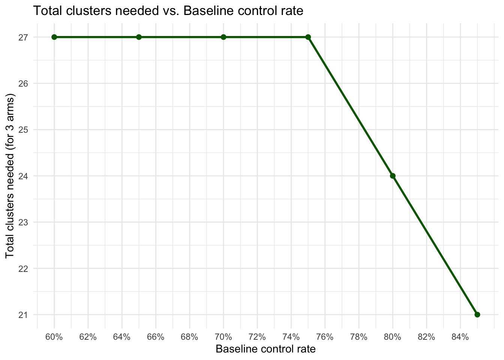{width=672}
:::
:::


### **(1.1.2) Varying ICC**

All parameters fixed, except ICC versus number of clusters & individuals needed


::: {.cell}

```{.r .cell-code}
# Define parameters
power <- 0.80
alpha <- 0.05
p_C <- 0.78 
m <- 40
CV <- 0.1

# Range of ICC values to test, bracketing the under-5 pilot CI (0.023-0.077)
ICC_values <- seq(0.02, 0.10, by = 0.01)

results_df <- data.frame(
  ICC = numeric(),
  n_clusters_per_arm = numeric(),
  n_individuals_per_arm = numeric()
)

for (icc in ICC_values) {
  p_I1 <- p_C - 0.20
  p_I2 <- p_C - 0.25

  h_I1_C <- cohen_h(p_I1, p_C)
  h_I2_C <- cohen_h(p_I2, p_C)

  # Clusters per arm for each contrast (small-sample corrected), take the max
  n_clusters_per_arm <- max(
    n_clusters_crt(h_I1_C, m, CV, icc, power, alpha),
    n_clusters_crt(h_I2_C, m, CV, icc, power, alpha)
  )

  results_df <- rbind(results_df, data.frame(
    ICC = icc,
    n_clusters_per_arm = n_clusters_per_arm,
    n_individuals_per_arm = n_clusters_per_arm * m
  ))
}
```
:::


::: {.cell}

```{.r .cell-code}
ggplot(results_df, aes(x = ICC, y = n_clusters_per_arm * 3)) +
  geom_line(color = "darkred", size = 1) +
  geom_point(color = "darkred", size = 2) +
  labs(
    title = "Total clusters needed vs. ICC",
    x = "ICC",
    y = "Total clusters needed (for 3 arms)"
  ) +
  theme_minimal() +
  scale_x_continuous(breaks = seq(0.02, 0.10, by = 0.01)) +
  scale_y_continuous(breaks = seq(0, max(results_df$n_clusters_per_arm * 3), by = 2))
```

::: {.cell-output-display}
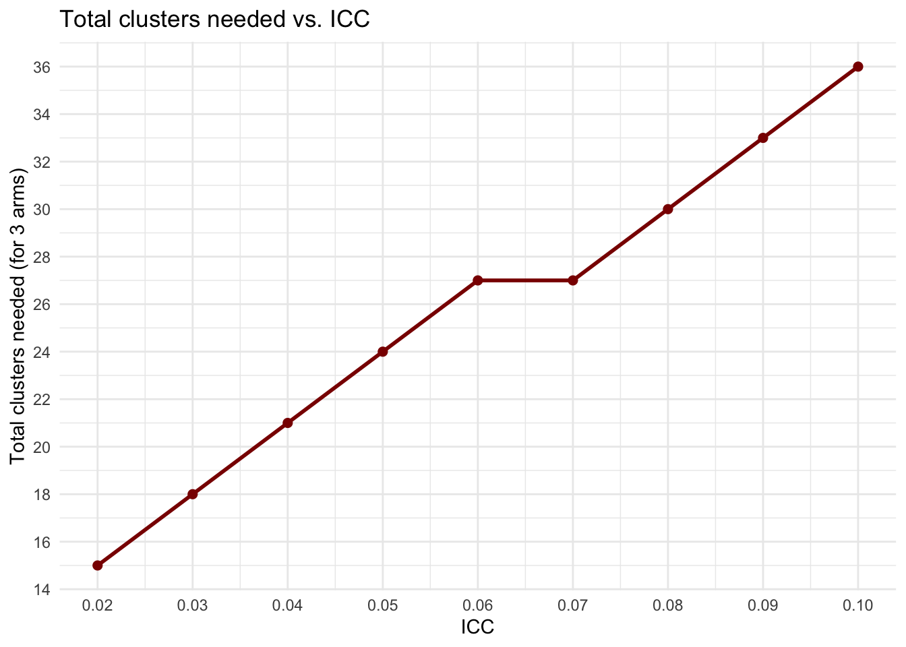{width=672}
:::
:::


### **(1.1.3) Varying Effect size**

Varying the effect size: from 25 pp down to 15 pp.

Keep the baseline prescription rate at 75% (control rate)

Keep m (cluster size) at 40, to base it on the kids (will not make much difference if changed to m=150 for adults)

Keep the CV at 0.1 (will not make any difference if CV = 0)

Keep ICC at 0.10

Plot delta vs power.


::: {.cell}

```{.r .cell-code}
# Define fixed parameters
power_target <- 0.80
alpha <- 0.05
p_C <- 0.78
ICC <- 0.08
CV <- 0.1
m <- 40

# Range of effect sizes (percentage point reductions)
effect_sizes_pp <- seq(15, 25, by = 1)

n_clusters_per_arm <- 13 # planned design

results_effect_df <- data.frame(
  effect_size_pp = numeric(),
  power = numeric()
)

for (delta_pp in effect_sizes_pp) {
  p_I <- p_C - (delta_pp / 100)

  # Skip if intervention rate is invalid
  if (p_I < 0) {
    next
  }

  h <- cohen_h(p_I, p_C)

  # Small-sample corrected
  results_effect_df <- rbind(results_effect_df, data.frame(
    effect_size_pp = delta_pp,
    power = power_crt(h, n_clusters_per_arm, m, CV, ICC, alpha, small_sample = TRUE)
  ))
}
```
:::


::: {.cell}

```{.r .cell-code}
ggplot(results_effect_df, aes(x = effect_size_pp, y = power)) +
  geom_hline(yintercept = power_target, linetype = "dashed", color = "red") +
  geom_line(color = "darkblue", size = 1) +
  geom_point(color = "darkblue", size = 2) +
  labs(
    title = "Power vs. Effect size (13 clusters per arm)",
    x = "Effect size (percentage point reduction)",
    y = "Power"
  ) +
  theme_minimal() +
  scale_x_continuous(breaks = seq(15, 25, by = 1)) +
  scale_y_continuous(labels = scales::percent_format(accuracy = 1),
                     limits = c(0, 1), breaks = seq(0, 1, by = 0.1))
```

::: {.cell-output-display}
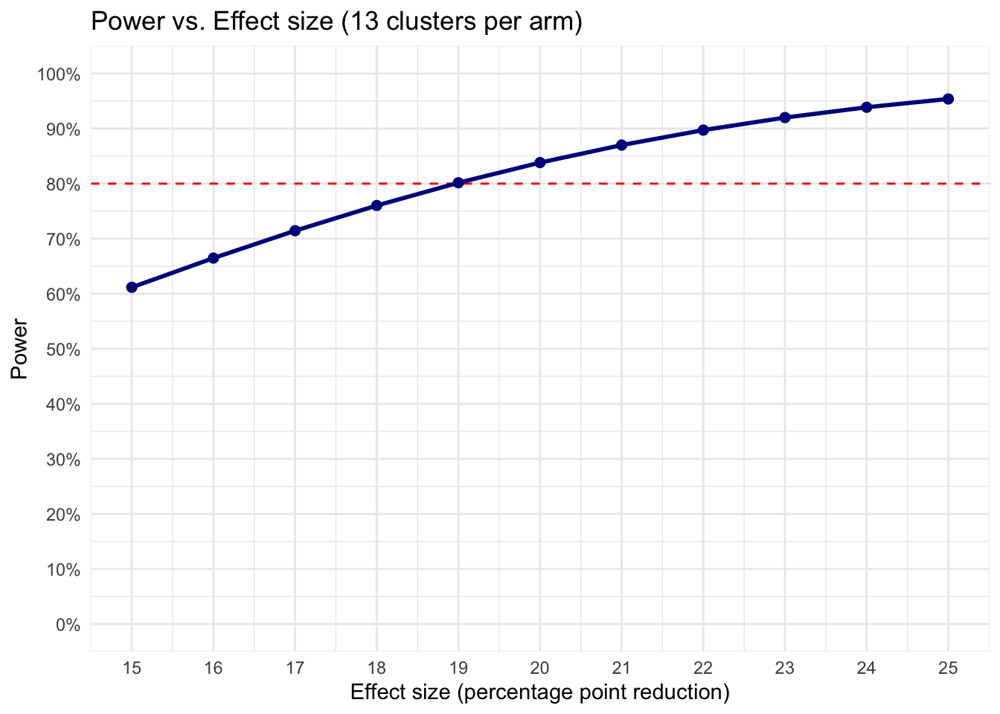{width=672}
:::
:::


### **(1.1.4) Varying Effect size and varying ICC**

3-D plot, varying the effect size (25 pp to 15 pp) & varying ICC (0.02 to 0.10)

Keep the baseline prescription rate at 75% (control rate)

Keep m (cluster size) at 40, to base it on the kids (will not make much difference if changed to m=150 for adults)

Keep the CV at 0.1 (will not make any difference if CV = 0)


::: {.cell}

```{.r .cell-code}
# Define parameters
power <- 0.80
alpha <- 0.05
p_C <- 0.78
CV <- 0.1
m <- 40

# Ranges
ICC_values <- seq(0.02, 0.10, by = 0.01)
effect_sizes_pp <- seq(15, 25, by = 1)

# Create grid
results_3d <- expand.grid(
  ICC = ICC_values,
  effect_size_pp = effect_sizes_pp
)

results_3d$n_clusters_per_arm <- NA

for (i in 1:nrow(results_3d)) {
  icc <- results_3d$ICC[i]
  delta_pp <- results_3d$effect_size_pp[i]

  p_I <- p_C - (delta_pp / 100)

  if (p_I < 0) {
    next
  }

  h <- cohen_h(p_I, p_C)

  # Small-sample corrected
  results_3d$n_clusters_per_arm[i] <- n_clusters_crt(h, m, CV, icc, power, alpha)
}
```
:::


::: {.cell}

```{.r .cell-code}
ggplot(results_3d, aes(x = effect_size_pp, y = ICC, fill = n_clusters_per_arm)) +
  geom_tile() +
  geom_contour(aes(z = n_clusters_per_arm), color = "white", size = 0.5, alpha = 0.6) +
  geom_text(aes(label = n_clusters_per_arm), size = 2.5, color = "black") +
  scale_fill_gradient2(
    low = "darkgreen", 
    mid = "yellow", 
    high = "darkred",
    midpoint = median(results_3d$n_clusters_per_arm, na.rm = TRUE),
    name = "Clusters\nper arm"
  ) +
  labs(
    title = "Clusters per arm: ICC vs Effect size (Power = 80%, pairwise comparison)",
    x = "Effect size (percentage point reduction)",
    y = "ICC"
  ) +
  theme_minimal() +
  theme(
    legend.position = "right",
    plot.title = element_text(hjust = 0.5, face = "bold")
  ) +
  scale_x_continuous(breaks = seq(15, 25, by = 2)) +
  scale_y_continuous(breaks = seq(0.02, 0.10, by = 0.01))
```

::: {.cell-output-display}
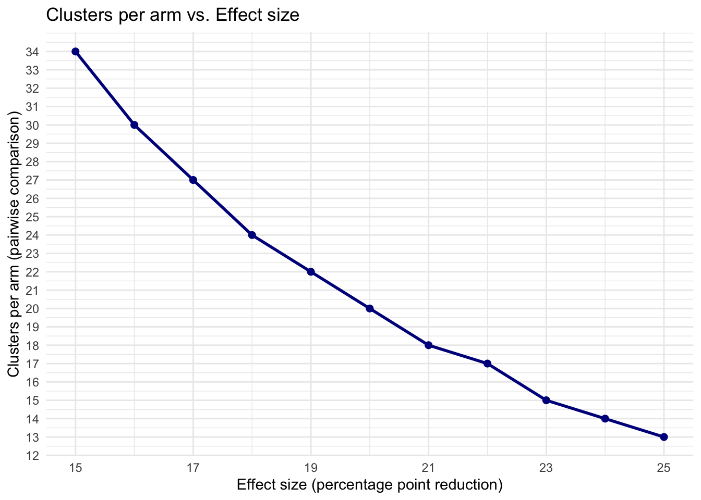{width=960}
:::
:::


### **(1.1.5) See whether cluster size improves anything in terms of power**

Just a quick check - adding more participants per clusters does not really help

Keeping it fix at the baseline scenario: 13 clusters per arm, 25 pp effect reduction, ICC 0.10


::: {.cell}

```{.r .cell-code}
# Fixed parameters
n_clusters_per_arm <- 13  # Fixed number of clusters
p_C <- 0.78
p_I <- 0.58  # 20 pp reduction
ICC <- 0.08
CV <- 0.1
alpha <- 0.05

# Range of cluster sizes to explore
cluster_sizes <- seq(20, 200, by = 10)

results_cluster_size <- data.frame(
  cluster_size = numeric(),
  total_n_per_arm = numeric(),
  achieved_power = numeric(),
  deff = numeric()
)

h <- cohen_h(p_I, p_C)

# NOTE: loop variable is m_j, not m, so that the global cluster size m (= 40) is not overwritten
for (m_j in cluster_sizes) {
  # Design effect for this cluster size
  deff_cv <- deff_cv_fun(m_j, CV, ICC)

  # Total individuals per arm
  total_n <- n_clusters_per_arm * m_j

  # Achieved power, small-sample corrected (df depend on clusters, not on cluster size,
  # which is exactly why adding individuals per cluster helps so little)
  power_achieved <- power_crt(h, n_clusters_per_arm, m_j, CV, ICC, alpha)

  results_cluster_size <- rbind(results_cluster_size, data.frame(
    cluster_size = m_j,
    total_n_per_arm = total_n,
    achieved_power = power_achieved,
    deff = deff_cv
  ))
}
```
:::


::: {.cell}

```{.r .cell-code}
ggplot(results_cluster_size, aes(x = cluster_size, y = achieved_power)) +
  geom_line(color = "darkgreen", linewidth = 1.2) +
  geom_point(color = "darkgreen", size = 2.5) +
  geom_hline(yintercept = 0.80, linetype = "dashed", color = "red", linewidth = 0.8) +
  labs(
    title = "Diminishing Returns: Power vs. Cluster Size, at fixed cluster N = 13 per arm",
    x = "Participants per cluster (m)",
    y = "Power"
  ) +
  theme_minimal() +
  scale_y_continuous(labels = scales::percent, limits = c(0, 1),
                     breaks = seq(0, 1, by = 0.1)) +
  scale_x_continuous(breaks = seq(20, 200, by = 20))
```

::: {.cell-output-display}
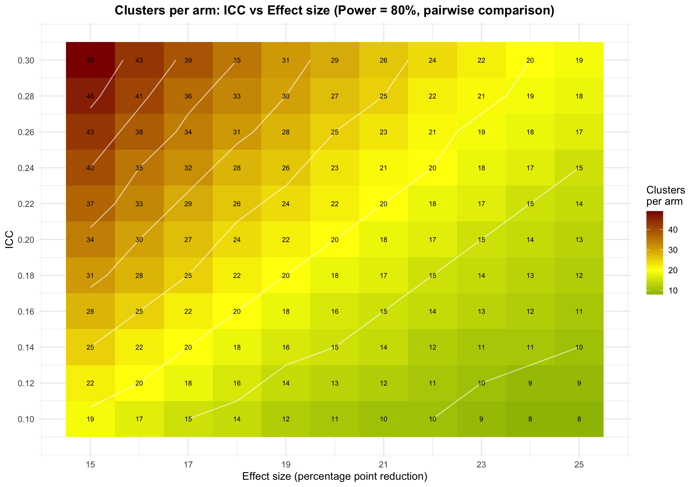{width=672}
:::
:::


# **(2) Sample size calculation CRT: Simulations**

## **(2.1) Parameters**

We follow the simulation setup according to J. Thompson & C. Leyrat, because we have a binary outcome and small-ish cluster sample size (26-30 clusters for the main pair-wise comparison): <https://bmcmedresmethodol.biomedcentral.com/articles/10.1186/s12874-022-01699-2>

Note: We simulate a two-arm trial setup (not three-arm), since power/sample size is based on the main pair-wise comparison (control vs int 1) =\> Max. 26 clusters!

**Data-generating model (per cluster):**

- For arm i (0=control, 1=intervention) and cluster j: Y_ij ∼ Binomial(m_ij, p_ij), logit⁡(p_ij) = β0 + β1_i + u_j , where u_j is a cluster random effect with mean 0 and variance σ\^2_b

  - ​Binomial(m_ij, p_ij): Conditional on p_ij, we assume each of the m_ij individuals in that cluster are independent Bernoulli trials with probability p_ij. So Y_ij is a binomial draw with that probability, for the cluster-level.

    - A Bernoulli trial is a random event with two outcomes (success/failure), with the same, independent, probability of success every time.

    - Independence assumption (within-cluster): Whether one person gets the prescription doesn’t change the probability for another person in the same cluster (once p_ij is fixed). The correlation between people’s outcomes in the same cluster comes entirely from them sharing the same p_ij.

    - =\> Y_ij can be any integer from 0 to m_ij. E.g. if m_ij =42 and p_ij =0.50, then Y_ij is the total number of prescriptions in that cluster, drawn from a binomial distribution with 42 trials and 50% success probability.

  - logit⁡(p_ij) = β0 + β1_i + u_j:

    - Using the logit link maps probability p ∈ (0,1) to the whole real line, so we can model it as a linear predictor.

    - β0 is the baseline log-odds (the logit of the control probability for a *typical* cluster, i.e. when u_j = 0), representing the the marginal cluster-specific probability.

    - β1_i encodes the treatment effect and is a log-odds difference; exp⁡(β1) is the *conditional odds ratio* comparing treatment vs control for the *same cluster* (holding u_j fixed).

    - u_j is the cluster random intercept (a cluster-level shift on the log-odds scale). It captures unobserved cluster-level factors (e.g. prescriber tendency) that move all individuals in the cluster up/down in log-odds. Typically, u_j has mean 0 and variance σ\^2_b and is independent across clusters (see above). The random intercept does not change the conditional treatment effect, it only shifts the baseline log-odds for that whole cluster. In other words, the *difference in log-odds* between arms for the same cluster is always constant, but the *actual probabilities* shift up/down with u_j. For clusters with positive u_j both arms have higher probabilities; for negative u_j both are lower.

**ICC on log-odds scale:**

- ICC = *p = rho* = σ\^2_b / (σ\^2_b+(π\^2/3))

- The ICC consists of individual-level variance (noise) and between-cluster variance (noise), in the sense of: between-cluster variance / total variance. The between-cluster variance approximates the cluster random effect variance (σ\^2_b)

- In logistic models, the individual level variation is usually fixed at π\^2/3 (3.29)

- So, focusing on the cluster random effect variance (σ\^2_b), we can derive it from the formula above as: σ_b = *sigma_b* = sqrt((ICC(π\^2/3))/(1−ICC))

- (If there’s additional within-site variation over time, i.e. baseline period or SW-CRT, we include σ\^2_b_p, typically as a fraction of σ\^2_b, e.g., half the site-level variance).

**Important - the two ICC scales, and which one we specify:**

- The formula above defines the ICC on the **latent (log-odds) scale**: the ICC of the unobserved continuous logistic variable underlying the binary outcome. This is *not* the same quantity as the ordinary **proportion-scale** ICC (the correlation between two individuals' observed 0/1 outcomes in the same cluster), which is what the design effect in chapter 1 requires, what published ICC tables report, and what our pilot data give us.

- The two differ substantially. At our control prevalence of 78%: a proportion-scale ICC of 0.02 corresponds to a latent ρ of 0.034; 0.05 corresponds to 0.083; 0.08 corresponds to 0.130; 0.10 corresponds to 0.160. Conversely, the latent ρ of 0.20 that this document previously used corresponds to a proportion-scale ICC of only 0.126 - i.e. the earlier simulations were markedly less conservative than the chapter 1 formula suggested, and the two chapters' ICC axes were not comparable.

- **We therefore specify the ICC on the proportion scale everywhere** (argument `icc`), and convert internally to the latent scale via `prop_icc_to_latent()` at the single point where the simulation needs σ_b. Chapters 1, 2 and 3 now all take the same number as input and their ICC axes are directly comparable.

**Cluster effect distributions:**

- While ICC is the proportion of the total variance (in the latent scale) that comes from between-cluster differences ("what fraction of the total variability is due to between-cluster differences"), the σ\^2_b is an absolute variance ("how much variation there is in prescription tendency across clusters") and can have different shapes.

- GLMM assumes normal distribution, but reality is often skewed - esp. with few clusters! Simulate three scenarios including a realistic/skewed/conservative scenario and see if GLMM breaks (as in paper above):

- a\) Normal: u_j ∼ N(0, σ\^2_b)

  - Symmetric, bell-shaped, skewness = 0, kurtosis = 0.

- b\) Gamma (skewed): generate a_j ∼ Gamma(shape=2,scale=1), then set u_j ​= σ_b(​(a_j​−2)/sqrt(2))

  - A shape parameter of 2 give a distribution with skew 1.4 and kurtosis 3, i.e., positive skew (some clusters much higher tendency than average)

- c\) Uniform: u_j ∼ Uniform(−sqrt(3)σ_b, sqrt(3)σ_b)

  - Skewness = 0 (perfectly symmetric), Kurtosis = −6/5 (lighter tails than normal), no extreme values, overall flat, all clusters are evenly spread; to test if GLMMs are sensitive to lack of tail weight, i.e., whether they rely on the normal distribution’s tails to stabilize estimates.

**Cluster sizes** m_ij​:

- Allow for varying cluster size, i.e. varying coefficient of variation (CV) of cluster sizes, using same approach as they did: They sampled cluster sizes so that m_ij = 2 + δ_ij,​ drawn from a Negative Binomial:

  - δ_ij ​∼ NegBin(size = (m-2)\^2/(s\^2-(m-2)), p = m-2/s\^2)

  - where s is the SD of cluster sizes (CV = s/m).

  - This yields a minimum cluster size of 3. (note: they wrote no.offails and prob.offail; but the above should represent the same).

  - δ is in a way the random component added to 2 to get the cluster size (of min 3).

## **(2.2) Create main functions and simulate one dataset**


::: {.cell}

```{.r .cell-code}
# 1) compute sigma_b from ICC (on latent logit scale):
icc_to_sigma <- function(rho){
  if(rho<=0) return(0)
  sigma_b <- sqrt( (rho * (pi^2/3)) / (1 - rho) )
  return(sigma_b)
}

# 1b) convert a PROPORTION-scale ICC into the equivalent LATENT (logit-scale) ICC.
#
# These are two different quantities and must not be used interchangeably:
#   - proportion scale: the ordinary correlation between two individuals' binary (0/1)
#     outcomes in the same cluster. This is what the DEFF formula in chapter 1 needs,
#     what published ICC tables report, and what our pilot data give us.
#   - latent scale: rho = sigma_b^2 / (sigma_b^2 + pi^2/3), i.e. the ICC of the
#     unobserved continuous logistic variable underlying the binary outcome. This is
#     what icc_to_sigma() inverts to get the random-intercept SD for the simulation.
#
# For a cluster-specific probability p_j = plogis(qlogis(p0) + u_j), the induced
# proportion-scale ICC is Var(p_j) / (E[p_j] * (1 - E[p_j])). We compute that by
# numerical integration over u_j ~ N(0, sigma_b) and invert it for the latent rho.
# Deterministic (no simulation), so results are exactly reproducible.
latent_icc_to_prop <- function(rho_latent, p0){
  if(rho_latent <= 0) return(0)
  sigma_b <- icc_to_sigma(rho_latent)
  b0 <- qlogis(p0)
  Ep  <- integrate(function(u) plogis(b0 + u) * dnorm(u, 0, sigma_b),
                   -10*sigma_b, 10*sigma_b)$value
  Ep2 <- integrate(function(u) plogis(b0 + u)^2 * dnorm(u, 0, sigma_b),
                   -10*sigma_b, 10*sigma_b)$value
  (Ep2 - Ep^2) / (Ep * (1 - Ep))
}

prop_icc_to_latent <- function(icc_prop, p0){
  if(icc_prop <= 0) return(0)
  uniroot(function(r) latent_icc_to_prop(r, p0) - icc_prop,
          interval = c(1e-6, 0.95), tol = 1e-9)$root
}

# 1c) The conversion above assumes u_j is NORMAL. Our conservative default distribution is
# gamma (skewed), and a skewed u_j with the same SD induces a DIFFERENT proportion-scale ICC:
# at sigma_b = 0.702 the normal gives ICC 0.080 but the gamma gives only 0.054. Simply reusing
# the normal-based sigma_b therefore silently simulates a lower ICC than requested, i.e. the
# "conservative" skewed scenario would in fact be run at a more favourable ICC.
#
# We therefore solve for sigma_b separately for each distribution, so that "icc = 0.08" means
# a realised proportion-scale ICC of 0.10 whichever u_j distribution is used. Both moments are
# obtained by quadrature over the actual distribution of u_j, so this stays deterministic.
icc_prop_given_sigma <- function(sigma_b, p0, dist = c("normal","gamma","uniform")){
  dist <- match.arg(dist)
  if(sigma_b <= 0) return(0)
  b0 <- qlogis(p0)
  mom <- function(k){
    if(dist == "normal"){
      integrate(function(u) plogis(b0 + u)^k * dnorm(u, 0, sigma_b),
                -10*sigma_b, 10*sigma_b)$value
    } else if(dist == "gamma"){
      # u_j = sigma_b * (a - 2)/sqrt(2), with a ~ Gamma(shape = 2, scale = 1)
      integrate(function(a) plogis(b0 + sigma_b*(a-2)/sqrt(2))^k * dgamma(a, shape=2, scale=1),
                0, Inf)$value
    } else {
      cut <- sqrt(3) * sigma_b
      integrate(function(u) plogis(b0 + u)^k / (2*cut), -cut, cut)$value
    }
  }
  Ep <- mom(1); Ep2 <- mom(2)
  (Ep2 - Ep^2) / (Ep * (1 - Ep))
}

# sigma_b that yields the requested PROPORTION-scale ICC under the given u_j distribution
sigma_b_for_icc <- function(icc_prop, p0, dist = "normal"){
  if(icc_prop <= 0) return(0)
  uniroot(function(s) icc_prop_given_sigma(s, p0, dist) - icc_prop,
          interval = c(1e-6, 10), tol = 1e-10)$root
}

# 1d) MARGINAL (population-average) prevalence implied by a linear predictor, E[plogis(lp + u_j)]
marginal_p <- function(lp, sigma_b, dist = c("normal","gamma","uniform")){
  dist <- match.arg(dist)
  if(sigma_b <= 0) return(plogis(lp))
  if(dist == "normal"){
    integrate(function(u) plogis(lp+u)*dnorm(u, 0, sigma_b), -10*sigma_b, 10*sigma_b)$value
  } else if(dist == "gamma"){
    integrate(function(a) plogis(lp + sigma_b*(a-2)/sqrt(2))*dgamma(a, shape=2, scale=1), 0, Inf)$value
  } else {
    cut <- sqrt(3)*sigma_b
    integrate(function(u) plogis(lp+u)/(2*cut), -cut, cut)$value
  }
}

# 1e) Choose beta0 and beta1 so the MARGINAL prevalences are exactly p0 and p1.
# This matters more than it looks. Setting beta0 = qlogis(p0) and beta1 = log(OR) makes p0 and p1 the CLUSTER-SPECIFIC probabilities (those of a cluster with u_j = 0). Because the logistic link is non-linear, averaging over u_j pulls the marginal prevalences toward 0.5: at ICC 0.08 the nominal "0.78 -> 0.58, 20 pp" actually generates a marginal 0.759 -> 0.572, i.e. only 18.7 pp.
calibrate_marginal <- function(p0, p1, sigma_b, dist = "normal"){
  b0 <- uniroot(function(b) marginal_p(b, sigma_b, dist) - p0, c(-20, 20), tol = 1e-10)$root
  b1 <- uniroot(function(b) marginal_p(b0 + b, sigma_b, dist) - p1, c(-20, 20), tol = 1e-10)$root
  c(beta0 = b0, beta1 = b1)
}

# 2) compute beta0 for given control prevalence p0
p_to_beta0 <- function(p0){
  qlogis(p0)
}

# 3) given p0 and p1, compute OR on the cluster-specific log-odds scale
p0_p1_to_OR <- function(p0, p1){
  odds0 <- p0 / (1 - p0)
  odds1 <- p1 / (1 - p1)
  odds1 / odds0
}

# 4) generate random cluster-level u_j for the three distributions
generate_u <- function(n_clusters, sigma_b, dist = c("normal","gamma","uniform")){
  dist <- match.arg(dist)
  if(sigma_b == 0) return(rep(0, n_clusters))
  if(dist == "normal"){
    return(rnorm(n_clusters, mean=0, sd = sigma_b))
  } else if(dist == "gamma"){
    # they used Gamma(shape=2, scale=1) then standardized to mean 0 and sd sigma_b
    a <- rgamma(n_clusters, shape=2, scale=1)
    # a has mean 2, var 2. Standardize: (a - 2)/sqrt(2) then scale to sigma_b
    return(sigma_b * (a - 2)/sqrt(2))
  } else if(dist == "uniform"){
    cut <- sqrt(3) * sigma_b
    return(runif(n_clusters, min = -cut, max = cut))
  }
}

# 5) generate cluster sizes with target mean m and CV. Implementation follows their negative-binomial based approach and enforces minimum cluster size of 3.
generate_cluster_sizes <- function(n_clusters, m, CV){
  if(CV == 0){
    return(rep(m, n_clusters))
  }
  s <- CV * m
  # We want delta = m_j - 2 to follow NegBin with mean (m-2) and variance s^2
  mu_delta <- m - 2
  var_delta <- s^2
  if(var_delta <= mu_delta){
    # Negative Binomial requires variance > mean, so this parameterization is impossible.
    # NOTE: this is the branch that actually runs at our design values (m = 40, CV = 0.1:
    # var_delta = 16 is well below mu_delta = 38), i.e. the NB path documented in chapter 2.1 is never used here. We fall back to a uniform around m. The half-width must be sqrt(3)*s, not 1.5*s: a uniform on m +/- w has SD w/sqrt(3), so w = 1.5*s gives SD 0.87*s and under-delivers the requested CV (0.088 instead of 0.100).
    w <- sqrt(3) * s
    out <- pmax(3, round(runif(n_clusters, m - w, m + w)))
    return(out)
  }
  size_nb <- (mu_delta^2) / (var_delta - mu_delta) # see formula above
  prob_nb <- mu_delta / var_delta # see formula above
  # rnbinom in R uses size, prob; mean = size*(1-prob)/prob, but with this param it matches
  delta <- rnbinom(n_clusters, size = size_nb, prob = prob_nb)
  m_j <- 2 + delta
  m_j[m_j < 3] <- 3 # enforce min 3 (generating 2+delta ensures >=2, we bump to 3)
  return(m_j)
}

# Parameters for single simulated dataset
n_clusters <- 26
m_mean <- 40
CV <- 0.1
p0 <- 0.78
p1 <- 0.58
OR <- p0_p1_to_OR(p0, p1) # compute OR from p0 and p1
icc <- 0.08 # ICC on the PROPORTION scale (under-5 pilot); sigma_b derived for the chosen re_dist below
re_dist <- "uniform"

# Simulate
set.seed(20250809)
sigma_b <- sigma_b_for_icc(icc, p0, re_dist)
u_j <- generate_u(n_clusters, sigma_b, dist = re_dist)
sizes <- generate_cluster_sizes(n_clusters, m_mean, CV)
arm_assign <- sample(rep(0:1, length.out = n_clusters))
# beta0/beta1 calibrated so the MARGINAL prevalences really are p0 and p1 (see helper 1e above)
betas <- calibrate_marginal(p0, p1, sigma_b, re_dist)
beta0 <- betas["beta0"]
beta1 <- betas["beta1"]
y <- integer(n_clusters)

for(j in seq_len(n_clusters)){ # iterate over each cluster
  # create the linear predictor (NOTE: beta1 turns 0 if arm0, and 1 * beta1 if arm1)
  linpred <- beta0 + beta1 * arm_assign[j] + u_j[j] 
  # apply the inverse logit (logistic function) to convert log-odds to probability
  p_j <- plogis(linpred) 
  # Simulate the number of successes in cluster j
  y[j] <- rbinom(1, size = sizes[j], prob = p_j) 
}

df_sim <- data.frame(cluster = seq_len(n_clusters),
                      arm = arm_assign,
                      size = sizes,
                      y = y)
df_sim
```

::: {.cell-output .cell-output-stdout}

```
   cluster arm size  y
1        1   1   39 20
2        2   0   34 31
3        3   1   36 20
4        4   0   41 34
5        5   0   39 31
6        6   0   42 38
7        7   0   38 30
8        8   0   46 35
9        9   0   43 32
10      10   1   44 29
11      11   1   45 35
12      12   1   46 26
13      13   0   39 28
14      14   1   39 33
15      15   1   41 30
16      16   1   42 36
17      17   0   40 33
18      18   1   35 32
19      19   0   35 28
20      20   1   37 22
21      21   0   36 30
22      22   1   42 24
23      23   1   41 12
24      24   0   44 37
25      25   1   44 39
26      26   0   39 24
```


:::

```{.r .cell-code}
mean_sizes <- df_sim %>%
  group_by(arm) %>%
  summarise(mean_size = mean(size))

ggplot(df_sim, aes(x = factor(cluster), y = size, fill = factor(arm))) +
  geom_bar(stat = "identity", color = "black") +
  geom_hline(data = mean_sizes, aes(yintercept = mean_size, color = factor(arm)),
             linetype = "dashed", size = 1, show.legend = FALSE) +
  geom_text(data = mean_sizes, aes(x = Inf, y = mean_size, label = paste0("Mean = ", round(mean_size, 1))),
            hjust = 1.1, vjust = -0.5, color = c("skyblue4", "tomato3"), size = 4) +
  scale_fill_manual(values = c("skyblue", "tomato"), labels = c("Control (arm=0)", "Intervention (arm=1)")) +
  scale_color_manual(values = c("skyblue4", "tomato3")) +
  labs(x = "Cluster", y = "Cluster Size", fill = "Treatment Group") +
  theme_minimal() +
  ggtitle("Cluster size per cluster") +
  theme(axis.text.x = element_text(angle = 45, hjust = 1))
```

::: {.cell-output-display}
{width=672}
:::
:::


size = number of individuals in a cluster

y = number of individual-level successes (binary=1) observed in the cluster, i.e., represents the number of individuals in that cluster who received an AB prescription.

## **(2.3) Simulate power, using cluster-level analysis approach**

NOTES:

- Use cluster-level analysis (unweighted t-test on log-odds, with 0.5 continuity correction, as per guidance according to Thompson & Leyrat & al -\> "clan" command)

- Keep gamma distribution, simulate 500-1000 trials

### **(2.3.1) Create function**


::: {.cell}

```{.r .cell-code}
simulate_power <- function(n_clusters = 26, 
                           m_mean = 40, 
                           CV = 0.1,
                           p0 = 0.78, 
                           p1 = 0.58, 
                           icc = 0.08,
                           re_dist = "gamma", 
                           n_sim = 1000,
                           alpha = 0.05, 
                           seed = 20250809) {
  set.seed(seed)
  
  # Compute derived parameters
  sigma_b <- sigma_b_for_icc(icc, p0, re_dist)
  # calibrate so the MARGINAL prevalences are p0 and p1 (see helper 1e in chapter 2.2)
  betas <- calibrate_marginal(p0, p1, sigma_b, re_dist)
  beta0 <- betas["beta0"]
  beta1 <- betas["beta1"]
  
  p_values <- numeric(n_sim)
  
  for (i in seq_len(n_sim)) {
    u_j <- generate_u(n_clusters, sigma_b, dist = re_dist)
    sizes <- generate_cluster_sizes(n_clusters, m_mean, CV)
    arm_assign <- sample(rep(0:1, length.out = n_clusters))
    
    y <- integer(n_clusters)
    for (j in seq_len(n_clusters)) {
      linpred <- beta0 + beta1 * arm_assign[j] + u_j[j]
      p_j <- plogis(linpred)
      y[j] <- rbinom(1, size = sizes[j], prob = p_j)
    }
    
    # Cluster-level log-odds with 0.5 continuity correction
    log_odds <- log((y + 0.5) / (sizes - y + 0.5))
    
    # Unweighted t-test
    group0 <- log_odds[arm_assign == 0]
    group1 <- log_odds[arm_assign == 1]
    
    test <- try(t.test(group1, group0, var.equal = TRUE), silent = TRUE)
    p_values[i] <- if (inherits(test, "try-error")) NA else test$p.value
  }
  
  # Estimate power
  mean(p_values < alpha, na.rm = TRUE)
}
```
:::


### **(2.3.2)** Calculate baseline scenario


::: {.cell}

```{.r .cell-code}
power_estimate <- simulate_power(n_clusters = 26,
                                 m_mean = 40,
                                 CV = 0.1,
                                 p0 = 0.78,
                                 p1 = 0.58,
                                 icc = 0.08,
                                 re_dist = "gamma",
                                 n_sim = 1000)

cat("Estimated power:", round(power_estimate, 3), "\n")
```

::: {.cell-output .cell-output-stdout}

```
Estimated power: 0.777 
```


:::
:::


### **(2.3.3) Vary effect sizes**


::: {.cell}

```{.r .cell-code}
p0_vals <- seq(0.50, 0.85, by = 0.05)
p1_vals <- seq(0.30, 0.70, by = 0.05)

grid <- expand.grid(p0 = p0_vals, p1 = p1_vals)

results <- grid %>%
  rowwise() %>%
  mutate(power = simulate_power(n_clusters = 26,
                                m_mean = 40,
                                CV = 0.1,
                                p0 = p0,
                                p1 = p1,
                                icc = 0.08,
                                re_dist = "gamma",
                                n_sim = 1000)) %>%
  ungroup()

# Plot
ggplot(results, aes(x = p1, y = power, color = factor(p0))) +
  
  # Shaded region above 80% power
  geom_rect(aes(xmin = -Inf, xmax = Inf, ymin = 0.8, ymax = Inf),
            fill = "lightgrey", alpha = 0.3, inherit.aes = FALSE) +
  
  # Power curves
  geom_line(size = 1.2) +
  geom_point() +
  
  # Labels and scales
  labs(title = "Power Curves by p0 and p1 (two-arm/pair-wise comparison)",
       x = "Intervention Group Probability (p1)",
       y = "Estimated Power",
       color = "Control Group (p0)") +
  scale_y_continuous(breaks = seq(0, 1, by = 0.1),
                     limits = c(0, 1),
                     labels = scales::percent_format(accuracy = 1)) +
  theme_minimal(base_size = 14)
```

::: {.cell-output-display}
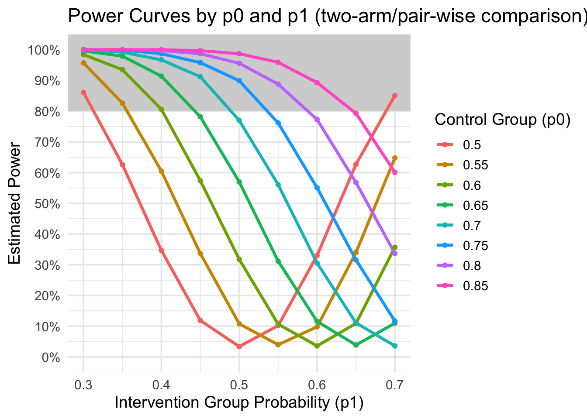{width=672}
:::
:::


### **(2.3.4) Vary ICC**


::: {.cell}

```{.r .cell-code}
# Vector of ICC values to test
icc_values <- seq(0.02, 0.10, by = 0.01)

# Run power simulations for each ICC
power_results <- sapply(icc_values, function(icc) {
  simulate_power(n_clusters = 26,
                 m_mean = 40,
                 CV = 0.1,
                 p0 = 0.78,
                 p1 = 0.58,
                 icc = icc,
                 re_dist = "gamma",
                 n_sim = 1000,
                 alpha = 0.05,
                 seed = 20250809)
})

# Create data frame for plotting
df_power_icc <- data.frame(ICC = icc_values, Power = power_results)

# Plot
ggplot(df_power_icc, aes(x = ICC, y = Power)) +
  geom_line(color = "darkred", size = 1.2) +
  geom_point(color = "firebrick") +
  labs(title = "Power curve by ICC, proportion scale (two-arm/pair-wise comparison)",
       x = "Intraclass correlation, proportion scale (ICC)",
       y = "Estimated Power") +
  scale_y_continuous(breaks = seq(0, 1, by = 0.1),
                     limits = c(0, 1),
                     labels = scales::percent_format(accuracy = 1)) +
  theme_minimal()
```

::: {.cell-output-display}
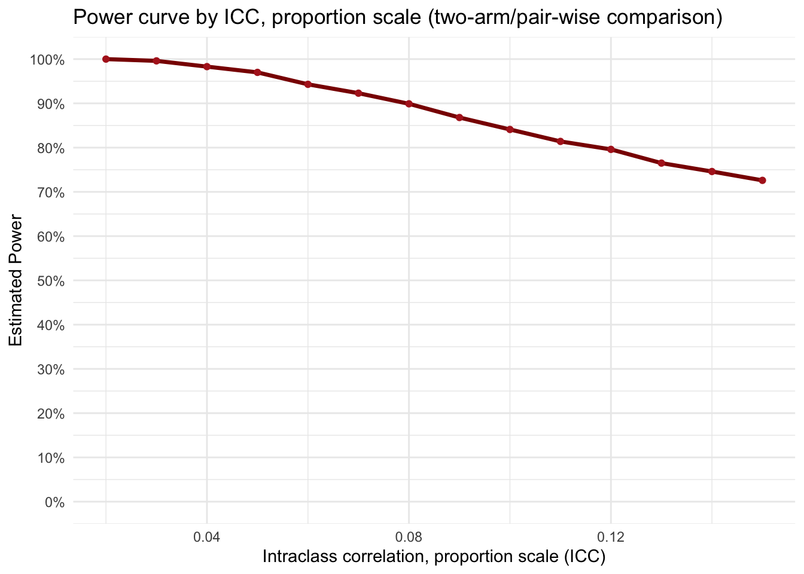{width=672}
:::
:::


### **(2.3.5) Vary number of clusters**


::: {.cell}

```{.r .cell-code}
# Vector of cluster counts to test
n_clusters_vec <- seq(10, 30, by = 1)

# Run power simulations for each cluster count
power_results <- sapply(n_clusters_vec, function(nc) {
  simulate_power(n_clusters = nc,
                 m_mean = 40,
                 CV = 0.1,
                 p0 = 0.78,
                 p1 = 0.58,
                 icc = 0.08,
                 re_dist = "gamma",
                 n_sim = 5000,
                 alpha = 0.05,
                 seed = 20250809)
})

# Create data frame for plotting
df_power_css <- data.frame(Cluster_ss = n_clusters_vec, Power = power_results)

# Plot
ggplot(df_power_css, aes(x = Cluster_ss, y = Power)) +
  geom_line(color = "darkgreen", size = 1.2) +
  geom_point(color = "forestgreen") +
  labs(title = "Power vs Number of total clusters (two-arm/pair-wise comparison)",
       x = "Total number of clusters (two-arm trial)",
       y = "Estimated power") +
  scale_y_continuous(breaks = seq(0, 1, by = 0.1),
                     limits = c(0, 1),
                     labels = scales::percent_format(accuracy = 1)) +
  scale_x_continuous(breaks = seq(10, 30, by = 2)) +
  theme_minimal()
```

::: {.cell-output-display}
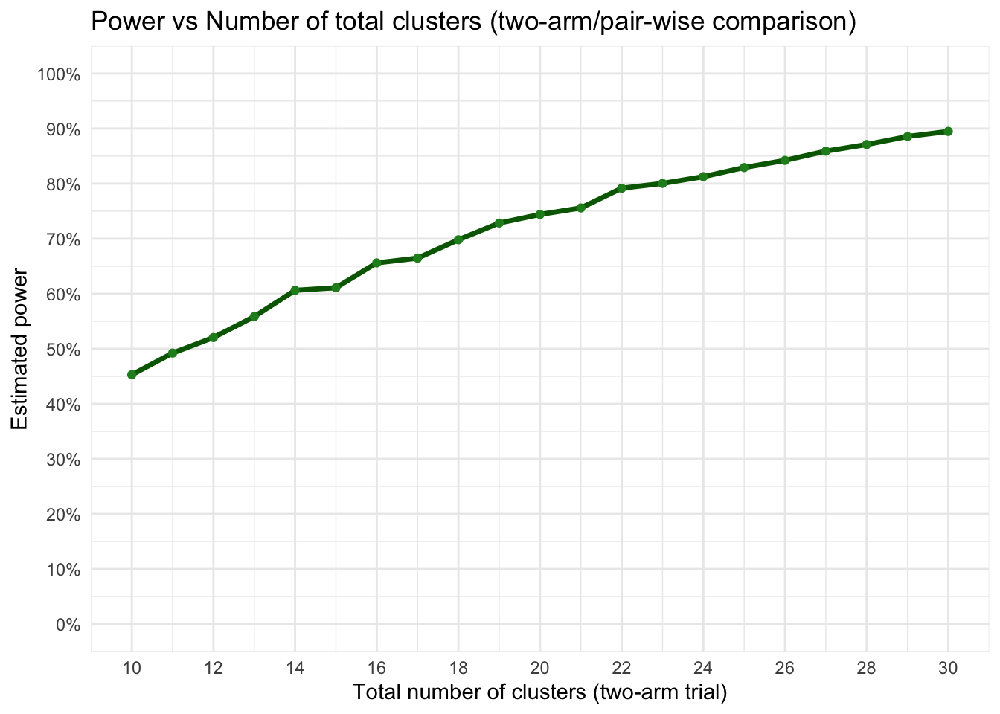{width=672}
:::
:::


### **(2.3.6) Vary number of individuals per cluster (mean cluster size)**


::: {.cell}

```{.r .cell-code}
m_mean_vec <- seq(10, 180, by = 10)

# Run power simulations for each cluster count
power_results <- sapply(m_mean_vec, function(n) {
  simulate_power(n_clusters = 26,
                 m_mean = n,
                 CV = 0.1,
                 p0 = 0.78,
                 p1 = 0.58,
                 icc = 0.08,
                 re_dist = "gamma",
                 n_sim = 1000,
                 alpha = 0.05,
                 seed = 20250809)
})

# Create data frame for plotting
df_power_iss <- data.frame(Individual_ss = m_mean_vec, Power = power_results)

# Plot
ggplot(df_power_iss, aes(x = Individual_ss, y = Power)) +
  geom_line(color = "darkblue", size = 1.2) +
  geom_point(color = "skyblue") +
  labs(title = "Power vs Number of total individuals (two-arm/pair-wise comparison)",
       x = "Total number of individuals (two-arm trial)",
       y = "Estimated power") +
  scale_y_continuous(breaks = seq(0, 1, by = 0.1),
                     limits = c(0, 1),
                     labels = scales::percent_format(accuracy = 1)) +
  scale_x_continuous(breaks = seq(10, 180, by = 10)) +
  theme_minimal()
```

::: {.cell-output-display}
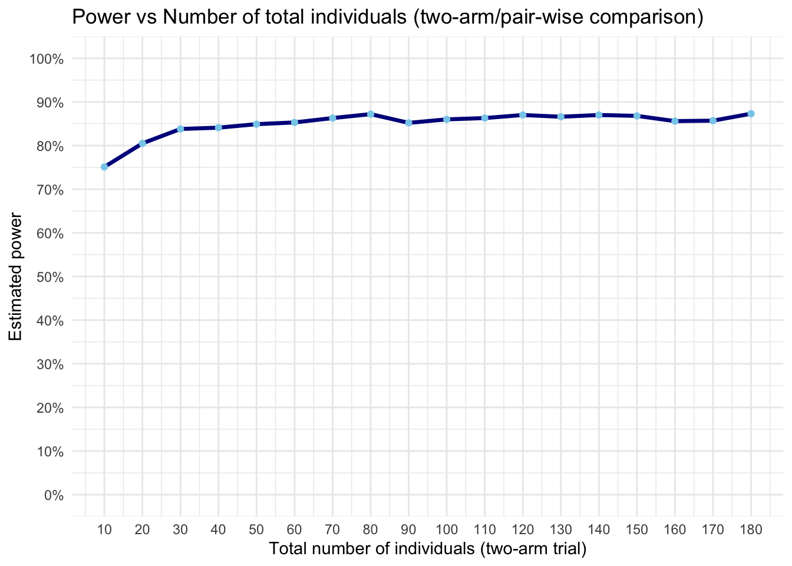{width=672}
:::
:::


## **(2.4) Simulate power, using GLMM analysis approach**

**NOTES:**

- As per guidance according to Thompson & Leyrat & al: GLMM with restricted pseudo-likelihood and reduced degree of freedom (minus all covariates in the model)

- Keep gamma distribution throughout

### **(2.4.1) Create function**


::: {.cell}

```{.r .cell-code}
simulate_power_glmmPQL <- function(n_clusters = 26, 
                                   m_mean = 40, 
                                   CV = 0.1,
                                   p0 = 0.78, 
                                   p1 = 0.58, 
                                   icc = 0.08,
                                   re_dist = "gamma", 
                                   n_sim = 1000,
                                   alpha = 0.05, 
                                   seed = 20250809) {
  set.seed(seed)
  
  sigma_b <- sigma_b_for_icc(icc, p0, re_dist)
  # calibrate so the MARGINAL prevalences are p0 and p1 (see helper 1e in chapter 2.2)
  betas <- calibrate_marginal(p0, p1, sigma_b, re_dist)
  beta0 <- betas["beta0"]
  beta1 <- betas["beta1"]
  
  p_values <- numeric(n_sim)
  
  for (i in seq_len(n_sim)) {
    u_j <- generate_u(n_clusters, sigma_b, dist = re_dist)
    sizes <- generate_cluster_sizes(n_clusters, m_mean, CV)
    arm_assign <- sample(rep(0:1, length.out = n_clusters))
    
    y <- integer(n_clusters)
    arm <- integer(n_clusters)
    cluster <- integer(n_clusters)
    
    for (j in seq_len(n_clusters)) {
      linpred <- beta0 + beta1 * arm_assign[j] + u_j[j]
      p_j <- plogis(linpred)
      y[j] <- rbinom(1, size = sizes[j], prob = p_j)
      arm[j] <- arm_assign[j]
      cluster[j] <- j
    }
    
    dd_sim <- data.frame(
      y = y,
      size = sizes,
      arm = factor(arm),
      cluster = factor(cluster)
    )
    
    # Fit GLMM using glmmPQL
    model_pql <- try(glmmPQL(
      fixed = cbind(y, size - y) ~ arm,
      random = ~1 | cluster,
      family = binomial(link = "logit"),
      data = dd_sim,
      verbose = FALSE
    ), silent = TRUE)
    
    if (!inherits(model_pql, "try-error")) {
      df_manual <- n_clusters - length(fixef(model_pql))
      coef <- model_pql$coefficients$fixed["arm1"]
      se <- summary(model_pql)$tTable["arm1", "Std.Error"]
      t_stat <- coef / se
      p_values[i] <- 2 * pt(-abs(t_stat), df = df_manual)
    } else {
      p_values[i] <- NA
    }
  }
  
  mean(p_values < alpha, na.rm = TRUE)
}
```
:::


### **(2.4.2)** Calculate baseline scenario


::: {.cell}

```{.r .cell-code}
power_estimate <- simulate_power_glmmPQL(n_clusters = 26,
                                         m_mean = 40,
                                         CV = 0.1,
                                         p0 = 0.78,
                                         p1 = 0.58,
                                         icc = 0.08,
                                         re_dist = "gamma",
                                         n_sim = 1000)

cat("Estimated power (GLMM):", round(power_estimate, 3), "\n")
```

::: {.cell-output .cell-output-stdout}

```
Estimated power (GLMM): 0.825 
```


:::
:::


### **(2.4.3) Vary effect sizes**


::: {.cell}

```{.r .cell-code}
p0_vals <- seq(0.50, 0.85, by = 0.05)
p1_vals <- seq(0.30, 0.70, by = 0.05)

grid_glmm <- expand.grid(p0 = p0_vals, p1 = p1_vals)

# Use map2 to apply the function to each p0/p1 pair, more efficient
grid_glmm$power <- map2_dbl(grid_glmm$p0, grid_glmm$p1, ~ simulate_power_glmmPQL(
  n_clusters = 26,
  m_mean = 40,
  CV = 0.1,
  p0 = .x,
  p1 = .y,
  icc = 0.08,
  re_dist = "gamma",
  n_sim = 300 # reduced for speed
))

ggplot(grid_glmm, aes(x = p1, y = power, color = factor(p0))) +
  geom_rect(aes(xmin = -Inf, xmax = Inf, ymin = 0.8, ymax = Inf),
            fill = "lightgrey", alpha = 0.3, inherit.aes = FALSE) +
  geom_line(size = 1.2) +
  geom_point() +
  labs(title = "Power Curves by p0 and p1 (two-arm/pair-wise comparison, GLMM)",
       x = "Intervention Group Probability (p1)",
       y = "Estimated Power",
       color = "Control Group (p0)") +
  scale_y_continuous(breaks = seq(0, 1, by = 0.1),
                     limits = c(0, 1),
                     labels = scales::percent_format(accuracy = 1)) +
  theme_minimal(base_size = 14)
```

::: {.cell-output-display}
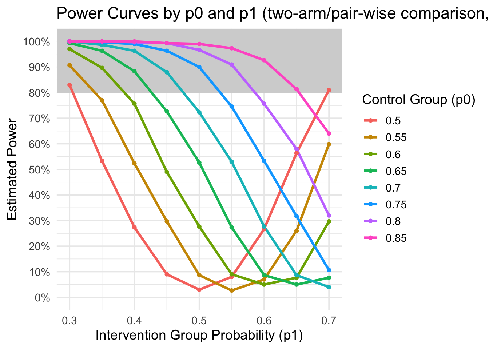{width=672}
:::
:::


### **(2.4.4) Vary ICC**


::: {.cell}

```{.r .cell-code}
icc_values <- seq(0.02, 0.10, by = 0.01)

power_results_glmm <- sapply(icc_values, function(icc) {
  simulate_power_glmmPQL(n_clusters = 26,
                 m_mean = 40,
                 CV = 0.1,
                 p0 = 0.78,
                 p1 = 0.58,
                 icc = icc,
                 re_dist = "gamma",
                 n_sim = 300, # reduced for speed
                 alpha = 0.05,
                 seed = 20250809)
})

df_power_icc_glmm <- data.frame(ICC = icc_values, Power = power_results_glmm)

ggplot(df_power_icc_glmm, aes(x = ICC, y = Power)) +
  geom_line(color = "darkred", size = 1.2) +
  geom_point(color = "firebrick") +
  labs(title = "Power curve by ICC, proportion scale (two-arm/pair-wise comparison, GLMM)",
       x = "Intraclass correlation, proportion scale (ICC)",
       y = "Estimated Power") +
  scale_y_continuous(breaks = seq(0, 1, by = 0.1),
                     limits = c(0, 1),
                     labels = scales::percent_format(accuracy = 1)) +
  theme_minimal()
```

::: {.cell-output-display}
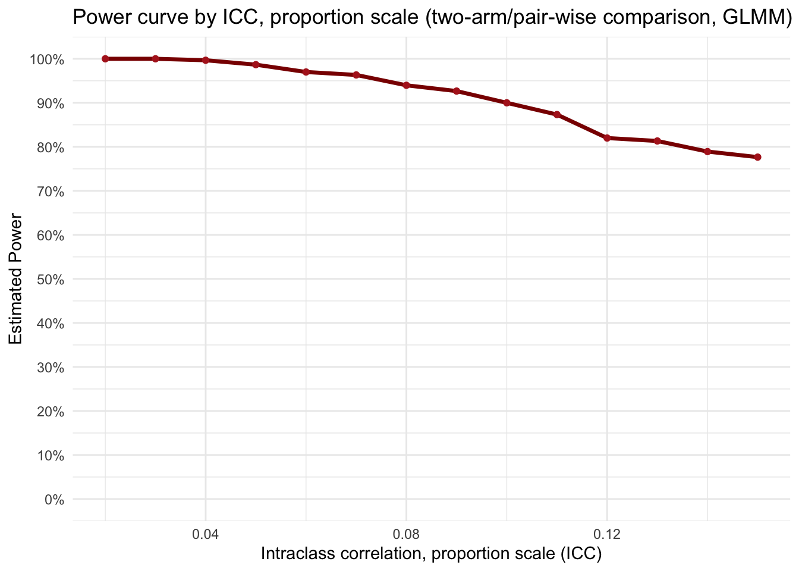{width=672}
:::
:::


### **(2.4.5) Vary number of clusters**


::: {.cell}

```{.r .cell-code}
n_clusters_vec <- seq(10, 30, by = 1)

power_results_glmm <- sapply(n_clusters_vec, function(nc) {
  simulate_power_glmmPQL(n_clusters = nc,
                 m_mean = 40,
                 CV = 0.1,
                 p0 = 0.78,
                 p1 = 0.58,
                 icc = 0.08,
                 re_dist = "gamma",
                 n_sim = 300, # reduced for speed
                 alpha = 0.05,
                 seed = 20250809)
})

df_power_css_glmm <- data.frame(Cluster_ss = n_clusters_vec, Power = power_results_glmm)

ggplot(df_power_css_glmm, aes(x = Cluster_ss, y = Power)) +
  geom_line(color = "darkgreen", size = 1.2) +
  geom_point(color = "forestgreen") +
  labs(title = "Power vs Number of total clusters (two-arm/pair-wise comparison, GLMM)",
       x = "Total number of clusters (two-arm trial)",
       y = "Estimated power") +
  scale_y_continuous(breaks = seq(0, 1, by = 0.1),
                     limits = c(0, 1),
                     labels = scales::percent_format(accuracy = 1)) +
  scale_x_continuous(breaks = seq(10, 30, by = 2)) +
  theme_minimal()
```

::: {.cell-output-display}
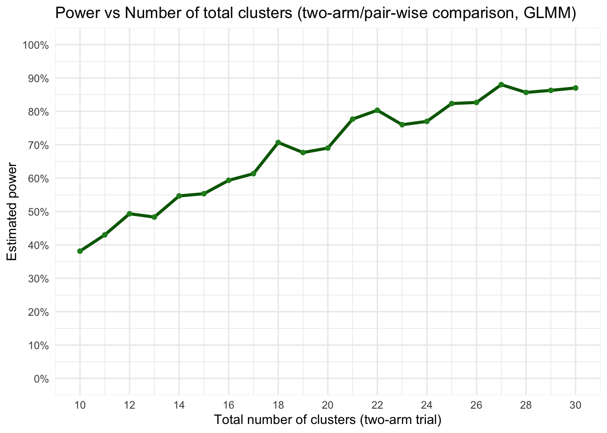{width=672}
:::
:::


## **(2.5) Powering on a smaller effect: power vs. delta at the planned design**

The 25 pp reduction assumed so far is optimistic. Now that the ICC is lower than originally thought, we can power for a lower, more realistic but still clincally meaningful delta, while keeping the planned design of **13 vs 13 clusters** for the main pairwise comparison.

Everything is held fixed at the planned design - ICC 0.10 (proportion scale), 13 clusters per arm, mean cluster size 40, CV 0.1, control rate 75%, alpha 0.05 - and only the effect size varies, from 25 pp down to 10 pp. The horizontal line marks 80% power; where each curve crosses it is that method's minimum detectable effect.

Five curves are shown, because they do not agree and the differences matter:

- **Closed formula** (chapter 1, with the small-sample t correction).

- **Simulation, cluster-level analysis, symmetric (normal) cluster effects.**

- **Simulation, cluster-level analysis, skewed (gamma) cluster effects** - our conservative default.

- **Simulation, GLMM, skewed cluster effects** (glmmPQL with reduced degrees of freedom)

- **Simulation, GLMM, symmetric (normal) cluster effects** (glmmPQL with reduced degrees of freedom)

All simulations are calibrated so that (a) the realised proportion-scale ICC really is 0.10 under the distribution used, and (b) the marginal (population-average) prevalences really are 75% and 75% minus delta, so that all five curves are answering the same question.

Read the gap between the symmetric and the skewed curves as the cost of the distributional assumption, and the gap between the two skewed curves as the cost of the analysis method. The former is the larger open question for this trial.


::: {.cell}

```{.r .cell-code}
## Design held fixed at the planned trial
n_clusters_total <- 26   # 13 vs 13, the main pairwise comparison
m_mean_fix <- 40
CV_fix <- 0.1
p0_fix <- 0.78
ICC_fix <- 0.08          # proportion scale
alpha_fix <- 0.05
target_power <- 0.80
re_dist_fix <- "gamma"   # the SKEWED stress-test curve; pilot log-odds are symmetric (skew +0.14),
                         # so the "symmetric" curves below are the primary planning basis

# Effect sizes: 25 pp down to 10 pp
deltas_pp <- seq(25, 10, by = -1)

## (a) Closed formula, small-sample corrected (helpers from chapter 1)
power_formula <- sapply(deltas_pp, function(d)
  power_crt(cohen_h(p0_fix - d/100, p0_fix),
            n_clusters_arm = n_clusters_total/2,
            m = m_mean_fix, CV = CV_fix, ICC = ICC_fix,
            alpha = alpha_fix, small_sample = TRUE))

## (b) Simulation, cluster-level analysis (cheap, so use many replicates).
## Run it under both the symmetric and the skewed cluster-effect distribution.
power_sim_clan_norm <- sapply(deltas_pp, function(d)
  simulate_power(n_clusters = n_clusters_total, m_mean = m_mean_fix, CV = CV_fix,
                 p0 = p0_fix, p1 = p0_fix - d/100, icc = ICC_fix,
                 re_dist = "normal", n_sim = 10000,
                 alpha = alpha_fix, seed = 20250809))

power_sim_clan <- sapply(deltas_pp, function(d)
  simulate_power(n_clusters = n_clusters_total, m_mean = m_mean_fix, CV = CV_fix,
                 p0 = p0_fix, p1 = p0_fix - d/100, icc = ICC_fix,
                 re_dist = re_dist_fix, n_sim = 10000,
                 alpha = alpha_fix, seed = 20250809))

## (c) Simulation, GLMM (expensive -> run the effect sizes in parallel).
## Each call seeds itself internally, so the result is reproducible regardless of scheduling.
plan(multisession, workers = max(1, min(8, availableCores() - 1)))
power_sim_glmm <- future_sapply(deltas_pp, function(d)
  simulate_power_glmmPQL(n_clusters = n_clusters_total, m_mean = m_mean_fix, CV = CV_fix,
                         p0 = p0_fix, p1 = p0_fix - d/100, icc = ICC_fix,
                         re_dist = re_dist_fix, n_sim = 1000,
                         alpha = alpha_fix, seed = 20250809),
  future.seed = TRUE)

power_sim_glmm_norm <- future_sapply(deltas_pp, function(d)
  simulate_power_glmmPQL(n_clusters = n_clusters_total, m_mean = m_mean_fix, CV = CV_fix,
                         p0 = p0_fix, p1 = p0_fix - d/100, icc = ICC_fix,
                         re_dist = "normal", n_sim = 1000,
                         alpha = alpha_fix, seed = 20250809),
  future.seed = TRUE)
plan(sequential)

method_levels <- c("Closed formula (t-corrected)",
                   "Simulation: cluster-level, symmetric cluster effects",
                   "Simulation: cluster-level, skewed cluster effects",
                   "Simulation: GLMM (SAP primary), skewed cluster effects",
                   "Simulation: GLMM (SAP primary), symmetric cluster effects")

df_delta <- data.frame(
  delta_pp = rep(deltas_pp, 5),
  power = c(power_formula, power_sim_clan_norm, power_sim_clan,
            power_sim_glmm, power_sim_glmm_norm),
  method = factor(rep(method_levels, each = length(deltas_pp)), levels = method_levels)
)

# Minimum detectable effect per method: smallest delta still reaching 80% power
mde_tbl <- df_delta %>%
  group_by(method) %>%
  summarise(mde_pp = if(any(power >= target_power)) min(delta_pp[power >= target_power]) else NA_real_,
            .groups = "drop")
knitr::kable(mde_tbl, digits = 1,
             col.names = c("Method", "Minimum detectable effect (pp) at 80% power"))
```

::: {.cell-output-display}
`````{=html}
<table>
 <thead>
  <tr>
   <th style="text-align:left;"> Method </th>
   <th style="text-align:right;"> Minimum detectable effect (pp) at 80% power </th>
  </tr>
 </thead>
<tbody>
  <tr>
   <td style="text-align:left;"> Closed formula (t-corrected) </td>
   <td style="text-align:right;"> 17 </td>
  </tr>
  <tr>
   <td style="text-align:left;"> Simulation: cluster-level, symmetric cluster effects </td>
   <td style="text-align:right;"> 18 </td>
  </tr>
  <tr>
   <td style="text-align:left;"> Simulation: cluster-level, skewed cluster effects </td>
   <td style="text-align:right;"> 22 </td>
  </tr>
  <tr>
   <td style="text-align:left;"> Simulation: GLMM (SAP primary), skewed cluster effects </td>
   <td style="text-align:right;"> 19 </td>
  </tr>
  <tr>
   <td style="text-align:left;"> Simulation: GLMM (SAP primary), symmetric cluster effects </td>
   <td style="text-align:right;"> 18 </td>
  </tr>
</tbody>
</table>

`````
:::
:::


::: {.cell}

```{.r .cell-code}
ggplot(df_delta, aes(x = delta_pp, y = power, colour = method)) +
  annotate("rect", xmin = -Inf, xmax = Inf, ymin = target_power, ymax = Inf,
           fill = "grey85", alpha = 0.5) +
  geom_hline(yintercept = target_power, linetype = "dashed", colour = "red") +
  geom_line(linewidth = 1.1) +
  geom_point(size = 2) +
  scale_x_reverse(breaks = seq(25, 10, by = -1)) +
  scale_y_continuous(breaks = seq(0, 1, by = 0.1), limits = c(0, 1),
                     labels = scales::percent_format(accuracy = 1)) +
  scale_colour_manual(values = setNames(
    c("grey35", "#7EA6D9", "#1F4E9C", "#8B1A1A", "#E8836F"), method_levels)) +
  guides(colour = guide_legend(ncol = 2)) +
  labs(title = "Power vs. effect size at the planned design (13 vs 13 clusters)",
       subtitle = paste0("ICC ", ICC_fix, " (proportion scale), control rate ",
                         p0_fix*100, "%, mean cluster size ", m_mean_fix,
                         ", CV ", CV_fix, ", alpha ", alpha_fix, "\n",
                         "Marginal effect sizes; shaded band = 80% power or above"),
       x = "Effect size (percentage point reduction vs. control)",
       y = "Power",
       colour = NULL) +
  theme_minimal(base_size = 13) +
  theme(legend.position = "bottom", plot.title = element_text(face = "bold"))
```

::: {.cell-output-display}
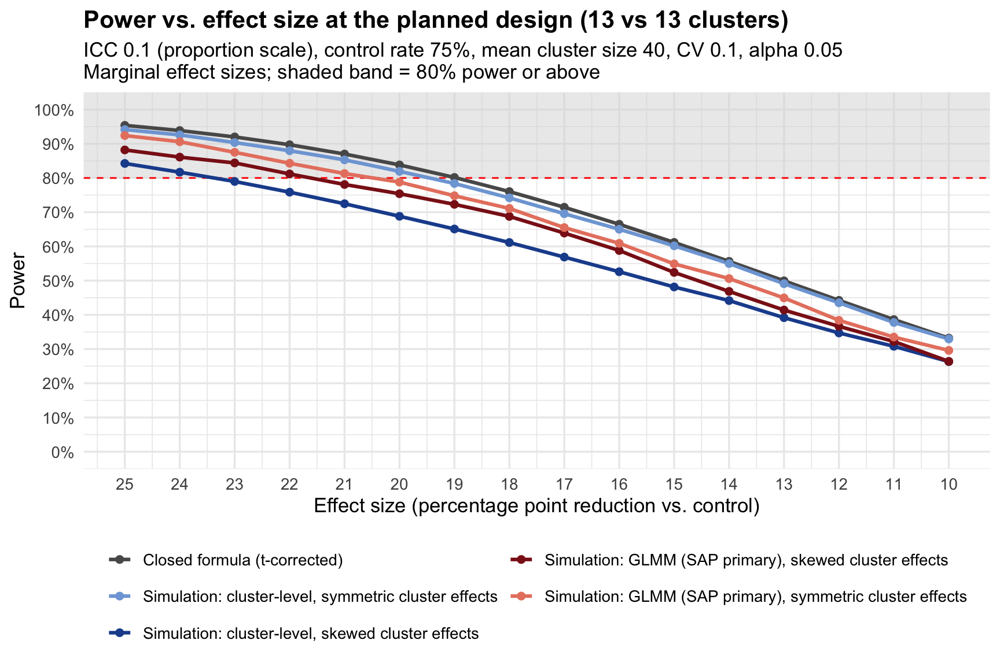{width=864}
:::
:::


## **(2.6) Verification of the simulation**

Checks that the data generating mechanism delivers what it is asked for, and that the test is valid.


::: {.cell}

```{.r .cell-code}
set.seed(20250809)

## Check 1 - type I error. The single most important check: with no true effect
## (p1 = p0) the rejection rate must be close to the nominal 5%.
t1_grid <- expand.grid(dist = c("normal","gamma","uniform"),
                       n_clusters = c(26, 16), stringsAsFactors = FALSE)
t1_grid$type_I <- mapply(function(d, nc)
  simulate_power(n_clusters = nc, m_mean = 40, CV = 0.1, p0 = 0.78, p1 = 0.78,
                 icc = 0.08, re_dist = d, n_sim = 4000, alpha = 0.05, seed = 11),
  t1_grid$dist, t1_grid$n_clusters)

## Check 2 - realised proportion-scale ICC matches the requested 0.08 under each
## u_j distribution (this is what sigma_b_for_icc is for)
icc_check <- sapply(c("normal","gamma","uniform"), function(d){
  s <- sigma_b_for_icc(0.08, 0.78, d)
  u <- generate_u(2e5, s, dist = d)
  p <- plogis(qlogis(0.78) + u); pb <- mean(p)
  c(sigma_b = s, realised_ICC = var(p)/(pb*(1-pb)))
})

## Check 3 - realised cluster sizes match the requested mean 40 and CV 0.1
sz <- replicate(2000, generate_cluster_sizes(26, 40, 0.1))

## Check 4 - u_j moments: mean 0, SD sigma_b, and the intended skew (gamma ~ +1.4)
u_check <- sapply(c("normal","gamma","uniform"), function(d){
  s <- sigma_b_for_icc(0.08, 0.78, d)
  u <- generate_u(2e5, s, dist = d)
  c(mean = mean(u), sd = sd(u), skew = mean((u-mean(u))^3)/sd(u)^3)
})

cat("Check 1 - type I error (nominal 0.05):\n")
```

::: {.cell-output .cell-output-stdout}

```
Check 1 - type I error (nominal 0.05):
```


:::

```{.r .cell-code}
print(t1_grid, row.names = FALSE)
```

::: {.cell-output .cell-output-stdout}

```
    dist n_clusters  type_I
  normal         26 0.05050
   gamma         26 0.04650
 uniform         26 0.04475
  normal         16 0.04825
   gamma         16 0.05150
 uniform         16 0.04950
```


:::

```{.r .cell-code}
cat("\nCheck 2 - realised proportion-scale ICC (target 0.08):\n")
```

::: {.cell-output .cell-output-stdout}

```

Check 2 - realised proportion-scale ICC (target 0.08):
```


:::

```{.r .cell-code}
print(round(icc_check, 4))
```

::: {.cell-output .cell-output-stdout}

```
             normal  gamma uniform
sigma_b      0.7015 0.8921  0.7032
realised_ICC 0.0798 0.0801  0.0800
```


:::

```{.r .cell-code}
cat("\nCheck 3 - cluster sizes (target mean 40, CV 0.10):\n")
```

::: {.cell-output .cell-output-stdout}

```

Check 3 - cluster sizes (target mean 40, CV 0.10):
```


:::

```{.r .cell-code}
cat("  mean =", round(mean(sz), 2), " CV =", round(sd(as.vector(sz))/mean(sz), 4),
    " range =", min(sz), "-", max(sz), "\n")
```

::: {.cell-output .cell-output-stdout}

```
  mean = 40  CV = 0.1006  range = 33 - 47 
```


:::

```{.r .cell-code}
cat("\nCheck 4 - u_j moments (target mean 0, skew ~+1.4 for gamma, ~0 otherwise):\n")
```

::: {.cell-output .cell-output-stdout}

```

Check 4 - u_j moments (target mean 0, skew ~+1.4 for gamma, ~0 otherwise):
```


:::

```{.r .cell-code}
print(round(u_check, 4))
```

::: {.cell-output .cell-output-stdout}

```
      normal  gamma uniform
mean -0.0009 0.0009 -0.0004
sd    0.7030 0.8942  0.7021
skew -0.0076 1.4229  0.0019
```


:::
:::


**Interpretation and known limitations:**

- Type I error is correctly calibrated at roughly 5% for all cluster-effect distributions and at both 26 and 16 clusters. The cluster-level t-test with the 0.5 continuity correction is valid in this regime, so the power estimates can be trusted.

- Where the "skewed distribution" power penalty comes from: It is worth being precise about this, because it drives the results in chapter 2.5. Holding σ_b fixed and only changing the *shape* of u_j costs almost nothing. The entire penalty appears only once we insist that each distribution reproduce the *same proportion-scale ICC of 0.08*: the gamma then needs σ_b = 0.892 rather than 0.702, and power at a 20 pp effect falls from 0.888 to 0.760. The reason is that the gamma's long right tail pushes cluster probabilities up against the ceiling of 1 (the control rate is already 0.78), where they add little to Var(p_j); to hit a given proportion-scale ICC it therefore needs much more variance on the log-odds scale - which is precisely the scale the analysis works on. So the conservative gamma scenario is really a statement about how much log-odds heterogeneity is implied by an observed ICC of 0.08, not about skewness per se. The under-5 pilot shows symmetric facility log-odds (skew +0.14, Shapiro-Wilk p = 0.32), so the symmetric curves in chapter 2.5 are the primary planning basis and the gamma is retained as a stress test.

- **The effect size is now specified on the marginal (population-average) scale**, matching what the closed formula in chapter 1 assumes and what "a 20 pp reduction in prescribing" means in the protocol. This was previously wrong and was the single largest source of disagreement between chapters 1 and 2: setting `beta0 = qlogis(p0)` and `beta1 = log(OR)` makes 0.78 and 0.58 the *cluster-specific* probabilities (those of a cluster with u_j = 0), and averaging over u_j pulls both toward 0.5, so the nominal 20 pp actually generated a marginal 0.759 -\> 0.572, i.e. only **18.7 pp**. `calibrate_marginal()` now solves for both coefficients so the marginal prevalences are exactly p0 and p1.

- Under symmetry the closed form and the simulation now agree closely once both are asked for the same marginal effect. Type I error is unchanged at \~0.05 after calibration, confirming the extra power is real and not an artefact of a broken test.

# **(3) Simulate the full dataset and implement the main analysis strategy**

**The main analysis strategy as per SAP:**

- Due to the relatively low number of clusters in each pair-wise comparison (n=\<30), we use a generalized linear mixed model (GLMM) with restricted pseudo-likelihood estimation and small-sample correction for degrees of freedom (clusters minus cluster-level parameters), as suggested by Thompson and colleagues(ref)

- We will adjust the model for these *a priori* defined covariates (as fixed effects):

  - Cluster-level covariates (cluster mean): attendance rate and baseline antibiotic prescription rate (as continuous covariates assuming linearity)

  - Individual-level covariates: Self-reported sex (as binary covariate: male, female) and age (as continuous covariates assuming non-linear association modelled using restricted cubic splines with 3 knots at 10^th^, 50^th^ and 90^th^ percentiles of the observed age distribution

- We will report the resulting treatment-effect (beta-1), which is the log-odds difference between intervention and control or – when exponentiated – the adjusted odds ratio, with its 95% confidence interval. This represents a relative cluster-specific effect, conditional on all included covariates. In addition, we will use marginal standardization and report the resulting population-average marginal relative risk and risk difference with their 95% confidence intervals

**Notes on simulating a realistic dataset:**

- We reuse the helper functions from chapter 2.2, incl. conservative gamma distribution for u_j

- Causal structure:

  - Cluster latent effect (u_j) influences both, baseline AB prescription rate (through alpha, the correlation strength between baseline and u_j) and attendance rate (through att_corr_target) and directly affects the outcome via the cluster random effect

  - Baseline AB prescription rate directly affects the outcome (via beta_baseline), representing residual correlation beyond the shared cluster effect alpha

  - Attendance rate directly affects the outcome (via beta_att), representing residual correlation beyond the shared cluster effect att_corr_target

  - =\> baseline_rate and attendance both directly push the outcome (via beta_baseline and beta_att) and share correlation with u_j (i.e., indirectly push the outcome)

  - =\> all of the above in the sense of: "Larger clusters (=higher attendance rate) -\> higher AB prescription rate at endline" and "Clusters with higher AB prescription rate at baseline -\> higher prescription rate at endline"

  - Treatment (arm 1) directly affects the outcome (through beta_1), but correlation above and noise below masking it

- Add some baseline noise (e.g. tau = 0.45) ensuring that even clusters with the same u_j will show some variability in their observed baseline_rate

- alpha (correlation baseline_rate with u_j): e.g. a value of 0.3 means 30% of the variation in the baseline logit is driven by u_j (i.e. drives true cluster tendency or the "cluster-to-cluster variation" at baseline, which also has an impact on the outcome), while the remaining comes from independent measurement noise.

- Produce an individual-level dataset, not cluster-level only - as the real-life dataset will look like and in case we also want to add individual-level correlations

## **(3.1) Simulate one dataset and check some diagnostics**


::: {.cell}

```{.r .cell-code}
## We use the helper functions from chapter 2.2

# icc_to_sigma
# generate_u
# generate_cluster_sizes
# p_to_beta0
# p0_p1_to_OR

## General parameters
set.seed(20250809)
n_clusters <- 26
m_mean <- 40
CV <- 0.1
p0 <- 0.78
p1 <- 0.58
OR <- p0_p1_to_OR(p0, p1)
icc <- 0.08 # ICC on the PROPORTION scale (under-5 pilot); sigma_b derived for the chosen re_dist below
re_dist <- "gamma" # distribution for u_j, keep it conservative

# Individual-level covariates
age_mean <- 35
age_sd <- 12
sex_prob <- 0.48

## Generate cluster structure
sizes <- generate_cluster_sizes(n_clusters, m_mean, CV)
sigma_b <- sigma_b_for_icc(icc, p0, re_dist)
u_j <- generate_u(n_clusters, sigma_b, dist = re_dist)
arm_assign <- sample(rep(0:1, length.out = n_clusters))

# First important thing to mimic: AB prescription rate at baseline
# alpha controls how much the baseline rate depends on the same latent cluster effect
# The bigger alpha, the more high-baseline clusters will also tend to have high endline outcomes indirectly, because u_j is reused in the outcome model => indirect correlation
# Baseline AB prescription rate is explained by u_j + random noise eps + global average level gamma0.
gamma0 <- qlogis(p0) # the average cluster-level log-odds of baseline antibiotic prescription
alpha <- 0.3 # how much baseline (logit) depends on u_j (i.e. the latent cluster effect); 0 would be no correlation (0-1)
tau <- 0.45 # the residual variation (SD) in baseline log-odds not explained by u_j, i.e. the random measurement noise
eps <- rnorm(n_clusters, 0, tau)
logit_b <- gamma0 + alpha * u_j + eps # putting it all together
baseline_rate <- plogis(logit_b) # map back to probability scale

# Second important thing to mimic: Attendance rate at baseline (see prelim data Nina)
# Easier, since it’s approximately normally distributed (per year is large enough)
# attendance = mean + (signal) + (noise)
mean_att_year <- 7786
sd_att_year   <- 3967
att_corr_target <- 0.2 # weak to moderate positive correlation between the latent cluster effect and attendance, so high-prescribers (positive u_j) will tend to be at higher attendance clinics.

sd_uj <- sd(u_j)
att_u_coef <- att_corr_target * sd_att_year / sd_uj # the signal. for each +1 SD in u_j, attendance increases by ~1,760 patients per year.
sd_att_noise <- sqrt(sd_att_year^2 * (1 - att_corr_target^2)) # rest is noise
attendance_year_raw <- mean_att_year + att_u_coef * u_j +
                       rnorm(n_clusters, 0, sd_att_noise)
attendance_year <- pmax(0, round(attendance_year_raw))
attendance_month <- attendance_year / 12

# Third, the island: uncorrelated binary covariate
island <- rbinom(n_clusters, 1, 0.5)

## Fixed effects on outcome, direct correlations on outcome
beta0 <- p_to_beta0(p0) # intercept
beta1 <- log(OR) # intervention effect
beta_baseline <- 0.5 # how strongly the baseline rate predicts the endline outcome, independent of u_j
beta_island <- 0.0 # no correlation
beta_att_per1000 <- 0.02 # how strongly attendance affects the outcome, independent of u_j (per 1000 pats/y)
beta_att <- beta_att_per1000 / 1000

# Calibrate BOTH the intercept and the treatment effect so that the marginal (population-average)
# prevalences really are p0 in the control arm and p1 in the intervention arm.
# Adding u_j, baseline_rate and attendance to the linear predictor shifts the mean outcome
# probability (the logistic link is non-linear), so the intercept has to absorb that shift; and
# for the same reason the cluster-specific log-OR does not deliver a marginal p0 -> p1 contrast.
# Previously this was a hard-coded "beta0 - 1.0" with an uncalibrated beta1, which left the
# realised control prevalence some way off p0 AND the realised effect well short of the intended
# 25 pp. We now solve for both numerically, weighting clusters by their size.
lin_nonint <- beta_baseline * qlogis(baseline_rate) +
              beta_att * attendance_year +
              beta_island * island +
              u_j
beta0_adj <- uniroot(function(b0) sum(sizes * plogis(b0 + lin_nonint)) / sum(sizes) - p0,
                     interval = c(-20, 20))$root
beta1 <- uniroot(function(b1) sum(sizes * plogis(beta0_adj + b1 + lin_nonint)) / sum(sizes) - p1,
                 interval = c(-20, 20))$root
cat("Calibrated intercept beta0_adj =", round(beta0_adj, 3),
    "| calibrated beta1 =", round(beta1, 3),
    "(un-calibrated: beta0 =", round(beta0, 3), ", beta1 =", round(log(OR), 3), ")\n")
```

::: {.cell-output .cell-output-stdout}

```
Calibrated intercept beta0_adj = 0.654 | calibrated beta1 = -1.068 (un-calibrated: beta0 = 1.266 , beta1 = -0.943 )
```


:::

```{.r .cell-code}
## Simulate individual-level data
ind_list <- vector("list", length = n_clusters)
for(j in seq_len(n_clusters)){
  nj <- sizes[j]
  age_j <- rnorm(nj, mean = age_mean, sd = age_sd) # draw from normal
  sex_j <- rbinom(nj, 1, prob = sex_prob) # draw from bernoulli
  
  logit_baseline_j <- qlogis(baseline_rate[j]) # back to logit
  # the log-odds of antibiotic prescription for all individuals in cluster j (same cluster-level predictors for all)
  linpred_j <- beta0_adj +
               beta1 * arm_assign[j] +
               beta_baseline * logit_baseline_j +
               beta_att * attendance_year[j] +
               beta_island * island[j] +
               u_j[j] # latent cluster random effect
  
  p_ij <- plogis(linpred_j) # Predicted probability of receiving an antibiotic for each individual in cluster j. Since all individuals in a cluster share the same cluster-level covariates, p_ij is identical for everyone in the cluster (unless we later include individual-level predictors...)
  y_ij <- rbinom(nj, 1, p_ij) # the outcome; bernoulli with probability p_ij
  
  # save data for this one cluster
  ind_list[[j]] <- data.frame(
    cluster = j,
    arm = arm_assign[j],
    age = age_j,
    sex = sex_j,
    attendance_year = attendance_year[j],
    attendance_month = attendance_month[j],
    island = island[j],
    baseline_rate = baseline_rate[j],
    u_j = u_j[j],
    p = p_ij,
    y = y_ij
  )
}
df_ind <- do.call(rbind, ind_list)

## Cluster-level summary, aggregate at cluster-level
df_cluster <- aggregate(y ~ cluster + arm, data = df_ind, sum) # aggregate number of outcomes
df_cluster$size <- aggregate(y ~ cluster, data = df_ind, length)$y # count number of ind => cluster size
cluster_meta <- data.frame(
  cluster = seq_len(n_clusters),
  arm = arm_assign,
  attendance_year = attendance_year,
  attendance_month = attendance_month,
  island = island,
  baseline_rate = baseline_rate,
  u_j = u_j
)
df_sim <- merge(df_cluster, cluster_meta, by = c("cluster","arm"))
df_sim <- df_sim[order(df_sim$cluster),
                 c("cluster","arm","size","y","baseline_rate",
                   "attendance_year","attendance_month",
                   "island","u_j")]

## Diagnostics
cat("Attendance (year): mean =", mean(attendance_year),
    "SD =", sd(attendance_year),
    "CV =", round(sd(attendance_year)/mean(attendance_year),2), "\n")
```

::: {.cell-output .cell-output-stdout}

```
Attendance (year): mean = 7049 SD = 4585.651 CV = 0.65 
```


:::

```{.r .cell-code}
cat("Target corr (attendance,u_j) =", att_corr_target,
    "Observed corr =", round(cor(attendance_year, u_j),2), "\n")
```

::: {.cell-output .cell-output-stdout}

```
Target corr (attendance,u_j) = 0.2 Observed corr = 0.27 
```


:::

```{.r .cell-code}
cat("Mean baseline_rate =", round(mean(baseline_rate),3), "\n")
```

::: {.cell-output .cell-output-stdout}

```
Mean baseline_rate = 0.769 
```


:::

```{.r .cell-code}
cat("Beta_att (per 1000 patients/year) =", beta_att_per1000,
    "=> clinic with 1000 more patients/year has OR =", round(exp(beta_att_per1000),3), " of prescribing antibiotics\n\n")
```

::: {.cell-output .cell-output-stdout}

```
Beta_att (per 1000 patients/year) = 0.02 => clinic with 1000 more patients/year has OR = 1.02  of prescribing antibiotics
```


:::

```{.r .cell-code}
cat("First few cluster-level rows:\n")
```

::: {.cell-output .cell-output-stdout}

```
First few cluster-level rows:
```


:::

```{.r .cell-code}
print(head(df_sim, 10))
```

::: {.cell-output .cell-output-stdout}

```
   cluster arm size  y baseline_rate attendance_year attendance_month island
1        1   0   38 26     0.7545235             484         40.33333      1
12       2   1   45 26     0.7018407            3314        276.16667      1
20       3   0   46 31     0.5219098            5358        446.50000      1
21       4   1   45 37     0.9229372           17338       1444.83333      1
22       5   0   42 34     0.8120310            8159        679.91667      0
23       6   0   41 42     0.8816137            2278        189.83333      0
24       7   1   47 22     0.7067149           11584        965.33333      1
25       8   0   40 32     0.6939769           17009       1417.41667      1
26       9   0   44 21     0.7922936            1313        109.41667      1
2       10   1   40 28     0.9063892            6660        555.00000      0
           u_j
1  -0.47796444
12 -0.18386663
20 -0.06807696
21  1.39287887
22  0.29727741
23  0.91967907
24 -0.43909643
25 -0.24654837
26 -0.96965917
2  -0.08391347
```


:::

```{.r .cell-code}
cat("First few individual-level rows:\n")
```

::: {.cell-output .cell-output-stdout}

```
First few individual-level rows:
```


:::

```{.r .cell-code}
print(head(df_ind, 50))
```

::: {.cell-output .cell-output-stdout}

```
   cluster arm       age sex attendance_year attendance_month island
1        1   0 31.141817   0             484         40.33333      1
2        1   0 38.836085   0             484         40.33333      1
3        1   0 36.036553   0             484         40.33333      1
4        1   0 43.068029   0             484         40.33333      1
5        1   0 33.707015   0             484         40.33333      1
6        1   0 29.838524   1             484         40.33333      1
7        1   0 41.398540   1             484         40.33333      1
8        1   0 45.060521   0             484         40.33333      1
9        1   0 18.519409   1             484         40.33333      1
10       1   0 21.600997   1             484         40.33333      1
11       1   0 26.200323   0             484         40.33333      1
12       1   0 37.607236   0             484         40.33333      1
13       1   0 20.627753   0             484         40.33333      1
14       1   0 55.024518   0             484         40.33333      1
15       1   0 44.204938   1             484         40.33333      1
16       1   0 42.996016   0             484         40.33333      1
17       1   0 29.151747   1             484         40.33333      1
18       1   0 20.397419   1             484         40.33333      1
19       1   0 58.662140   0             484         40.33333      1
20       1   0 38.238681   0             484         40.33333      1
21       1   0 50.367882   0             484         40.33333      1
22       1   0 43.097409   1             484         40.33333      1
23       1   0 36.927717   0             484         40.33333      1
24       1   0 41.338233   0             484         40.33333      1
25       1   0 44.548945   1             484         40.33333      1
26       1   0 25.789525   0             484         40.33333      1
27       1   0 45.963908   1             484         40.33333      1
28       1   0 31.667433   1             484         40.33333      1
29       1   0 30.456096   0             484         40.33333      1
30       1   0 30.160906   0             484         40.33333      1
31       1   0 41.426915   0             484         40.33333      1
32       1   0 51.759286   1             484         40.33333      1
33       1   0 26.230610   0             484         40.33333      1
34       1   0 41.536981   0             484         40.33333      1
35       1   0 49.981626   0             484         40.33333      1
36       1   0 31.490423   1             484         40.33333      1
37       1   0 39.726115   1             484         40.33333      1
38       1   0 41.955090   0             484         40.33333      1
39       2   1  9.124056   0            3314        276.16667      1
40       2   1 42.462407   1            3314        276.16667      1
41       2   1 48.208422   0            3314        276.16667      1
42       2   1 49.436545   0            3314        276.16667      1
43       2   1 14.160414   0            3314        276.16667      1
44       2   1 15.872495   0            3314        276.16667      1
45       2   1 50.214321   1            3314        276.16667      1
46       2   1 41.816423   0            3314        276.16667      1
47       2   1 38.097800   1            3314        276.16667      1
48       2   1 26.032686   1            3314        276.16667      1
49       2   1  5.919001   0            3314        276.16667      1
50       2   1 26.229268   0            3314        276.16667      1
   baseline_rate        u_j         p y
1      0.7545235 -0.4779644 0.6786556 1
2      0.7545235 -0.4779644 0.6786556 0
3      0.7545235 -0.4779644 0.6786556 0
4      0.7545235 -0.4779644 0.6786556 1
5      0.7545235 -0.4779644 0.6786556 0
6      0.7545235 -0.4779644 0.6786556 0
7      0.7545235 -0.4779644 0.6786556 1
8      0.7545235 -0.4779644 0.6786556 1
9      0.7545235 -0.4779644 0.6786556 0
10     0.7545235 -0.4779644 0.6786556 1
11     0.7545235 -0.4779644 0.6786556 1
12     0.7545235 -0.4779644 0.6786556 1
13     0.7545235 -0.4779644 0.6786556 1
14     0.7545235 -0.4779644 0.6786556 0
15     0.7545235 -0.4779644 0.6786556 1
16     0.7545235 -0.4779644 0.6786556 1
17     0.7545235 -0.4779644 0.6786556 1
18     0.7545235 -0.4779644 0.6786556 1
19     0.7545235 -0.4779644 0.6786556 0
20     0.7545235 -0.4779644 0.6786556 1
21     0.7545235 -0.4779644 0.6786556 0
22     0.7545235 -0.4779644 0.6786556 1
23     0.7545235 -0.4779644 0.6786556 1
24     0.7545235 -0.4779644 0.6786556 0
25     0.7545235 -0.4779644 0.6786556 0
26     0.7545235 -0.4779644 0.6786556 1
27     0.7545235 -0.4779644 0.6786556 1
28     0.7545235 -0.4779644 0.6786556 1
29     0.7545235 -0.4779644 0.6786556 1
30     0.7545235 -0.4779644 0.6786556 0
31     0.7545235 -0.4779644 0.6786556 1
32     0.7545235 -0.4779644 0.6786556 1
33     0.7545235 -0.4779644 0.6786556 1
34     0.7545235 -0.4779644 0.6786556 1
35     0.7545235 -0.4779644 0.6786556 0
36     0.7545235 -0.4779644 0.6786556 1
37     0.7545235 -0.4779644 0.6786556 1
38     0.7545235 -0.4779644 0.6786556 1
39     0.7018407 -0.1838666 0.4742102 0
40     0.7018407 -0.1838666 0.4742102 1
41     0.7018407 -0.1838666 0.4742102 1
42     0.7018407 -0.1838666 0.4742102 1
43     0.7018407 -0.1838666 0.4742102 0
44     0.7018407 -0.1838666 0.4742102 1
45     0.7018407 -0.1838666 0.4742102 1
46     0.7018407 -0.1838666 0.4742102 1
47     0.7018407 -0.1838666 0.4742102 0
48     0.7018407 -0.1838666 0.4742102 1
49     0.7018407 -0.1838666 0.4742102 1
50     0.7018407 -0.1838666 0.4742102 1
```


:::

```{.r .cell-code}
cat("\nOverall N =", sum(df_sim$size), "individuals across", n_clusters, "clusters\n")
```

::: {.cell-output .cell-output-stdout}

```

Overall N = 1075 individuals across 26 clusters
```


:::

```{.r .cell-code}
# Compute mean prescription rate per arm
arm_rates <- aggregate(y ~ arm, data = df_ind, mean)
arm_rates$y <- round(arm_rates$y, 3)
for(i in seq_len(nrow(arm_rates))){
  cat("Arm", arm_rates$arm[i], "observed prescription rate:", arm_rates$y[i], "\n")
}
```

::: {.cell-output .cell-output-stdout}

```
Arm 0 observed prescription rate: 0.751 
Arm 1 observed prescription rate: 0.639 
```


:::

```{.r .cell-code}
invisible(list(individual = df_ind, cluster = df_sim)) # prevents automatic printing to console
```
:::


## **(3.2) The analysis approach, step-by-step**

Note on the small-sample degrees of freedom: as per SAP, the correction is "clusters minus **cluster-level** parameters" (Thompson & Leyrat). Individual-level covariates (sex, the age splines) are estimated from individual-level information and do not consume cluster-level degrees of freedom, so they must not be subtracted. Subtracting df = 26 - 5 = 21 (DOUBLE-CHECK SAP!!!)


::: {.cell}

```{.r .cell-code}
# Which fixed effects are CLUSTER-level? Only these consume cluster-level degrees of freedom.
cluster_level_terms <- c("(Intercept)", "arm1", "baseline_rate", "attendance_year", "island1")
n_cluster_params <- function(model){
  sum(names(fixef(model)) %in% cluster_level_terms)
}

## Precompute spline basis for age and convert to numeric
age_spline <- as.data.frame(ns(df_ind$age, knots = quantile(df_ind$age, probs=c(0.1,0.5,0.9))))
colnames(age_spline) <- paste0("age_spline", seq_len(ncol(age_spline)))
age_spline[] <- lapply(age_spline, as.numeric)
df_ind <- cbind(df_ind, age_spline)

## Ensure factor levels
df_ind$arm <- factor(df_ind$arm, levels = c(0,1)) # 0 = control, 1 = intervention
df_ind$sex <- factor(df_ind$sex, levels = c(0,1)) # 0 = male, 1 = female
df_ind$island <- factor(df_ind$island, levels = c(0,1)) # 0 = "Unguja", 1 = "Pemba"

## Fit GLMM (fully adjusted)
spline_cols <- colnames(df_ind)[grepl("^age_spline", colnames(df_ind))]
form <- as.formula(
  paste("y ~ arm + baseline_rate + attendance_year + island + sex +",
        paste(spline_cols, collapse=" + "))
)
model_pql <- glmmPQL(
  fixed = form,
  random = ~1 | cluster,
  family = binomial(link="logit"),
  data = df_ind,
  verbose = FALSE
)
summary(model_pql)
```

::: {.cell-output .cell-output-stdout}

```
Linear mixed-effects model fit by maximum likelihood
  Data: df_ind 
  AIC BIC logLik
   NA  NA     NA

Random effects:
 Formula: ~1 | cluster
        (Intercept)  Residual
StdDev:   0.5329561 0.9697334

Variance function:
 Structure: fixed weights
 Formula: ~invwt 
Fixed effects:  y ~ arm + baseline_rate + attendance_year + island + sex + age_spline1 +      age_spline2 + age_spline3 + age_spline4 
                    Value Std.Error   DF   t-value p-value
(Intercept)     -2.917688 1.3502163 1044 -2.160904  0.0309
arm1            -0.846324 0.2670301   21 -3.169397  0.0046
baseline_rate    4.237671 1.4812862   21  2.860805  0.0094
attendance_year  0.000057 0.0000315   21  1.816888  0.0835
island1         -0.179735 0.2774497   21 -0.647812  0.5241
sex1             0.017728 0.1355381 1044  0.130798  0.8960
age_spline1      0.661268 0.6343231 1044  1.042479  0.2974
age_spline2      0.603808 0.5961588 1044  1.012832  0.3114
age_spline3      0.948171 1.5398964 1044  0.615737  0.5382
age_spline4     -0.625433 0.9003859 1044 -0.694628  0.4874
 Correlation: 
                (Intr) arm1   bsln_r attnd_ islnd1 sex1   ag_sp1 ag_sp2 ag_sp3
arm1             0.130                                                        
baseline_rate   -0.834 -0.247                                                 
attendance_year -0.051 -0.182 -0.048                                          
island1         -0.257 -0.067  0.231 -0.313                                   
sex1            -0.045 -0.008 -0.008  0.003 -0.007                            
age_spline1     -0.477  0.019 -0.002 -0.032  0.010  0.011                     
age_spline2     -0.436  0.016  0.013 -0.016 -0.013  0.033  0.644              
age_spline3     -0.493  0.024  0.003 -0.026  0.014  0.001  0.875  0.725       
age_spline4     -0.032  0.021 -0.020 -0.024  0.046 -0.036  0.254 -0.280  0.313

Standardized Within-Group Residuals:
       Min         Q1        Med         Q3        Max 
-3.3179034 -1.1427766  0.4952885  0.7254385  1.1679505 

Number of Observations: 1075
Number of Groups: 26 
```


:::

```{.r .cell-code}
### Now, let's make a few comparisons
## 1. Unadjusted OR
form_unadj <- y ~ arm
model_unadj <- glmmPQL(
  fixed = form_unadj,
  random = ~1|cluster,
  family = binomial(link="logit"),
  data = df_ind,
  verbose = FALSE
)
coef_name_unadj <- grep("^arm", names(fixef(model_unadj)), value=TRUE)
coef_arm_unadj <- fixef(model_unadj)[coef_name_unadj]
se_arm_unadj <- summary(model_unadj)$tTable[coef_name_unadj,"Std.Error"]
df_unadj <- length(unique(df_ind$cluster)) - n_cluster_params(model_unadj)
t_stat_unadj <- coef_arm_unadj / se_arm_unadj
p_val_unadj <- 2 * pt(-abs(t_stat_unadj), df=df_unadj) # small sample correction
OR_unadj <- exp(coef_arm_unadj)
CI_unadj <- exp(coef_arm_unadj + c(-1,1)*qt(0.975, df=df_unadj)*se_arm_unadj)

## 2. Adjusted for stratification variables only
form_strata <- y ~ arm + baseline_rate + attendance_year + island
model_strata <- glmmPQL(
  fixed = form_strata,
  random = ~1|cluster,
  family = binomial(link="logit"),
  data = df_ind,
  verbose = FALSE
)
coef_name_strata <- grep("^arm", names(fixef(model_strata)), value=TRUE)
coef_arm_strata <- fixef(model_strata)[coef_name_strata]
se_arm_strata <- summary(model_strata)$tTable[coef_name_strata,"Std.Error"]
df_strata <- length(unique(df_ind$cluster)) - n_cluster_params(model_strata)
t_stat_strata <- coef_arm_strata / se_arm_strata
p_val_strata <- 2 * pt(-abs(t_stat_strata), df=df_strata) # small sample correction
OR_strata <- exp(coef_arm_strata)
CI_strata <- exp(coef_arm_strata + c(-1,1)*qt(0.975, df=df_strata)*se_arm_strata)

## 3. Fully adjusted, age as spline (see main model above)
coef_name_full <- grep("^arm", names(fixef(model_pql)), value=TRUE)
coef_arm_full <- fixef(model_pql)[coef_name_full]
se_arm_full <- summary(model_pql)$tTable[coef_name_full,"Std.Error"]
df_full <- length(unique(df_ind$cluster)) - n_cluster_params(model_pql)
t_stat_full <- coef_arm_full / se_arm_full
p_val_full <- 2 * pt(-abs(t_stat_full), df=df_full) # small sample correction
OR_full <- exp(coef_arm_full)
CI_full <- exp(coef_arm_full + c(-1,1)*qt(0.975, df=df_full)*se_arm_full)

## 4. And finally, calculate RR for the main model, using marginal standardization
RR_model <- tryCatch({
  avg_comparisons(model_pql, variables="arm", type="response", comparison="ratio")
}, error=function(e) NULL)

if(!is.null(RR_model)){
  rr <- RR_model$estimate[1]
  rr_cl <- RR_model$conf.low[1]
  rr_ch <- RR_model$conf.high[1]
} else {
  rr <- rr_cl <- rr_ch <- NA_real_
}

## Combine it all into a table
results_table <- data.frame(
  Metric = c("Unadjusted", "Adjusted for strat only", "Fully adjusted; age spline"),
  OR = c(sprintf("%.3f", OR_unadj),
         sprintf("%.3f", OR_strata),
         sprintf("%.3f", OR_full)),
  CI_lower = c(sprintf("%.3f", CI_unadj[1]),
               sprintf("%.3f", CI_strata[1]),
               sprintf("%.3f", CI_full[1])),
  CI_upper = c(sprintf("%.3f", CI_unadj[2]),
               sprintf("%.3f", CI_strata[2]),
               sprintf("%.3f", CI_full[2])),
  t_based_p_value = c(sprintf("%.3f", p_val_unadj), sprintf("%.3f", p_val_strata), sprintf("%.3f", p_val_full)),
  RR = c(NA, NA, sprintf("%.3f", rr)),
  RR_CI_lower = c(NA, NA, sprintf("%.3f", rr_cl)),
  RR_CI_upper = c(NA, NA, sprintf("%.3f", rr_ch))
)

results_table %>%
  kable("html", caption="Intervention effect: OR and RR with 95% CI (single simulation)") %>%
  kable_styling(bootstrap_options="striped", full_width=FALSE)
```

::: {.cell-output-display}
`````{=html}
<table class="table table-striped" style="width: auto !important; margin-left: auto; margin-right: auto;">
<caption>Intervention effect: OR and RR with 95% CI (single simulation)</caption>
 <thead>
  <tr>
   <th style="text-align:left;"> Metric </th>
   <th style="text-align:left;"> OR </th>
   <th style="text-align:left;"> CI_lower </th>
   <th style="text-align:left;"> CI_upper </th>
   <th style="text-align:left;"> t_based_p_value </th>
   <th style="text-align:left;"> RR </th>
   <th style="text-align:left;"> RR_CI_lower </th>
   <th style="text-align:left;"> RR_CI_upper </th>
  </tr>
 </thead>
<tbody>
  <tr>
   <td style="text-align:left;"> Unadjusted </td>
   <td style="text-align:left;"> 0.550 </td>
   <td style="text-align:left;"> 0.298 </td>
   <td style="text-align:left;"> 1.016 </td>
   <td style="text-align:left;"> 0.056 </td>
   <td style="text-align:left;"> NA </td>
   <td style="text-align:left;"> NA </td>
   <td style="text-align:left;"> NA </td>
  </tr>
  <tr>
   <td style="text-align:left;"> Adjusted for strat only </td>
   <td style="text-align:left;"> 0.430 </td>
   <td style="text-align:left;"> 0.250 </td>
   <td style="text-align:left;"> 0.740 </td>
   <td style="text-align:left;"> 0.004 </td>
   <td style="text-align:left;"> NA </td>
   <td style="text-align:left;"> NA </td>
   <td style="text-align:left;"> NA </td>
  </tr>
  <tr>
   <td style="text-align:left;"> Fully adjusted; age spline </td>
   <td style="text-align:left;"> 0.429 </td>
   <td style="text-align:left;"> 0.246 </td>
   <td style="text-align:left;"> 0.748 </td>
   <td style="text-align:left;"> 0.005 </td>
   <td style="text-align:left;"> 0.788 </td>
   <td style="text-align:left;"> 0.670 </td>
   <td style="text-align:left;"> 0.906 </td>
  </tr>
</tbody>
</table>

`````
:::
:::


CAVE: This is 1 randomly simulated dataset.

Due to correlation structure the adjustment for stratification factors increases power and precision. The further adjustment for individual-level covariates does not change much, makes sense, since there is no built-in correlation at that level in the simulation structure.

RR only constructed for primary model (fully adjusted model)

## **(3.3) Put all together and simulate the power**

1000 simulations, based on dataset simulation (Chapter 3.1) and primary analysis model (Chapter 3.2)


::: {.cell}

```{.r .cell-code}
simulate_crt <- function(
  n_clusters = 26,
  m_mean = 40,
  CV = 0.1,
  p0 = 0.78,
  p1 = 0.58,
  icc = 0.08,
  re_dist = "gamma",
  alpha = 0.3, # weak-moderate correlation between u_j and baseline AB prescription rate
  tau = 0.45, # SD of baseline noise
  mean_att_year = 7786,
  sd_att_year = 3967,
  att_corr_target = 0.2, # weak-moderate correlation between u_j and attendance rate
  beta_baseline = 0.5, # pos correlation: baseline AB rate -> outcome, independent of u_j (matches chapter 3.1)
  beta_att_per1000 = 0.02, # weak-moderate pos correlation: attendance rate -> outcome, independent of u_j
  beta_island = 0.0, # no correlation (was previously read from the global environment)
  age_mean = 35,
  age_sd = 12,
  sex_prob = 0.48
){

  # (1) Compute OR and intercept
  OR <- p0_p1_to_OR(p0, p1)
  beta0 <- p_to_beta0(p0)
  beta1 <- log(OR)
  beta_att <- beta_att_per1000 / 1000

  # (2) Generate clusters
  sizes <- generate_cluster_sizes(n_clusters, m_mean, CV)
  sigma_b <- sigma_b_for_icc(icc, p0, re_dist)
  u_j <- generate_u(n_clusters, sigma_b, dist = re_dist)
  arm_assign <- sample(rep(0:1, length.out = n_clusters))
  
  # (3) Baseline AB prescription rate
  eps <- rnorm(n_clusters, 0, tau)
  logit_b <- qlogis(p0) + alpha * u_j + eps
  baseline_rate <- plogis(logit_b)
  
  # (4) Attendance
  sd_uj <- sd(u_j)
  att_u_coef <- att_corr_target * sd_att_year / sd_uj
  sd_att_noise <- sqrt(sd_att_year^2 * (1 - att_corr_target^2))
  attendance_year_raw <- mean_att_year + att_u_coef * u_j +
                         rnorm(n_clusters, 0, sd_att_noise)
  attendance_year <- pmax(0, round(attendance_year_raw))
  attendance_month <- attendance_year / 12
  
  # (5) Island
  island <- rbinom(n_clusters, 1, 0.5)

  # (5b) Calibrate beta0 AND beta1 so the marginal prevalences really are p0 and p1
  # (see chapter 3.1 - replaces the previous hard-coded "beta0 - 1.0" and uncalibrated beta1)
  lin_nonint <- beta_baseline * qlogis(baseline_rate) +
                beta_att * attendance_year +
                beta_island * island +
                u_j
  beta0_adj <- uniroot(function(b0) sum(sizes * plogis(b0 + lin_nonint)) / sum(sizes) - p0,
                       interval = c(-20, 20))$root
  beta1 <- uniroot(function(b) sum(sizes * plogis(beta0_adj + b + lin_nonint)) / sum(sizes) - p1,
                   interval = c(-20, 20))$root
  
  # (6) Individual-level simulation
  ind_list <- vector("list", length = n_clusters)
  for(j in seq_len(n_clusters)){
    nj <- sizes[j]
    age_j <- rnorm(nj, mean = age_mean, sd = age_sd)
    sex_j <- rbinom(nj, 1, sex_prob)
    logit_baseline_j <- qlogis(baseline_rate[j])
    
    linpred_j <- beta0_adj +
                 beta1 * arm_assign[j] +
                 beta_baseline * logit_baseline_j +
                 beta_att * attendance_year[j] +
                 u_j[j] +
                 beta_island * island[j]
    
    p_ij <- plogis(linpred_j)
    y_ij <- rbinom(nj, 1, p_ij)
    
    ind_list[[j]] <- data.frame(
      cluster = j,
      arm = arm_assign[j],
      age = age_j,
      sex = sex_j,
      attendance_year = attendance_year[j],
      attendance_month = attendance_month[j],
      island = island[j],
      baseline_rate = baseline_rate[j],
      u_j = u_j[j],
      p = p_ij,
      y = y_ij
    )
  }
  
  df_ind <- do.call(rbind, ind_list)
  
  # (7) Cluster-level summary
  df_cluster <- aggregate(y ~ cluster + arm, data = df_ind, sum)
  df_cluster$size <- aggregate(y ~ cluster, data = df_ind, length)$y
  cluster_meta <- data.frame(
    cluster = seq_len(n_clusters),
    arm = arm_assign,
    attendance_year = attendance_year,
    attendance_month = attendance_month,
    island = island,
    baseline_rate = baseline_rate,
    u_j = u_j
  )
  df_sim <- merge(df_cluster, cluster_meta, by = c("cluster","arm"))
  df_sim <- df_sim[order(df_sim$cluster),
                   c("cluster","arm","size","y","baseline_rate",
                     "attendance_year","attendance_month",
                     "island","u_j")]
  
  return(list(
    individual = df_ind,
    cluster = df_sim
  ))
}

# Default simulation
# sim_data <- simulate_crt()
# df_ind <- sim_data$individual
# df_cluster <- sim_data$cluster

# Number of simulations
n_sims <- 1000
set.seed(20250809)

# Storage
# NOTE: these must be named arguments (col = NA). Writing "results$col <- NA" inside
# data.frame() is an assignment, not an argument: it silently mutates whatever object
# called `results` already exists in the environment (e.g. the leftover grid from 2.3.3)
# and produces junk column names, or errors outright in a fresh session.
results <- data.frame(
  sim = 1:n_sims,
  unadj_signif = NA,
  adj_signif = NA,
  beta_unadj = NA,
  beta_adj = NA,
  OR_unadj = NA,
  OR_unadj_lower = NA,
  OR_unadj_upper = NA,
  OR_adj = NA,
  OR_adj_lower = NA,
  OR_adj_upper = NA
)

for(i in seq_len(n_sims)){
  
  # (1) Simulate trial
  sim_data <- simulate_crt()
  df_ind <- sim_data$individual
  
  # (2) Prepare age spline
  age_spline <- as.data.frame(ns(df_ind$age, 
                                 knots = quantile(df_ind$age, probs=c(0.1,0.5,0.9))))
  colnames(age_spline) <- paste0("age_spline", seq_len(ncol(age_spline)))
  df_ind <- cbind(df_ind, age_spline)
  
  # (3) Ensure factors
  df_ind$arm <- factor(df_ind$arm, levels = c(0,1))
  df_ind$sex <- factor(df_ind$sex, levels = c(0,1))
  df_ind$island <- factor(df_ind$island, levels = c(0,1))
  
  # (4) Unadjusted model
  model_unadj <- glmmPQL(
    fixed = y ~ arm,
    random = ~1 | cluster,
    family = binomial(link="logit"),
    data = df_ind,
    verbose = FALSE
  )
  beta1_unadj <- fixef(model_unadj)["arm1"]
  se1_unadj   <- summary(model_unadj)$tTable["arm1","Std.Error"]
  t1 <- beta1_unadj / se1_unadj
  df1 <- length(unique(df_ind$cluster)) - n_cluster_params(model_unadj)
  pval_unadj <- 2 * pt(-abs(t1), df=df1)
  
  # (5) Fully adjusted model
  spline_cols <- colnames(df_ind)[grepl("^age_spline", colnames(df_ind))]
  form <- as.formula(
    paste("y ~ arm + baseline_rate + attendance_year + island + sex +",
          paste(spline_cols, collapse=" + "))
  )
  model_adj <- glmmPQL(
    fixed = form,
    random = ~1 | cluster,
    family = binomial(link="logit"),
    data = df_ind,
    verbose = FALSE
  )
  beta1_adj <- fixef(model_adj)["arm1"]
  se1_adj   <- summary(model_adj)$tTable["arm1","Std.Error"]
  t_adj <- beta1_adj / se1_adj
  df_adj <- length(unique(df_ind$cluster)) - n_cluster_params(model_adj)
  pval_adj <- 2 * pt(-abs(t_adj), df=df_adj)
  
  # (6) Save results including OR and CI
  df1 <- length(unique(df_ind$cluster)) - n_cluster_params(model_unadj)
  tval <- qt(0.975, df=df1)
  results$OR_unadj[i] <- exp(beta1_unadj)
  results$OR_unadj_lower[i] <- exp(beta1_unadj - tval * se1_unadj)
  results$OR_unadj_upper[i] <- exp(beta1_unadj + tval * se1_unadj)
  
  df_adj <- length(unique(df_ind$cluster)) - n_cluster_params(model_adj)
  tval_adj <- qt(0.975, df=df_adj)
  results$OR_adj[i] <- exp(beta1_adj)
  results$OR_adj_lower[i] <- exp(beta1_adj - tval_adj * se1_adj)
  results$OR_adj_upper[i] <- exp(beta1_adj + tval_adj * se1_adj)
  
  results$unadj_signif[i] <- (pval_unadj < 0.05)
  results$adj_signif[i]   <- (pval_adj < 0.05)
}

# (7) Compute estimated power
power_unadj <- mean(results$unadj_signif)
power_adj <- mean(results$adj_signif)

cat("Estimated power (unadjusted)  =", round(power_unadj,4), "\n")
```

::: {.cell-output .cell-output-stdout}

```
Estimated power (unadjusted)  = 0.746 
```


:::

```{.r .cell-code}
cat("Estimated power (fully adjusted) =", round(power_adj,4), "\n")
```

::: {.cell-output .cell-output-stdout}

```
Estimated power (fully adjusted) = 0.903 
```


:::

```{.r .cell-code}
# Summary of ORs
summary(results[,c("OR_unadj","OR_unadj_lower","OR_unadj_upper",
                   "OR_adj","OR_adj_lower","OR_adj_upper")])
```

::: {.cell-output .cell-output-stdout}

```
    OR_unadj      OR_unadj_lower    OR_unadj_upper       OR_adj      
 Min.   :0.1018   Min.   :0.04345   Min.   :0.2052   Min.   :0.1081  
 1st Qu.:0.2714   1st Qu.:0.12397   1st Qu.:0.5745   1st Qu.:0.2825  
 Median :0.3654   Median :0.16711   Median :0.7643   Median :0.3552  
 Mean   :0.3791   Mean   :0.17683   Mean   :0.8272   Mean   :0.3702  
 3rd Qu.:0.4538   3rd Qu.:0.21396   3rd Qu.:1.0044   3rd Qu.:0.4337  
 Max.   :1.3705   Max.   :0.61830   Max.   :3.0378   Max.   :0.9537  
  OR_adj_lower      OR_adj_upper   
 Min.   :0.04391   Min.   :0.2661  
 1st Qu.:0.15259   1st Qu.:0.5182  
 Median :0.19315   Median :0.6457  
 Mean   :0.20280   Mean   :0.6849  
 3rd Qu.:0.24207   3rd Qu.:0.8015  
 Max.   :0.52240   Max.   :2.0619  
```


:::
:::


# **(4) Stratified randomization algorithm**

## **(4.1) Minimization**

Following the method proposed in \[Xiao L, Yank V, Ma J. Algorithm for balancing both continuous and categorical covariates in randomized controlled trials. *Comput Methods Programs Biomed*. 2012;108(3):1185-1190. doi:10.1016/j.cmpb.2012.06.001\](<https://pubmed.ncbi.nlm.nih.gov/22727633/>)

They propose a modified symmetric Kullback–Leibler divergence (KLD) method to balance multi-arm trials. Works the same for a CRT if cluster-level covariates. The KLD method tries to balance both arm sizes and covariates dynamically (and prospectively) as clusters are assigned, but we can also use it with (a) fixed time-point of randomization and (b) fixed arm size (e.g. 13:13:13), by setting Dn = 1 and p_Dn = 1. Enforcing such tight group-size balance while still allow minimization on covariates. In other words, it removes randomness in group totals but keeps balance across covariates =\> stratified randomization.

This has two disadvantages:

1.  Randomization becomes more predictable (esp. towards the end of allocation)
2.  Strict equal group sizes may slightly reduce the algorithm’s ability to optimize covariate balance, because sometimes the “best” assignment for covariates would tip the arm sizes temporarily, esp. in case of small number of clusters.

Number (1) is not a problem in our case since we randomize all at once. Number (2) is the best we can get.

The method works as follows: For the (n+1)th cluster: compute the “amount of imbalance” (using KLD imbalance score) assuming the cluster is assigned to each arm in turn, then bias toward the arm(s) with the smallest value. They recommend: Pk = c(0.8, 0.1, 0.1): the covariate-balance biased-coin probabilities. 80% chance of choosing the arm with the smallest imbalance, 10% chance for the second-smallest, 10% chance for the worst. If all three arms tie, then average all slots (0.8+0.1+0.1)/3 = 0.333 (simple randomization)

Dn: maximum tolerated size imbalance before intervening

p_Dn: probability of forcing assignment to the smallest group once that imbalance is exceeded

- if any arm is ahead by ≥1 cluster, the next cluster is forced to the smallest arm. The “numbers-balance” rule (Sec. 2.3); they introduce p_Dn to reduce predictability vs. setting it to 1, but allow either.

The first 2 sequences (here 6 clusters) are allocated as a permuted block - two per arm - before using minimization. This ensures early variance estimates exist for the KLD and mirrors the recommended start.

The symmetric-KLD part assumes approximate normality for continuous covariates (but they note high robustness even in case of violation)

We demonstrate it on a hypothetical allocation dataset, but will eventually feed the same code with the real allocation dataset.

Structure of allocation dataset:

1.  cluster_id: 1-39
2.  antibiotic_rate
    - Definition: Patients receiving an antibiotic prescription among all presenting at the participating cluster. Mean over past year?

    - Proportion, ranging from 0.44-0.87
3.  attendance_rate
    - All patients presenting at the participating cluster, per month, mean over past year

    - Absolute count, ranging from 200-2000
4.  island
    - Pemba vs Unguja
    - 30:70
5.  arm: allocation 1-3


::: {.cell}

```{.r .cell-code}
set.seed(20250820)

# create hypothetical allocation dataset
n_clusters <- 39
cluster_data <- data.frame(
  cluster_id = 1:n_clusters,
  antibiotic_rate = runif(n_clusters, 0.44, 0.87),
  attendance_rate = sample(200:2000, n_clusters, TRUE),
  island = factor(ifelse(rbinom(n_clusters, 1, prob = 0.3) == 1, "Pemba", "Unguja"))
)
print(cluster_data)
```

::: {.cell-output .cell-output-stdout}

```
   cluster_id antibiotic_rate attendance_rate island
1           1       0.8175535             389 Unguja
2           2       0.4593160             652 Unguja
3           3       0.8621713             372 Unguja
4           4       0.7707444             604  Pemba
5           5       0.4551056            1254  Pemba
6           6       0.6258714             329 Unguja
7           7       0.6704471            1587 Unguja
8           8       0.4909854            1300 Unguja
9           9       0.4857333            1092 Unguja
10         10       0.8505579             615 Unguja
11         11       0.6766742             827  Pemba
12         12       0.4758405            1220  Pemba
13         13       0.4410584             220 Unguja
14         14       0.7559218            1209  Pemba
15         15       0.4635024             546 Unguja
16         16       0.5350358             351 Unguja
17         17       0.8120696            1227  Pemba
18         18       0.7226116             902 Unguja
19         19       0.5457951            1321 Unguja
20         20       0.6043556            1405 Unguja
21         21       0.4889210             561 Unguja
22         22       0.7520059            1124  Pemba
23         23       0.8496349            1692  Pemba
24         24       0.5743991            1941 Unguja
25         25       0.5006325            1005 Unguja
26         26       0.8609247            1735  Pemba
27         27       0.8012171            1581 Unguja
28         28       0.5604527            1544 Unguja
29         29       0.8319907            1630 Unguja
30         30       0.4641657            1164  Pemba
31         31       0.5750356            1382 Unguja
32         32       0.8478091            1822 Unguja
33         33       0.7960053             683 Unguja
34         34       0.4691478            1317  Pemba
35         35       0.5454399             463 Unguja
36         36       0.7230553            1044 Unguja
37         37       0.7860256             968  Pemba
38         38       0.7082810            1777 Unguja
39         39       0.6951461             469 Unguja
```


:::

```{.r .cell-code}
# Parameters for minimization
n_arms <- 3
Dn <- 1
p_Dn <- 1
Pk <- c(0.8, 0.1, 0.1)

## Symmetric KLD for continuous covariates
# the mean-difference term scaled by inverse variances plus a variance-term, summed over covariates, with the 0.5 factor (Eq. (1), continuous part). A tiny eps stabilizes near-zero variances.
symKLD_cont <- function(Xi, Xj, eps = 1e-8) {
  # Xi, Xj : matrices with columns = continuous covariates
  mu_i <- colMeans(Xi)
  mu_j <- colMeans(Xj)
  v_i  <- apply(Xi, 2, var)
  v_j  <- apply(Xj, 2, var)
  # stabilize in case of near-constant covariate within an arm
  v_i  <- pmax(v_i, eps)
  v_j  <- pmax(v_j, eps)
  term_mu  <- ((mu_i - mu_j)^2) * (1 / v_i + 1 / v_j)
  term_var <- (v_i + v_j) * (1 / v_i + 1 / v_j) - 2
  # 0.5 * sum over covariates
  0.5 * sum(term_mu + term_var)
}

## Symmetric KLD for categorical variables
symKLD_cat <- function(fac_i, fac_j, eps = 1e-8) {
  cats <- levels(factor(c(fac_i, fac_j)))
  p_i <- prop.table(table(factor(fac_i, levels = cats)))
  p_j <- prop.table(table(factor(fac_j, levels = cats)))
  p_i <- pmax(p_i, eps)
  p_j <- pmax(p_j, eps)
  0.5 * (sum(p_i * log(p_i / p_j)) + sum(p_j * log(p_j / p_i)))
}

## Combined imbalance measure
symKLD_mixed <- function(Xi, Xj, cont_vars = character(0), cat_vars = character(0)) {
  D <- 0
  if (length(cont_vars) > 0) {
    D <- D + symKLD_cont(Xi[, cont_vars, drop = FALSE],
                         Xj[, cont_vars, drop = FALSE])
  }
  if (length(cat_vars) > 0) {
    for (v in cat_vars) {
      D <- D + symKLD_cat(Xi[[v]], Xj[[v]])
    }
  }
  D
}

## Total imbalance function using mixed covariates
## Multi-arm extension and “what-if” evaluation (Sec. 2.1–2.4)
# For the (n+1)th cluster: compute the “amount of imbalance” assuming the cluster is assigned to each arm in turn, then bias toward the arm(s) with the smallest value (Algorithm Step 4; di construction extended to T > 2 arms). The function pretends to assign the cluster to arm g and sums the pairwise KLDs across all unordered arm pairs under that hypothetical allocation. Terms not affected by the placement cancel in comparisons, so minimizing this total is equivalent to minimizing the paper’s di ranking.
total_imbalance_if <- function(alloc, data, idx, g, n_arms,
                               cont_vars = character(0), cat_vars = character(0)) {
  tmp <- alloc
  tmp[idx] <- g
  arm_X <- lapply(1:n_arms, function(a) data[tmp == a, , drop = FALSE])
  D <- 0
  for (i in 1:(n_arms - 1)) {
    for (j in (i + 1):n_arms) {
      if (nrow(arm_X[[i]]) >= 2 && nrow(arm_X[[j]]) >= 2) {
        D <- D + symKLD_mixed(arm_X[[i]], arm_X[[j]],
                              cont_vars, cat_vars)
      } else {
        D <- D + 1e6  # small penalty if too few per arm
      }
    }
  }
  D
}

## convert imbalance vector d_i to assignment probabilities with proper tie-averaging
# smaller di ⇒ larger probability; if multiple arms tie, average the corresponding P_k positions so tied arms receive the same probability (Sec. 2.2). Normalizing ensures a proper probability vector.
probs_from_di <- function(di, Pk) {
  K <- length(di)
  o <- order(di)# ranks by increasing imbalance
  probs <- numeric(K)
  pos <- 1
  for (tie in split(o, di[o])) {
    k <- length(tie)
    # slots for this tie = pos...(pos+k-1)
    probs[tie] <- mean(Pk[pos:(pos + k - 1)])
    pos <- pos + k
  }
  # normalize, just in case rounding makes probs not sum exactly to 1
  probs / sum(probs)
}

## main randomization
alloc <- rep(NA, n_clusters)

## Start with permuted block (first 2T = 6 clusters: 2 per arm)
init_ids <- sample(1:n_clusters, 2 * n_arms)
alloc[init_ids] <- rep(1:n_arms, each=2)

## MAIN LOOP
cont_vars <- c("antibiotic_rate", "attendance_rate")
cat_vars  <- c("island")  # your new binary covariate

# Remaining clusters to allocate
remaining <- setdiff(1:n_clusters, which(!is.na(alloc)))

for (cl in remaining) {
  # current group-size imbalance (ignore NA entries)
  group_sizes <- tabulate(alloc[!is.na(alloc)], nbins = n_arms)
  # group_sizes <- tabulate(factor(alloc, levels = 1:n_arms), nbins = n_arms)
  max_diff <- max(group_sizes) - min(group_sizes)

  if (max_diff >= Dn) {
    min_group <- which.min(group_sizes)
    if (runif(1) < p_Dn) {
      alloc[cl] <- min_group
      next
    }
  }

  # Compute D_i (hypothetical imbalances) for assigning this cluster to each arm
  di <- sapply(1:n_arms, function(g)
  total_imbalance_if(alloc, cluster_data, cl, g, n_arms,
                     cont_vars, cat_vars))

  # Translate to assignment probabilities with tie-averaging -> Pk probabilities
  prob_vec <- probs_from_di(di, Pk)

  # Safety fallback
  # If for some reason prob_vec is invalid (all zeros, or has NA), then the algorithm falls back to equal randomization (1/3 each)
  if (all(prob_vec == 0) || any(is.na(prob_vec))) {
    prob_vec <- rep(1/n_arms, n_arms)
  }

  # Assign cluster using these probabilities
  # This is the actual biased-coin randomization step; chooses one of the arms 1, 2, 3, according to prob_vec
  alloc[cl] <- sample.int(n_arms, size = 1, prob = prob_vec)

}

# attach allocation
cluster_data$arm <- alloc

# quick sanity check
print(cluster_data)
```

::: {.cell-output .cell-output-stdout}

```
   cluster_id antibiotic_rate attendance_rate island arm
1           1       0.8175535             389 Unguja   2
2           2       0.4593160             652 Unguja   1
3           3       0.8621713             372 Unguja   3
4           4       0.7707444             604  Pemba   1
5           5       0.4551056            1254  Pemba   2
6           6       0.6258714             329 Unguja   3
7           7       0.6704471            1587 Unguja   2
8           8       0.4909854            1300 Unguja   1
9           9       0.4857333            1092 Unguja   3
10         10       0.8505579             615 Unguja   2
11         11       0.6766742             827  Pemba   2
12         12       0.4758405            1220  Pemba   1
13         13       0.4410584             220 Unguja   3
14         14       0.7559218            1209  Pemba   1
15         15       0.4635024             546 Unguja   3
16         16       0.5350358             351 Unguja   1
17         17       0.8120696            1227  Pemba   3
18         18       0.7226116             902 Unguja   2
19         19       0.5457951            1321 Unguja   1
20         20       0.6043556            1405 Unguja   2
21         21       0.4889210             561 Unguja   2
22         22       0.7520059            1124  Pemba   3
23         23       0.8496349            1692  Pemba   2
24         24       0.5743991            1941 Unguja   3
25         25       0.5006325            1005 Unguja   1
26         26       0.8609247            1735  Pemba   1
27         27       0.8012171            1581 Unguja   3
28         28       0.5604527            1544 Unguja   1
29         29       0.8319907            1630 Unguja   2
30         30       0.4641657            1164  Pemba   3
31         31       0.5750356            1382 Unguja   1
32         32       0.8478091            1822 Unguja   2
33         33       0.7960053             683 Unguja   3
34         34       0.4691478            1317  Pemba   3
35         35       0.5454399             463 Unguja   1
36         36       0.7230553            1044 Unguja   2
37         37       0.7860256             968  Pemba   2
38         38       0.7082810            1777 Unguja   1
39         39       0.6951461             469 Unguja   3
```


:::

```{.r .cell-code}
print(table(cluster_data$arm))
```

::: {.cell-output .cell-output-stdout}

```

 1  2  3 
13 13 13 
```


:::

```{.r .cell-code}
print(aggregate(cluster_data[, c("antibiotic_rate", "attendance_rate")],
                by = list(arm = cluster_data$arm), mean))
```

::: {.cell-output .cell-output-stdout}

```
  arm antibiotic_rate attendance_rate
1   1       0.5988004       1120.2308
2   2       0.7172879       1130.4615
3   3       0.6340379        928.0769
```


:::

```{.r .cell-code}
island_table <- table(cluster_data$arm, cluster_data$island)
island_prop <- prop.table(island_table, margin = 1)
barplot(t(island_prop),
        beside = TRUE,
        col = c("steelblue", "tomato"),
        legend.text = TRUE,
        args.legend = list(title = "Island", x = "topright"),
        xlab = "Arm", ylab = "Proportion", main = "Island distribution across arms")
```

::: {.cell-output-display}
{width=672}
:::
:::


## **(4.2) Covariate-constrained randomization**

If we use batch-randomization (all clusters randomized at once and no new clusters entering later), the probably simple covariate-constrained randomization to be used: <https://rethinkingclinicaltrials.org/chapters/design/experimental-designs-and-randomization-schemes/covariate-constrained-randomization/>

- Exact 1:1:1 overall allocation:

  - 13 Control / 13 Intervention 1 / 13 Intervention 2

- Soft stratification for "island":

  - Within island it should roughly be balance in terms of 1:1 intervention: control, across the 3 arms

  - But we prioritize balancing the continuous covariates (below) over exact island distribution (deviation from ideal 1:1:1 allowed)

- Global numeric balance re antibiotic_rate and attendance_rate:

  - Optimise re mean difference between arms
  - Both covariates are standardized (z-scores) so they contribute equally to the balance metric, preventing attendance_rate from dominating (attendance_rate has much larger magnitude than antibiotic_rate)
  - Equal weight for the two continuous covariates because they're standardized and equally important

- Random selection among best allocations to preserve randomness, while enforcing optimal balance

Structure of allocation dataset:

1.  cluster_id: 1-39
2.  antibiotic_rate
    - Definition: Patients receiving an antibiotic prescription among all presenting at the participating cluster. Mean over past year.

    - Proportion, ranging from 0.44-0.87
3.  attendance_rate
    - All patients presenting at the participating cluster, per month, mean over past year

    - Absolute count, ranging from 200-2000
4.  island
    - Pemba vs Unguja
    - 30:70
5.  arm: allocation 1-3


::: {.cell}

```{.r .cell-code}
set.seed(20250820)

# Create hypothetical allocation dataset
n_clusters <- 39
cluster_data <- data.frame(
  cluster_id = 1:n_clusters,
  antibiotic_rate = runif(n_clusters, 0.44, 0.87),
  attendance_rate = sample(200:2000, n_clusters, TRUE),
  island = factor(ifelse(rbinom(n_clusters, 1, prob = 0.3) == 1, "Pemba", "Unguja"))
)
print(cluster_data)
```

::: {.cell-output .cell-output-stdout}

```
   cluster_id antibiotic_rate attendance_rate island
1           1       0.8175535             389 Unguja
2           2       0.4593160             652 Unguja
3           3       0.8621713             372 Unguja
4           4       0.7707444             604  Pemba
5           5       0.4551056            1254  Pemba
6           6       0.6258714             329 Unguja
7           7       0.6704471            1587 Unguja
8           8       0.4909854            1300 Unguja
9           9       0.4857333            1092 Unguja
10         10       0.8505579             615 Unguja
11         11       0.6766742             827  Pemba
12         12       0.4758405            1220  Pemba
13         13       0.4410584             220 Unguja
14         14       0.7559218            1209  Pemba
15         15       0.4635024             546 Unguja
16         16       0.5350358             351 Unguja
17         17       0.8120696            1227  Pemba
18         18       0.7226116             902 Unguja
19         19       0.5457951            1321 Unguja
20         20       0.6043556            1405 Unguja
21         21       0.4889210             561 Unguja
22         22       0.7520059            1124  Pemba
23         23       0.8496349            1692  Pemba
24         24       0.5743991            1941 Unguja
25         25       0.5006325            1005 Unguja
26         26       0.8609247            1735  Pemba
27         27       0.8012171            1581 Unguja
28         28       0.5604527            1544 Unguja
29         29       0.8319907            1630 Unguja
30         30       0.4641657            1164  Pemba
31         31       0.5750356            1382 Unguja
32         32       0.8478091            1822 Unguja
33         33       0.7960053             683 Unguja
34         34       0.4691478            1317  Pemba
35         35       0.5454399             463 Unguja
36         36       0.7230553            1044 Unguja
37         37       0.7860256             968  Pemba
38         38       0.7082810            1777 Unguja
39         39       0.6951461             469 Unguja
```


:::

```{.r .cell-code}
### CCR function for global randomisation with 3 arms
# Create 10000 random allocations
# Score each allocation: Each allocation gets a balance score based on how well it balances the covariates and island distribution. Lower scores = better balance.
# Keep the top 10%: top_pct = 0.10
# Randomly pick one from these top 1000
run_global_ccr <- function(df, n_sims = 10000, top_pct = 0.10) {
  n <- nrow(df)
  
  n_per_arm <- floor(n / 3)
  
  scores <- numeric(n_sims)
  allocs <- matrix(NA, nrow = n_sims, ncol = n)
  
  for (i in 1:n_sims) {
    arm_assign <- sample(c(rep("Control", n_per_arm),
                           rep("Intervention_A", n_per_arm),
                           rep("Intervention_B", n_per_arm)))
    allocs[i, ] <- arm_assign
    temp <- df
    temp$arm <- arm_assign
    
    # Standardize covariates to same scale (mean=0, sd=1) for fair comparison
    temp$antibiotic_rate_std <- scale(temp$antibiotic_rate)
    temp$attendance_rate_std <- scale(temp$attendance_rate)
    
    # Calculate max pairwise difference across all 3 arms
    means_abx <- tapply(temp$antibiotic_rate_std, temp$arm, mean)
    means_att <- tapply(temp$attendance_rate_std, temp$arm, mean)
    
    # Max absolute difference across all pairs of arms for both numeric covariates
    abx_imbal <- max(abs(means_abx["Control"] - means_abx["Intervention_A"]),
                     abs(means_abx["Control"] - means_abx["Intervention_B"]),
                     abs(means_abx["Intervention_A"] - means_abx["Intervention_B"]))
    att_imbal <- max(abs(means_att["Control"] - means_att["Intervention_A"]),
                     abs(means_att["Control"] - means_att["Intervention_B"]),
                     abs(means_att["Intervention_A"] - means_att["Intervention_B"]))
    
    # Soft stratification for island: sum of squared differences from ideal allocation per island
    island_table <- table(temp$island, temp$arm)
    ideal_island <- table(temp$island) / 3  # ideal alloc per arm per island
    island_diff <- 0
    for (arm in c("Control", "Intervention_A", "Intervention_B")) {
      island_diff <- island_diff + 
        sum((island_table[, arm] - ideal_island)^2)
    }
    
    # Total score: sum of imbalances with weight for island; Recap:
    # Maximum difference in mean antibiotic rates across the 3 arms (with weight 1.0)
    # Maximum difference in mean attendance rates across the 3 arms (with weight 1.0)
    # Island distribution deviation from ideal 1:1:1 across arms (weight 0.01; much smaller weight = "soft" stratification)
    # We prioritize balancing the continuous covariates over exact island distribution
    # Equal weight for the two continuous covariates because they're standardized and equally important
    scores[i] <- abx_imbal + att_imbal + 0.01 * island_diff
  }
  
  # Select best allocations
  threshold <- quantile(scores, top_pct)
  best_idx <- which(scores <= threshold)
  chosen <- sample(best_idx, 1)
  
  df$final_arm <- allocs[chosen, ]
  return(df)
}

### Run it
final_result <- run_global_ccr(cluster_data)
print(final_result)
```

::: {.cell-output .cell-output-stdout}

```
   cluster_id antibiotic_rate attendance_rate island      final_arm
1           1       0.8175535             389 Unguja        Control
2           2       0.4593160             652 Unguja        Control
3           3       0.8621713             372 Unguja Intervention_B
4           4       0.7707444             604  Pemba Intervention_A
5           5       0.4551056            1254  Pemba Intervention_B
6           6       0.6258714             329 Unguja Intervention_B
7           7       0.6704471            1587 Unguja Intervention_A
8           8       0.4909854            1300 Unguja Intervention_B
9           9       0.4857333            1092 Unguja Intervention_B
10         10       0.8505579             615 Unguja        Control
11         11       0.6766742             827  Pemba Intervention_B
12         12       0.4758405            1220  Pemba        Control
13         13       0.4410584             220 Unguja Intervention_A
14         14       0.7559218            1209  Pemba Intervention_A
15         15       0.4635024             546 Unguja Intervention_B
16         16       0.5350358             351 Unguja Intervention_A
17         17       0.8120696            1227  Pemba Intervention_A
18         18       0.7226116             902 Unguja        Control
19         19       0.5457951            1321 Unguja        Control
20         20       0.6043556            1405 Unguja Intervention_B
21         21       0.4889210             561 Unguja Intervention_A
22         22       0.7520059            1124  Pemba        Control
23         23       0.8496349            1692  Pemba Intervention_A
24         24       0.5743991            1941 Unguja Intervention_A
25         25       0.5006325            1005 Unguja        Control
26         26       0.8609247            1735  Pemba Intervention_A
27         27       0.8012171            1581 Unguja        Control
28         28       0.5604527            1544 Unguja        Control
29         29       0.8319907            1630 Unguja Intervention_B
30         30       0.4641657            1164  Pemba        Control
31         31       0.5750356            1382 Unguja Intervention_A
32         32       0.8478091            1822 Unguja        Control
33         33       0.7960053             683 Unguja Intervention_B
34         34       0.4691478            1317  Pemba Intervention_B
35         35       0.5454399             463 Unguja        Control
36         36       0.7230553            1044 Unguja Intervention_B
37         37       0.7860256             968  Pemba Intervention_B
38         38       0.7082810            1777 Unguja Intervention_A
39         39       0.6951461             469 Unguja Intervention_A
```


:::

```{.r .cell-code}
### Checks
cat("\nOverall treatment counts:\n")
```

::: {.cell-output .cell-output-stdout}

```

Overall treatment counts:
```


:::

```{.r .cell-code}
print(table(final_result$final_arm))
```

::: {.cell-output .cell-output-stdout}

```

       Control Intervention_A Intervention_B 
            13             13             13 
```


:::

```{.r .cell-code}
cat("\nBalance within each island (aim: approximate 1:1:1):\n")
```

::: {.cell-output .cell-output-stdout}

```

Balance within each island (aim: approximate 1:1:1):
```


:::

```{.r .cell-code}
print(table(final_result$island, final_result$final_arm))
```

::: {.cell-output .cell-output-stdout}

```
        
         Control Intervention_A Intervention_B
  Pemba        3              5              4
  Unguja      10              8              9
```


:::

```{.r .cell-code}
cat("\nBalance by mean antibiotic_rate by arm:\n")
```

::: {.cell-output .cell-output-stdout}

```

Balance by mean antibiotic_rate by arm:
```


:::

```{.r .cell-code}
print(tapply(final_result$antibiotic_rate, final_result$final_arm, mean))
```

::: {.cell-output .cell-output-stdout}

```
       Control Intervention_A Intervention_B 
     0.6417998      0.6721246      0.6362018 
```


:::

```{.r .cell-code}
cat("\nBalance by mean attendance_rate by arm:\n")
```

::: {.cell-output .cell-output-stdout}

```

Balance by mean attendance_rate by arm:
```


:::

```{.r .cell-code}
print(tapply(final_result$attendance_rate, final_result$final_arm, mean))
```

::: {.cell-output .cell-output-stdout}

```
       Control Intervention_A Intervention_B 
     1061.6923      1135.0000       982.0769 
```


:::

```{.r .cell-code}
cat("\nStandard deviations:\n")
```

::: {.cell-output .cell-output-stdout}

```

Standard deviations:
```


:::

```{.r .cell-code}
cat("antibiotic_rate SD:", sd(final_result$antibiotic_rate), "\n")
```

::: {.cell-output .cell-output-stdout}

```
antibiotic_rate SD: 0.146911 
```


:::

```{.r .cell-code}
cat("attendance_rate SD:", sd(final_result$attendance_rate), "\n")
```

::: {.cell-output .cell-output-stdout}

```
attendance_rate SD: 488.5173 
```


:::

```{.r .cell-code}
island_table <- table(final_result$final_arm, final_result$island)
island_prop <- prop.table(island_table, margin = 1)
par(mar = c(7, 4, 4, 2) + 0.1)  # Increase bottom margin
barplot(t(island_prop),
        beside = TRUE,
        col = c("steelblue", "tomato"),
        legend.text = TRUE,
        args.legend = list(title = "Island", x = "bottom", horiz = TRUE),
        xlab = "Arm", ylab = "Proportion", main = "Island distribution across arms")
```

::: {.cell-output-display}
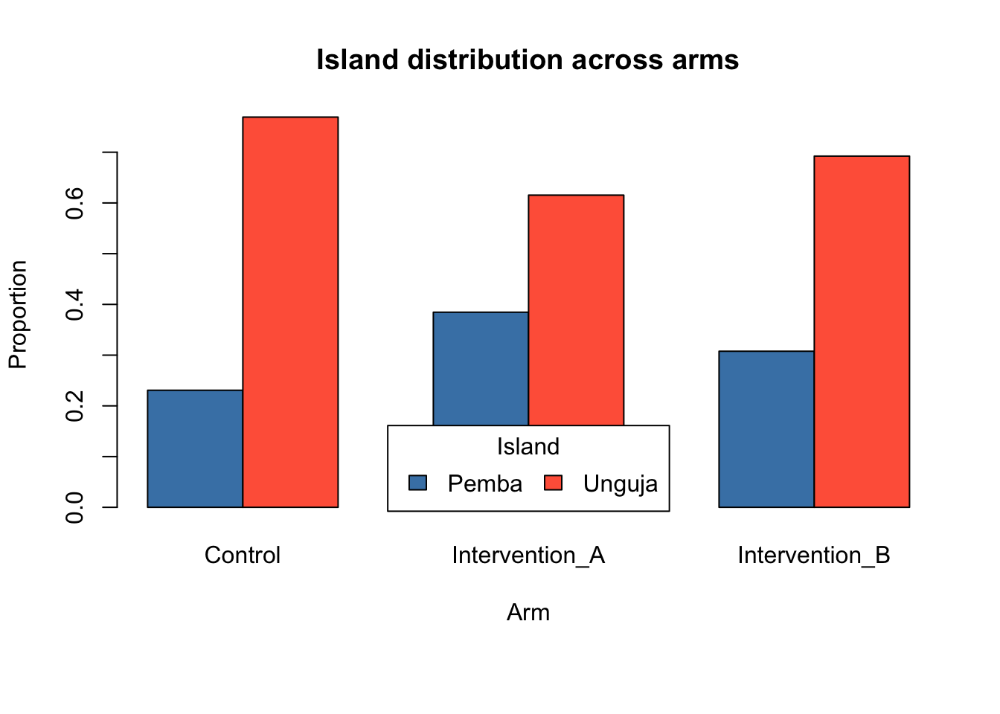{width=672}
:::
:::
