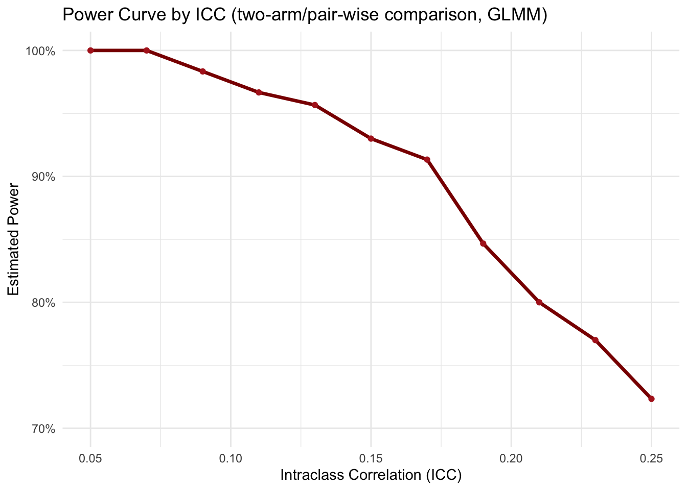

# DAWA cluster randomized trial (CRT)

Interventions on the level of health care workers at health facilities (dispensaries) in Zanzibar to reduce antibiotic prescriptions. Multi-arm with 2 interventions:

-   **Control**: Standard of care

-   **Intervention 1**: eHealth tool (CDSS & nudging)

-   **Intervention 2**: eHealth tool (CDSS & nudging) + AMR stewardship clubs

## Parameters and design considerations

-   Eligible participants: Patients attending the dispensary with acute infectious illness

-   Power it for subgroup of kids under 5 years (special subgroup of interest), ca. 33% of all attending patients with acute infectious illness

-   Cluster size of eligible overall participants: 80-500 per cluster per month

-   Cluster size of eligible kids under 5 years (special subgroup of interest): 26-165 per cluster per month

-   Max. 39 clusters, i.e. max. 13 clusters per arm, due to feasibility/budget

-   Binary outcome: Proportion of patients prescribed an antibiotic at first presentation

-   Baseline prescription rate (control clusters): 75%, based on existing data

-   Expected delta Control to Intervention 1: 25 percentage points, based on prior evidence

-   Expected delta Control to Intervention 2: 30 percentage points

-   Intervention 1 vs Intervention 2 is not of primary interest

-   Min. desired power 80%

-   ICC for AB prescription: 0.20, based on prior evidence in same setting (but mainland TZ)

-   We expect the intervention effect to manifest 3-4 months after baseline

-   Important feasibility aspect: The primary outcome is collected through routine data, while the key secondary outcomes are collected via phone calls

-   CV (coefficient of variation), ratio of standard deviation of cluster sizes to mean of cluster sizes

-   Since we have flexibility in individual sample size per cluster and need to restrict it anyway to keep the data collection for the key secondary outcomes feasible, we decided to take a random sample from each cluster, same n, which will reduce the CV. Moreover, we will stratify the randomization and adjust the outcome model for actual cluster size (attendance rate)

-   An individual sample size per cluster (i.e. mean cluster size) of n=150 will be feasible to recruit during 2 months (month 4 and 5 after baseline, when effect of intervention kicks in) from each cluster, using a random sampling strategy. N=150/cluster means we will get n=40/cluster kids under 5, for which we power the sample size. And we can safely assume a minimal CV of 0.1

-   Recruitment bias? -\> see protocol how to mitigate

-   Multiplicity? -\> see separate discussion. Decision: No adjustment for multiplicity

**Packages**


::: {.cell}

```{.r .cell-code}
req_pkgs <- c("pwr",
              "dplyr",
              "purrr",
              "ggplot2",
              "lme4",
              "geepack", # for GEE (if needed)
              "MASS", # for GLMM PQL
              "marginaleffects", # for marginal standardization
              
              "future.apply",
              "nlme",
              
              "tibble",
              "knitr",
              "kableExtra"
)
install_if_missing <- function(pkgs){
  for(p in pkgs){
    if(!requireNamespace(p, quietly=TRUE)){
      install.packages(p, repos="https://cloud.r-project.org")
    }
    library(p, character.only=TRUE)
  }
}
install_if_missing(req_pkgs)

# set global RNG seed for reproducibility
set.seed(20250809)
```
:::


## Corresponding individual randomized trial

Sample size for the individual randomized trial on the same question


::: {.cell}

```{.r .cell-code}
# Parameters
p_C <- 0.75 # Baseline prescription rate (control group)
p_I1 <- 0.50 # int 1: 25pp reduction
p_I2 <- 0.45 # int 2: 30pp reduction
power <- 0.80 # desired power
alpha <- 0.05 # do not apply any (bonferroni) correction for multiplicity (see separate discussion)

# Effect sizes, standardized as Cohen's h
h_I1_C <- ES.h(p1 = p_I1, p2 = p_C)
h_I2_C <- ES.h(p1 = p_I2, p2 = p_C)

cat("Cohen's h for I1 vs Control:", round(h_I1_C, 3), "\n")
```

::: {.cell-output .cell-output-stdout}

```
Cohen's h for I1 vs Control: -0.524 
```


:::

```{.r .cell-code}
cat("Cohen's h for I2 vs Control:", round(h_I2_C, 3), "\n")
```

::: {.cell-output .cell-output-stdout}

```
Cohen's h for I2 vs Control: -0.624 
```


:::

```{.r .cell-code}
# => reduction of mind. 25% is a Cohen's h of over 0.5 -> medium to large effect according to Cohen

# Sample size first pair-wise comparison (I1 vs C)
ss_I1_C <- pwr.2p.test(h = h_I1_C, sig.level = alpha, power = power)
cat("Sample size per arm (I1 vs C):", ceiling(ss_I1_C$n), "\n")
```

::: {.cell-output .cell-output-stdout}

```
Sample size per arm (I1 vs C): 58 
```


:::

```{.r .cell-code}
# Sample size second pair-wise comparison (I2 vs C)
ss_I2_C <- pwr.2p.test(h = h_I2_C, sig.level = alpha, power = power)
cat("Sample size per arm (I2 vs C):", ceiling(ss_I2_C$n), "\n")
```

::: {.cell-output .cell-output-stdout}

```
Sample size per arm (I2 vs C): 41 
```


:::

```{.r .cell-code}
# Use max of the two
n_per_arm <- max(ceiling(ss_I1_C$n), ceiling(ss_I2_C$n))
n_total <- n_per_arm * 3

cat("Sample size per arm:", n_per_arm, "\n")
```

::: {.cell-output .cell-output-stdout}

```
Sample size per arm: 58 
```


:::

```{.r .cell-code}
cat("Total sample size (3-arm trial):", n_total)
```

::: {.cell-output .cell-output-stdout}

```
Total sample size (3-arm trial): 174
```


:::
:::


A reduction of at least 25% percentage points (the smaller delta of the two) represents a Cohen's h of \>0.5 =\> medium to large effect

# **(1) Standard sample size calculation CRT**

Add the design effect (DEFF) to the individual RCT sample size. The usual standard DEFF formula:

DEFF = 1+(m−1)ICC , whereby m = cluster size

However, let's not forget the cluster size variation. The usual conservative adjustment of the DEFF with cluster size variation is (e.g. see here: [https://pmc.ncbi.nlm.nih.gov/articles/PMC7394950/#sup1](#0)):

DEFF_cv = 1+((m(1+CV\^2)−1))ICC , whereby CV is the coefficient of variation (ratio of standard deviation of cluster sizes to mean of cluster sizes)


::: {.cell}

```{.r .cell-code}
# Parameters
p_C <- 0.75 
p_I1 <- 0.50 
p_I2 <- 0.45 
power <- 0.80 
ICC <- 0.20
alpha <- 0.05 # do not apply any (bonferroni) correction for multiplicity (see separate discussion). Bonferroni would be alpha_familywise / number of comparisons (=2)

m <- 40
CV <- 0.1 # minimal CV

deff <- 1+(m-1)*ICC # standard DEFF
deff_cv <- 1+((m*(1+CV^2))-1)*ICC # DEFF with cluster size variation

# Effect sizes
h_I1_C <- ES.h(p1 = p_I1, p2 = p_C)
h_I2_C <- ES.h(p1 = p_I2, p2 = p_C)

# Individual RCT sample sizes for both contrasts
ss1 <- pwr.2p.test(h = h_I1_C, power = 0.80, sig.level = alpha)$n
ss2 <- pwr.2p.test(h = h_I2_C, power = 0.80, sig.level = alpha)$n

# CRT sample sizes for both contrasts
ss1_crt <- ceiling(ss1 * deff_cv)
ss2_crt <- ceiling(ss2 * deff_cv)

# Contrast 1 (smaller Delta/Cohens'd => determines overall cluster number)
n_clusters1 <- ceiling(ss1_crt / m)
cat("Cluster sample size int arm 1:", n_clusters1, "\n")
```

::: {.cell-output .cell-output-stdout}

```
Cluster sample size int arm 1: 13 
```


:::

```{.r .cell-code}
cat("Individual sample size int arm 1:", ss1_crt, "\n")
```

::: {.cell-output .cell-output-stdout}

```
Individual sample size int arm 1: 509 
```


:::

```{.r .cell-code}
# Contrast 2
n_clusters2 <- ceiling(ss2_crt / m)
cat("Cluster sample size int arm 2:", n_clusters2, "\n")
```

::: {.cell-output .cell-output-stdout}

```
Cluster sample size int arm 2: 9 
```


:::

```{.r .cell-code}
cat("Individual sample size int arm 2:", ss2_crt, "\n")
```

::: {.cell-output .cell-output-stdout}

```
Individual sample size int arm 2: 359 
```


:::

```{.r .cell-code}
# Total
tot_clusters <- n_clusters1 * 3
tot_ind <- ss1_crt * 3
cat("Total cluster sample size:", tot_clusters, "\n")
```

::: {.cell-output .cell-output-stdout}

```
Total cluster sample size: 39 
```


:::

```{.r .cell-code}
cat("Total individual sample size:", tot_ind, "\n")
```

::: {.cell-output .cell-output-stdout}

```
Total individual sample size: 1527 
```


:::
:::


## **(1.1) Varying assumptions - Standard sample size calculation**

### **(1.1.1) Varying baseline control rate**

All parameters fixed, except baseline control rate versus number of clusters & individuals needed


::: {.cell}

```{.r .cell-code}
# Define fixed parameters
power <- 0.80
alpha <- 0.05
ICC <- 0.20
CV <- 0.1
m <- 40

# Baseline control rates
p_C_values <- seq(0.60, 0.85, by = 0.05)

results_df <- data.frame(
  p_C = numeric(),
  n_clusters_per_arm = numeric(),
  n_individuals_per_arm = numeric()
)

cohen_h <- function(p1, p2) {
  2 * (asin(sqrt(p1)) - asin(sqrt(p2)))
}

for (p_C in p_C_values) {
  p_I1 <- p_C - 0.25
  p_I2 <- p_C - 0.30
  
  # Skip if intervention rates are invalid (less than 0)
  if (p_I1 < 0 | p_I2 < 0) {
    next
  }

  deff_cv <- 1 + ((m * (1 + CV^2)) - 1) * ICC

  h_I1_C <- cohen_h(p_I1, p_C)
  h_I2_C <- cohen_h(p_I2, p_C)

  ss1 <- pwr.2p.test(h = h_I1_C, power = power, sig.level = alpha)$n
  ss2 <- pwr.2p.test(h = h_I2_C, power = power, sig.level = alpha)$n
  
  # Use max of the two
  n_per_arm_rct <- max(ss1, ss2)
  
  # Individual sample size
  n_per_arm_crt <- ceiling(n_per_arm_rct * deff_cv)
  
  # Cluster sample size
  n_clusters_per_arm <- ceiling(n_per_arm_crt / m)
  
  # Append results
  results_df <- rbind(results_df, data.frame(
    p_C = p_C,
    n_clusters_per_arm = n_clusters_per_arm,
    n_individuals_per_arm = n_per_arm_crt
  ))
}
```
:::

::: {.cell}

```{.r .cell-code}
ggplot(results_df, aes(x = p_C, y = n_clusters_per_arm * 3)) +
  geom_line(color = "darkgreen", size = 1) +
  geom_point(color = "darkgreen", size = 2) +
  labs(
    title = "Total clusters needed vs. Baseline control rate",
    x = "Baseline control rate",
    y = "Total clusters needed (for 3 arms)"
  ) +
  theme_minimal() +
  scale_x_continuous(labels = scales::percent_format(accuracy = 1),
                     breaks = seq(0.50, 0.85, by = 0.02)) +
  scale_y_continuous(breaks = seq(0, max(results_df$n_clusters_per_arm * 3), by = 1))
```

::: {.cell-output-display}
{width=672}
:::
:::

::: {.cell}

```{.r .cell-code}
ggplot(results_df, aes(x = p_C, y = n_individuals_per_arm * 3)) +
  geom_line(color = "lightgreen", size = 1) +
  geom_point(color = "lightgreen", size = 2) +
  labs(
    title = "Total individuals needed vs. Baseline control rate",
    x = "Baseline control rate",
    y = "Total individuals needed (for 3 arms)"
  ) +
  theme_minimal() +
  scale_x_continuous(labels = scales::percent_format(accuracy = 1),
                     breaks = seq(0.60, 0.85, by = 0.02)) +
  scale_y_continuous(breaks = seq(0, max(results_df$n_individuals_per_arm * 3), by = 50))
```

::: {.cell-output-display}
{width=672}
:::
:::


### **(1.1.2) Varying ICC**

All parameters fixed, except ICC versus number of clusters & individuals needed


::: {.cell}

```{.r .cell-code}
# Define parameters
power <- 0.80
alpha <- 0.05
p_C <- 0.75 
m <- 40
CV <- 0.1

# Range of ICC values to test
ICC_values <- seq(0.05, 0.25, by = 0.01)

results_df <- data.frame(
  ICC = numeric(),
  n_clusters_per_arm = numeric(),
  n_individuals_per_arm = numeric()
)

cohen_h <- function(p1, p2) {
  2 * (asin(sqrt(p1)) - asin(sqrt(p2)))
}

for (icc in ICC_values) {
  p_I1 <- p_C - 0.25
  p_I2 <- p_C - 0.30
  
  deff_cv <- 1 + ((m * (1 + CV^2)) - 1) * icc
  
  h_I1_C <- cohen_h(p_I1, p_C)
  h_I2_C <- cohen_h(p_I2, p_C)
  
  ss1 <- pwr.2p.test(h = h_I1_C, power = power, sig.level = alpha)$n
  ss2 <- pwr.2p.test(h = h_I2_C, power = power, sig.level = alpha)$n
  
  n_per_arm_rct <- max(ss1, ss2)
  
  n_per_arm_crt <- ceiling(n_per_arm_rct * deff_cv)
  
  n_clusters_per_arm <- ceiling(n_per_arm_crt / m)
  
  results_df <- rbind(results_df, data.frame(
    ICC = icc,
    n_clusters_per_arm = n_clusters_per_arm,
    n_individuals_per_arm = n_per_arm_crt
  ))
}
```
:::

::: {.cell}

```{.r .cell-code}
ggplot(results_df, aes(x = ICC, y = n_clusters_per_arm * 3)) +
  geom_line(color = "darkred", size = 1) +
  geom_point(color = "darkred", size = 2) +
  labs(
    title = "Total clusters needed vs. ICC",
    x = "ICC",
    y = "Total clusters needed (for 3 arms)"
  ) +
  theme_minimal() +
  scale_x_continuous(breaks = seq(0.05, 0.25, by = 0.01)) +
  scale_y_continuous(breaks = seq(0, max(results_df$n_clusters_per_arm * 3), by = 2))
```

::: {.cell-output-display}
{width=672}
:::
:::

::: {.cell}

```{.r .cell-code}
ggplot(results_df, aes(x = ICC, y = n_individuals_per_arm * 3)) +
  geom_line(color = "red", size = 1) +
  geom_point(color = "red", size = 2) +
  labs(
    title = "Total individuals needed vs. ICC",
    x = "ICC",
    y = "Total individuals needed (for 3 arms)"
  ) +
  theme_minimal() +
  scale_x_continuous(breaks = seq(0.05, 0.25, by = 0.02)) +
  scale_y_continuous(breaks = seq(0, max(results_df$n_individuals_per_arm * 3), by = 100))
```

::: {.cell-output-display}
{width=672}
:::
:::


# **(2) Simulations**

## **(2.1) Parameters**

We follow the simulation setup according to J. Thompson & C. Leyrat, because we have a binary outcome and small-ish cluster sample size (26-30 clusters for the main pair-wise comparison): <https://bmcmedresmethodol.biomedcentral.com/articles/10.1186/s12874-022-01699-2>

Note: We simulate a two-arm trial setup (not three-arm), since power/sample size is based on the main pair-wise comparison (control vs int 1) =\> Max. 26 clusters!

**Data-generating model (per cluster):**

-   For arm i (0=control, 1=intervention) and cluster j: Y_ij ∼ Binomial(m_ij, p_ij), logit⁡(p_ij) = β0 + β1_i + u_j , where u_j is a cluster random effect with mean 0 and variance σ\^2_b

    -   ​Binomial(m_ij, p_ij): Conditional on p_ij, we assume each of the m_ij individuals in that cluster are independent Bernoulli trials with probability p_ij. So Y_ij is a binomial draw with that probability, for the cluster-level.

        -   A Bernoulli trial is a random event with two outcomes (success/failure), with the same, independent, probability of success every time.

        -   Independence assumption (within-cluster): Whether one person gets the prescription doesn’t change the probability for another person in the same cluster (once p_ij is fixed). The correlation between people’s outcomes in the same cluster comes entirely from them sharing the same p_ij.

        -   =\> Y_ij can be any integer from 0 to m_ij. E.g. if m_ij =42 and p_ij =0.50, then Y_ij is the total number of prescriptions in that cluster, drawn from a binomial distribution with 42 trials and 50% success probability.

    -   logit⁡(p_ij) = β0 + β1_i + u_j:

        -   Using the logit link maps probability p ∈ (0,1) to the whole real line, so we can model it as a linear predictor.

        -   β0 is the baseline log-odds (the logit of the control probability for a *typical* cluster, i.e. when u_j = 0), representing the the marginal cluster-specific probability.

        -   β1_i encodes the treatment effect and is a log-odds difference; exp⁡(β1) is the *conditional odds ratio* comparing treatment vs control for the *same cluster* (holding u_j fixed).

        -   u_j is the cluster random intercept (a cluster-level shift on the log-odds scale). It captures unobserved cluster-level factors (e.g. prescriber tendency) that move all individuals in the cluster up/down in log-odds. Typically, u_j has mean 0 and variance σ\^2_b and is independent across clusters (see above). The random intercept does not change the conditional treatment effect, it only shifts the baseline log-odds for that whole cluster. In other words, the *difference in log-odds* between arms for the same cluster is always constant, but the *actual probabilities* shift up/down with u_j. For clusters with positive u_j both arms have higher probabilities; for negative u_j both are lower.

**ICC on log-odds scale:**

-   ICC = *p = rho* = σ\^2_b / (σ\^2_b+(π\^2/3))

-   The ICC consists of individual-level variance (noise) and between-cluster variance (noise), in the sense of: between-cluster variance / total variance. The between-cluster variance approximates the cluster random effect variance (σ\^2_b)

-   In logistic models, the individual level variation is usually fixed at π\^2/3 (3.29)

-   So, focusing on the cluster random effect variance (σ\^2_b), we can derive it from the formula above as: σ_b = *sigma_b* = sqrt((ICC(π\^2/3))/(1−ICC))

-   (If there’s additional within-site variation over time, i.e. baseline period or SW-CRT, we include σ\^2_b_p, typically as a fraction of σ\^2_b, e.g., half the site-level variance).

**Cluster effect distributions:**

-   While ICC is the proportion of the total variance (in the latent scale) that comes from between-cluster differences ("what fraction of the total variability is due to between-cluster differences"), the σ\^2_b is an absolute variance ("How big the cluster intercept spread is in log-odds units" or "how much variation there is in prescription tendency across clusters") and can have different shapes.

-   GLMM assumes normal distribution, but reality is often skewed - esp. with few clusters! Simulate three scenarios including a realistic/skewed/conservative scenario and see if GLMM breaks (as in paper above):

-   a\) Normal: u_j ∼ N(0, σ\^2_b)

    -   Symmetric, bell-shaped, skewness = 0, kurtosis = 0.

-   b\) Gamma (skewed): generate a_j ∼ Gamma(shape=2,scale=1), then set u_j ​= σ_b(​(a_j​−2)/sqrt(2))

    -   A shape parameter of 2 give a distribution with skew 1.4 and kurtosis 3, i.e., positive skew (some clusters much higher tendency than average)

-   c\) Uniform: u_j ∼ Uniform(−sqrt(3)σ_b, sqrt(3)σ_b)

    -   Skewness = 0 (perfectly symmetric), Kurtosis = −6/5 (lighter tails than normal), no extreme values, overall flat, all clusters are evenly spread; to test if GLMMs are sensitive to lack of tail weight, i.e., whether they rely on the normal distribution’s tails to stabilize estimates.

**Cluster sizes** m_ij​:

-   Allow for varying cluster size, i.e. varying coefficient of variation (CV) of cluster sizes, using same approach as they did: They sampled cluster sizes so that m_ij = 2 + δ_ij,​ drawn from a Negative Binomial:

    -   δ_ij ​∼ NegBin(size = (m-2)\^2/(s\^2-(m-2)), p = m-2/s\^2)

    -   where s is the SD of cluster sizes (CV = s/m).

    -   This yields a minimum cluster size of 3. (note: they wrote no.offails and prob.offail; but the above should represent the same).

    -   δ is in a way the random component added to 2 to get the cluster size (of min 3).

## **(2.2) Create main functions and simulate one dataset**


::: {.cell}

```{.r .cell-code}
# 1) compute sigma_b from ICC (on latent logit scale):
icc_to_sigma <- function(rho){
  if(rho<=0) return(0)
  sigma_b <- sqrt( (rho * (pi^2/3)) / (1 - rho) )
  return(sigma_b)
}

# 2) compute beta0 for given control prevalence p0
p_to_beta0 <- function(p0){
  qlogis(p0)
}

# 3) given p0 and p1, compute OR on the cluster-specific log-odds scale
p0_p1_to_OR <- function(p0, p1){
  odds0 <- p0 / (1 - p0)
  odds1 <- p1 / (1 - p1)
  odds1 / odds0
}

# 4) generate random cluster-level u_j for the three distributions
generate_u <- function(n_clusters, sigma_b, dist = c("normal","gamma","uniform")){
  dist <- match.arg(dist)
  if(sigma_b == 0) return(rep(0, n_clusters))
  if(dist == "normal"){
    return(rnorm(n_clusters, mean=0, sd = sigma_b))
  } else if(dist == "gamma"){
    # they used Gamma(shape=2, scale=1) then standardized to mean 0 and sd sigma_b
    a <- rgamma(n_clusters, shape=2, scale=1)
    # a has mean 2, var 2. Standardize: (a - 2)/sqrt(2) then scale to sigma_b
    return(sigma_b * (a - 2)/sqrt(2))
  } else if(dist == "uniform"){
    cut <- sqrt(3) * sigma_b
    return(runif(n_clusters, min = -cut, max = cut))
  }
}

# 5) generate cluster sizes with target mean m and CV. Implementation follows their negative-binomial based approach and enforces minimum cluster size of 3.
generate_cluster_sizes <- function(n_clusters, m, CV){
  if(CV == 0){
    return(rep(m, n_clusters))
  }
  s <- CV * m
  # We want delta = m_j - 2 to follow NegBin with mean (m-2) and variance s^2
  mu_delta <- m - 2
  var_delta <- s^2
  if(var_delta <= mu_delta){
    # Negative Binomial requires variance > mean. So, this is an impossible NB parameterization
    # If so, fall back to a discrete uniform around m
    low <- max(3, floor(m - s*1.5))
    high <- ceiling(m + s*1.5)
    out <- pmax(3, round(runif(n_clusters, low, high)))
    return(out)
  }
  size_nb <- (mu_delta^2) / (var_delta - mu_delta) # see formula above
  prob_nb <- mu_delta / var_delta # see formula above
  # rnbinom in R uses size, prob; mean = size*(1-prob)/prob, but with this param it matches
  delta <- rnbinom(n_clusters, size = size_nb, prob = prob_nb)
  m_j <- 2 + delta
  m_j[m_j < 3] <- 3 # enforce min 3 (generating 2+delta ensures >=2, we bump to 3)
  return(m_j)
}

# Parameters for single simulated dataset
n_clusters <- 26
m_mean <- 40
CV <- 0.1
p0 <- 0.75
p1 <- 0.50
OR <- p0_p1_to_OR(p0, p1) # compute OR from p0 and p1
rho <- 0.20 # ICC
re_dist <- "uniform"

# Simulate
set.seed(20250809)
sigma_b <- icc_to_sigma(rho)
u_j <- generate_u(n_clusters, sigma_b, dist = re_dist)
sizes <- generate_cluster_sizes(n_clusters, m_mean, CV)
arm_assign <- sample(rep(0:1, length.out = n_clusters))
beta0 <- p_to_beta0(p0)
beta1 <- log(OR)
y <- integer(n_clusters)

for(j in seq_len(n_clusters)){ # iterate over each cluster
  # create the linear predictor (NOTE: beta1 turns 0 if arm0, and 1 * beta1 if arm1)
  linpred <- beta0 + beta1 * arm_assign[j] + u_j[j] 
  # apply the inverse logit (logistic function) to convert log-odds to probability
  p_j <- plogis(linpred) 
  # Simulate the number of successes in cluster j
  y[j] <- rbinom(1, size = sizes[j], prob = p_j) 
}

df_sim <- data.frame(cluster = seq_len(n_clusters),
                      arm = arm_assign,
                      size = sizes,
                      y = y)
df_sim
```

::: {.cell-output .cell-output-stdout}

```
   cluster arm size  y
1        1   1   39 15
2        2   0   35 32
3        3   1   37 19
4        4   0   41 33
5        5   0   39 29
6        6   0   41 37
7        7   0   38 29
8        8   0   45 31
9        9   0   43 28
10      10   1   43 27
11      11   1   44 33
12      12   1   45 20
13      13   0   39 25
14      14   1   39 32
15      15   1   41 29
16      16   1   41 35
17      17   0   40 31
18      18   1   36 33
19      19   0   36 25
20      20   1   38 12
21      21   0   37 30
22      22   1   41 21
23      23   1   41  7
24      24   0   43 35
25      25   1   44 39
26      26   0   39 20
```


:::

```{.r .cell-code}
mean_sizes <- df_sim %>%
  group_by(arm) %>%
  summarise(mean_size = mean(size))

ggplot(df_sim, aes(x = factor(cluster), y = size, fill = factor(arm))) +
  geom_bar(stat = "identity", color = "black") +
  geom_hline(data = mean_sizes, aes(yintercept = mean_size, color = factor(arm)),
             linetype = "dashed", size = 1, show.legend = FALSE) +
  geom_text(data = mean_sizes, aes(x = Inf, y = mean_size, label = paste0("Mean = ", round(mean_size, 1))),
            hjust = 1.1, vjust = -0.5, color = c("skyblue4", "tomato3"), size = 4) +
  scale_fill_manual(values = c("skyblue", "tomato"), labels = c("Control (arm=0)", "Intervention (arm=1)")) +
  scale_color_manual(values = c("skyblue4", "tomato3")) +
  labs(x = "Cluster", y = "Cluster Size", fill = "Treatment Group") +
  theme_minimal() +
  ggtitle("Cluster size per cluster") +
  theme(axis.text.x = element_text(angle = 45, hjust = 1))
```

::: {.cell-output-display}
{width=672}
:::
:::


size = number of individuals in a cluster

y = number of individual-level successes (binary=1) observed in the cluster, i.e., represents the number of individuals in that cluster who received an AB prescription.

## **(2.3) Simulate power, using cluster-level analysis approach**

NOTES:

-   Use cluster-level analysis (unweighted t-test on log-odds, with 0.5 continuity correction, as per guidance according to Thompson & Leyrat & al -\> "clan" command)

-   Keep gamma distribution, simulate 500-1000 trials

### **(2.3.1) Create function**


::: {.cell}

```{.r .cell-code}
simulate_power <- function(n_clusters = 26, 
                           m_mean = 40, 
                           CV = 0.1,
                           p0 = 0.75, 
                           p1 = 0.50, 
                           rho = 0.20,
                           re_dist = "gamma", 
                           n_sim = 1000,
                           alpha = 0.05, 
                           seed = 20250809) {
  set.seed(seed)
  
  # Compute derived parameters
  sigma_b <- icc_to_sigma(rho)
  beta0 <- p_to_beta0(p0)
  OR <- p0_p1_to_OR(p0, p1)
  beta1 <- log(OR)
  
  p_values <- numeric(n_sim)
  
  for (i in seq_len(n_sim)) {
    u_j <- generate_u(n_clusters, sigma_b, dist = re_dist)
    sizes <- generate_cluster_sizes(n_clusters, m_mean, CV)
    arm_assign <- sample(rep(0:1, length.out = n_clusters))
    
    y <- integer(n_clusters)
    for (j in seq_len(n_clusters)) {
      linpred <- beta0 + beta1 * arm_assign[j] + u_j[j]
      p_j <- plogis(linpred)
      y[j] <- rbinom(1, size = sizes[j], prob = p_j)
    }
    
    # Cluster-level log-odds with 0.5 continuity correction
    log_odds <- log((y + 0.5) / (sizes - y + 0.5))
    
    # Unweighted t-test
    group0 <- log_odds[arm_assign == 0]
    group1 <- log_odds[arm_assign == 1]
    
    test <- try(t.test(group1, group0, var.equal = TRUE), silent = TRUE)
    p_values[i] <- if (inherits(test, "try-error")) NA else test$p.value
  }
  
  # Estimate power
  mean(p_values < alpha, na.rm = TRUE)
}
```
:::


### **(2.3.2)** Calculate baseline scenario


::: {.cell}

```{.r .cell-code}
power_estimate <- simulate_power(n_clusters = 26,
                                 m_mean = 40,
                                 CV = 0.1,
                                 p0 = 0.75,
                                 p1 = 0.50,
                                 rho = 0.20,
                                 re_dist = "gamma",
                                 n_sim = 1000)

cat("Estimated power:", round(power_estimate, 3), "\n")
```

::: {.cell-output .cell-output-stdout}

```
Estimated power: 0.79 
```


:::
:::


### **(2.3.3) Vary effect sizes**


::: {.cell}

```{.r .cell-code}
p0_vals <- seq(0.50, 0.85, by = 0.05)
p1_vals <- seq(0.30, 0.70, by = 0.05)

grid <- expand.grid(p0 = p0_vals, p1 = p1_vals)

results <- grid %>%
  rowwise() %>%
  mutate(power = simulate_power(n_clusters = 26,
                                m_mean = 40,
                                CV = 0.1,
                                p0 = p0,
                                p1 = p1,
                                rho = 0.2,
                                re_dist = "gamma",
                                n_sim = 1000)) %>%
  ungroup()

# Plot
ggplot(results, aes(x = p1, y = power, color = factor(p0))) +
  
  # Shaded region above 80% power
  geom_rect(aes(xmin = -Inf, xmax = Inf, ymin = 0.8, ymax = Inf),
            fill = "lightgrey", alpha = 0.3, inherit.aes = FALSE) +
  
  # Power curves
  geom_line(size = 1.2) +
  geom_point() +
  
  # Labels and scales
  labs(title = "Power Curves by p0 and p1 (two-arm/pair-wise comparison)",
       x = "Intervention Group Probability (p1)",
       y = "Estimated Power",
       color = "Control Group (p0)") +
  scale_y_continuous(breaks = seq(0, 1, by = 0.1),
                     limits = c(0, 1),
                     labels = scales::percent_format(accuracy = 1)) +
  theme_minimal(base_size = 14)
```

::: {.cell-output-display}
{width=672}
:::
:::


### **(2.3.4) Vary ICC**


::: {.cell}

```{.r .cell-code}
# Vector of ICC values to test
icc_values <- seq(0.05, 0.25, by = 0.02)

# Run power simulations for each ICC
power_results <- sapply(icc_values, function(rho) {
  simulate_power(n_clusters = 26,
                 m_mean = 40,
                 CV = 0.1,
                 p0 = 0.75,
                 p1 = 0.50,
                 rho = rho,
                 re_dist = "gamma",
                 n_sim = 1000,
                 alpha = 0.05,
                 seed = 20250809)
})

# Create data frame for plotting
df_power_icc <- data.frame(ICC = icc_values, Power = power_results)

# Plot
ggplot(df_power_icc, aes(x = ICC, y = Power)) +
  geom_line(color = "darkred", size = 1.2) +
  geom_point(color = "firebrick") +
  labs(title = "Power Curve by ICC (two-arm/pair-wise comparison)",
       x = "Intraclass Correlation (ICC)",
       y = "Estimated Power") +
  scale_y_continuous(breaks = seq(0.70, 1, by = 0.1),
                     limits = c(0.70, 1),
                     labels = scales::percent_format(accuracy = 1)) +
  theme_minimal()
```

::: {.cell-output-display}
{width=672}
:::
:::


### **(2.3.5) Vary number of clusters**


::: {.cell}

```{.r .cell-code}
# Vector of cluster counts to test
n_clusters_vec <- seq(22, 36, by = 1)

# Run power simulations for each cluster count
power_results <- sapply(n_clusters_vec, function(nc) {
  simulate_power(n_clusters = nc,
                 m_mean = 40,
                 CV = 0.1,
                 p0 = 0.75,
                 p1 = 0.50,
                 rho = 0.20,
                 re_dist = "gamma",
                 n_sim = 5000,
                 alpha = 0.05,
                 seed = 20250809)
})

# Create data frame for plotting
df_power_css <- data.frame(Cluster_ss = n_clusters_vec, Power = power_results)

# Plot
ggplot(df_power_css, aes(x = Cluster_ss, y = Power)) +
  geom_line(color = "darkgreen", size = 1.2) +
  geom_point(color = "forestgreen") +
  labs(title = "Power vs Number of total clusters (two-arm/pair-wise comparison)",
       x = "Total number of clusters (two-arm trial)",
       y = "Estimated power") +
  scale_y_continuous(breaks = seq(0.70, 1, by = 0.1),
                     limits = c(0.70, 1),
                     labels = scales::percent_format(accuracy = 1)) +
  scale_x_continuous(breaks = seq(22, 36, by = 1)) +
  theme_minimal()
```

::: {.cell-output-display}
{width=672}
:::
:::


### **(2.3.6) Vary number of individuals per cluster (mean cluster size)**


::: {.cell}

```{.r .cell-code}
m_mean_vec <- seq(10, 180, by = 10)

# Run power simulations for each cluster count
power_results <- sapply(m_mean_vec, function(n) {
  simulate_power(n_clusters = 26,
                 m_mean = n,
                 CV = 0.1,
                 p0 = 0.75,
                 p1 = 0.50,
                 rho = 0.20,
                 re_dist = "gamma",
                 n_sim = 1000,
                 alpha = 0.05,
                 seed = 20250809)
})

# Create data frame for plotting
df_power_iss <- data.frame(Individual_ss = m_mean_vec, Power = power_results)

# Plot
ggplot(df_power_iss, aes(x = Individual_ss, y = Power)) +
  geom_line(color = "darkblue", size = 1.2) +
  geom_point(color = "skyblue") +
  labs(title = "Power vs Number of total individuals (two-arm/pair-wise comparison)",
       x = "Total number of individuals (two-arm trial)",
       y = "Estimated power") +
  scale_y_continuous(breaks = seq(0.70, 1, by = 0.1),
                     limits = c(0.70, 1),
                     labels = scales::percent_format(accuracy = 1)) +
  scale_x_continuous(breaks = seq(10, 180, by = 10)) +
  theme_minimal()
```

::: {.cell-output-display}
{width=672}
:::
:::


## **(2.4) Simulate power, using GLMM analysis approach**

**NOTES:**

-   As per guidance according to Thompson & Leyrat & al: GLMM with restricted pseudo-likelihood and reduced degree of freedom (minus all covariates in the model)

-   Keep gamma distribution throughout

-   Repetitions per scenario: 500-1000 simulated trials

### **(2.4.1) Create function**


::: {.cell}

```{.r .cell-code}
simulate_power_glmmPQL <- function(n_clusters = 26, 
                                   m_mean = 40, 
                                   CV = 0.1,
                                   p0 = 0.75, 
                                   p1 = 0.50, 
                                   rho = 0.20,
                                   re_dist = "gamma", 
                                   n_sim = 1000,
                                   alpha = 0.05, 
                                   seed = 20250809) {
  set.seed(seed)
  
  sigma_b <- icc_to_sigma(rho)
  beta0 <- p_to_beta0(p0)
  OR <- p0_p1_to_OR(p0, p1)
  beta1 <- log(OR)
  
  p_values <- numeric(n_sim)
  
  for (i in seq_len(n_sim)) {
    u_j <- generate_u(n_clusters, sigma_b, dist = re_dist)
    sizes <- generate_cluster_sizes(n_clusters, m_mean, CV)
    arm_assign <- sample(rep(0:1, length.out = n_clusters))
    
    y <- integer(n_clusters)
    arm <- integer(n_clusters)
    cluster <- integer(n_clusters)
    
    for (j in seq_len(n_clusters)) {
      linpred <- beta0 + beta1 * arm_assign[j] + u_j[j]
      p_j <- plogis(linpred)
      y[j] <- rbinom(1, size = sizes[j], prob = p_j)
      arm[j] <- arm_assign[j]
      cluster[j] <- j
    }
    
    dd_sim <- data.frame(
      y = y,
      size = sizes,
      arm = factor(arm),
      cluster = factor(cluster)
    )
    
    # Fit GLMM using glmmPQL
    model_pql <- try(glmmPQL(
      fixed = cbind(y, size - y) ~ arm,
      random = ~1 | cluster,
      family = binomial(link = "logit"),
      data = dd_sim,
      verbose = FALSE
    ), silent = TRUE)
    
    if (!inherits(model_pql, "try-error")) {
      df_manual <- n_clusters - length(fixef(model_pql))
      coef <- model_pql$coefficients$fixed["arm1"]
      se <- summary(model_pql)$tTable["arm1", "Std.Error"]
      t_stat <- coef / se
      p_values[i] <- 2 * pt(-abs(t_stat), df = df_manual)
    } else {
      p_values[i] <- NA
    }
  }
  
  mean(p_values < alpha, na.rm = TRUE)
}
```
:::


### **(2.4.2)** Calculate baseline scenario


::: {.cell}

```{.r .cell-code}
power_estimate <- simulate_power_glmmPQL(n_clusters = 26,
                                         m_mean = 40,
                                         CV = 0.1,
                                         p0 = 0.75,
                                         p1 = 0.50,
                                         rho = 0.20,
                                         re_dist = "gamma",
                                         n_sim = 1000)

cat("Estimated power (GLMM):", round(power_estimate, 3), "\n")
```

::: {.cell-output .cell-output-stdout}

```
Estimated power (GLMM): 0.829 
```


:::
:::


### **(2.4.3) Vary effect sizes**


::: {.cell}

```{.r .cell-code}
p0_vals <- seq(0.50, 0.85, by = 0.05)
p1_vals <- seq(0.30, 0.70, by = 0.05)

grid_glmm <- expand.grid(p0 = p0_vals, p1 = p1_vals)

# Use map2 to apply the function to each p0/p1 pair, more efficient
grid_glmm$power <- map2_dbl(grid_glmm$p0, grid_glmm$p1, ~ simulate_power_glmmPQL(
  n_clusters = 26,
  m_mean = 40,
  CV = 0.1,
  p0 = .x,
  p1 = .y,
  rho = 0.2,
  re_dist = "gamma",
  n_sim = 500 # reduced for speed
))

ggplot(grid_glmm, aes(x = p1, y = power, color = factor(p0))) +
  geom_rect(aes(xmin = -Inf, xmax = Inf, ymin = 0.8, ymax = Inf),
            fill = "lightgrey", alpha = 0.3, inherit.aes = FALSE) +
  geom_line(size = 1.2) +
  geom_point() +
  labs(title = "Power Curves by p0 and p1 (two-arm/pair-wise comparison, GLMM)",
       x = "Intervention Group Probability (p1)",
       y = "Estimated Power",
       color = "Control Group (p0)") +
  scale_y_continuous(breaks = seq(0, 1, by = 0.1),
                     limits = c(0, 1),
                     labels = scales::percent_format(accuracy = 1)) +
  theme_minimal(base_size = 14)
```

::: {.cell-output-display}
{width=672}
:::
:::


### **(2.4.4) Vary ICC**


::: {.cell}

```{.r .cell-code}
icc_values <- seq(0.05, 0.25, by = 0.02)

power_results_glmm <- sapply(icc_values, function(rho) {
  simulate_power_glmmPQL(n_clusters = 26,
                 m_mean = 40,
                 CV = 0.1,
                 p0 = 0.75,
                 p1 = 0.50,
                 rho = rho,
                 re_dist = "gamma",
                 n_sim = 700, # reduced for speed
                 alpha = 0.05,
                 seed = 20250809)
})

df_power_icc_glmm <- data.frame(ICC = icc_values, Power = power_results_glmm)

ggplot(df_power_icc_glmm, aes(x = ICC, y = Power)) +
  geom_line(color = "darkred", size = 1.2) +
  geom_point(color = "firebrick") +
  labs(title = "Power Curve by ICC (two-arm/pair-wise comparison, GLMM)",
       x = "Intraclass Correlation (ICC)",
       y = "Estimated Power") +
  scale_y_continuous(breaks = seq(0.70, 1, by = 0.1),
                     limits = c(0.70, 1),
                     labels = scales::percent_format(accuracy = 1)) +
  theme_minimal()
```

::: {.cell-output-display}
{width=672}
:::
:::


### **(2.4.5) Vary number of clusters**


::: {.cell}

```{.r .cell-code}
n_clusters_vec <- seq(22, 36, by = 1)

power_results_glmm <- sapply(n_clusters_vec, function(nc) {
  simulate_power_glmmPQL(n_clusters = nc,
                 m_mean = 40,
                 CV = 0.1,
                 p0 = 0.75,
                 p1 = 0.50,
                 rho = 0.20,
                 re_dist = "gamma",
                 n_sim = 700, # reduced for speed
                 alpha = 0.05,
                 seed = 20250809)
})

df_power_css_glmm <- data.frame(Cluster_ss = n_clusters_vec, Power = power_results_glmm)

ggplot(df_power_css_glmm, aes(x = Cluster_ss, y = Power)) +
  geom_line(color = "darkgreen", size = 1.2) +
  geom_point(color = "forestgreen") +
  labs(title = "Power vs Number of total clusters (two-arm/pair-wise comparison, GLMM)",
       x = "Total number of clusters (two-arm trial)",
       y = "Estimated power") +
  scale_y_continuous(breaks = seq(0.70, 1, by = 0.1),
                     limits = c(0.70, 1),
                     labels = scales::percent_format(accuracy = 1)) +
  scale_x_continuous(breaks = seq(22, 36, by = 1)) +
  theme_minimal()
```

::: {.cell-output-display}
{width=672}
:::
:::


## **(2.5) Simulate scenario with baseline control rate**

**Notes:**

-   Use GLMM with PQL, keep gamma, and all other assumptions/parameters

-   New parameters:

    -   gamma0 (average baseline rate)

    -   alpha (correlation strength with u_j)

        -   E.g. a value of 0.3 means 30% of the variation in the baseline logit is driven by u_j, while the remaining comes from independent measurement noise. In other words, higher alpha means tighter coupling between baseline_rate and the true cluster tendency.

    -   tau (measurement noise SD on logit scale)

        -   0.25 ensures that even clusters with the same u_j will show some variability in their observed baseline_rate

-   Alpha 0.6 with tau 0.55 represents a moderate correlation, ca. 50% of the between-cluster variation explained by baseline value

-   Include other stratification variables?

### **(2.5.1) Create functions and simulate one dataset**


::: {.cell}

```{.r .cell-code}
n_clusters <- 26
m_mean <- 40
CV <- 0.1
p0 <- 0.75
p1 <- 0.50
OR <- p0_p1_to_OR(p0, p1)
rho <- 0.20
re_dist <- "gamma"
gamma0 <- qlogis(0.75) # average baseline rate ~40%
alpha <- 0.6 # correlation strength with u_j
tau <- 0.55 # measurement noise SD on logit scale

# Simulation; simulate outcome counts using the same u_j (so baseline explains part of u_j)
set.seed(20250809)
sigma_b <- icc_to_sigma(rho)
u_j <- generate_u(n_clusters, sigma_b, dist = re_dist)
sizes <- generate_cluster_sizes(n_clusters, m_mean, CV)
arm_assign <- sample(rep(0:1, length.out = n_clusters))
beta0 <- p_to_beta0(p0)
beta1 <- log(OR)

eps <- rnorm(n_clusters, mean = 0, sd = tau)
logit_b <- gamma0 + alpha * u_j + eps
baseline_rate <- plogis(logit_b)

y <- integer(n_clusters)

for(j in seq_len(n_clusters)){
  linpred <- beta0 + beta1 * arm_assign[j] + u_j[j]
  p_j <- plogis(linpred)
  y[j] <- rbinom(1, size = sizes[j], prob = p_j)
}

df_sim <- data.frame(cluster = seq_len(n_clusters),
                      arm = arm_assign,
                      size = sizes,
                      y = y,
                      baseline_rate = baseline_rate)
df_sim
```

::: {.cell-output .cell-output-stdout}

```
   cluster arm size  y baseline_rate
1        1   1   39 17     0.7741177
2        2   1   44 23     0.7582251
3        3   0   46 38     0.6286028
4        4   1   40 10     0.8246766
5        5   0   38 33     0.5879118
6        6   0   36 26     0.5553129
7        7   0   34 34     0.8439361
8        8   1   45 41     0.9263460
9        9   0   35 19     0.6980732
10      10   0   37 25     0.3792211
11      11   1   36 15     0.4449409
12      12   1   37 11     0.3282339
13      13   1   38 21     0.7891104
14      14   1   34 31     0.7752043
15      15   0   35 29     0.8023677
16      16   0   46 38     0.7625536
17      17   0   45 30     0.7260699
18      18   1   38 24     0.6989200
19      19   0   44 20     0.6721145
20      20   0   44 36     0.5544201
21      21   0   34 26     0.8083426
22      22   1   34 12     0.8013749
23      23   1   34 17     0.8491099
24      24   1   38 15     0.6664438
25      25   1   40 15     0.7467892
26      26   0   44 31     0.8879796
```


:::

```{.r .cell-code}
# Fit GLMMs with PQL: unadjusted vs adjusted for baseline
mod_unadj <- glmmPQL(fixed = cbind(y, size - y) ~ arm,
                     random = ~1 | cluster,
                     family = binomial(link = "logit"),
                     data = df_sim,
                     verbose = FALSE)
mod_adj <- glmmPQL(fixed = cbind(y, size - y) ~ arm + baseline_rate,
                     random = ~1 | cluster,
                     family = binomial(link = "logit"),
                     data = df_sim,
                     verbose = FALSE)

generate_pql_results_table <- function(model_pql, data, name = c("adjusted")) {
  # Manually calculate and adjust degrees of freedom as per guidance above
  n_clusters <- length(unique(data$cluster))
  n_fixed_params <- length(fixef(model_pql))
  df_manual <- n_clusters - n_fixed_params

  treatment_coef <- model_pql$coefficients$fixed["arm"]
  treatment_se <- summary(model_pql)$tTable["arm", "Std.Error"]

  t_stat <- treatment_coef / treatment_se
  p_value <- 2 * pt(-abs(t_stat), df = df_manual)
  t_critical <- qt(0.975, df = df_manual)
  ci_lower_log <- treatment_coef - t_critical * treatment_se
  ci_upper_log <- treatment_coef + t_critical * treatment_se

  # Combine results into a tibble
  results_table <- tibble(
    Method = name,
    Estimate = round(c(treatment_coef), 3),
    OR = round(exp(c(treatment_coef)), 2),
    CI_Lower = round(exp(c(ci_lower_log)), 2),
    CI_Upper = round(exp(c(ci_upper_log)), 2),
    p_value = c(p_value)
  ) %>%
    mutate(
      p_value = ifelse(p_value < 0.001, "<0.001", sprintf("%.3f", p_value))
    )

  # Display as a Quarto-friendly table
  return(
    results_table %>%
      kable("pipe", col.names = c("Method", "Estimate (log-odds)", "Odds Ratio", "95% CI Lower", "95% CI Upper", "p-value")) %>%
      kable_styling(full_width = FALSE)
  )
}

generate_pql_results_table(mod_unadj, df_sim, "GLMM pseudolikelihood, adapted DF, unadjusted")
```

::: {.cell-output-display}


|Method                                        | Estimate (log-odds)| Odds Ratio| 95% CI Lower| 95% CI Upper|p-value |
|:---------------------------------------------|-------------------:|----------:|------------:|------------:|:-------|
|GLMM pseudolikelihood, adapted DF, unadjusted |              -1.025|       0.36|         0.18|          0.7|0.004   |


:::

```{.r .cell-code}
generate_pql_results_table(mod_adj, df_sim, "GLMM pseudolikelihood, adapted DF, adjusted")
```

::: {.cell-output-display}


|Method                                      | Estimate (log-odds)| Odds Ratio| 95% CI Lower| 95% CI Upper|p-value |
|:-------------------------------------------|-------------------:|----------:|------------:|------------:|:-------|
|GLMM pseudolikelihood, adapted DF, adjusted |              -1.083|       0.34|         0.17|         0.66|0.003   |


:::

```{.r .cell-code}
# marginal standardization using marginaleffects package
rr_mod_unadj <- avg_comparisons(
  mod_unadj,
  variables = "arm",
  type = "response",
  comparison = "ratio"
)
rr_mod_unadj
```

::: {.cell-output .cell-output-stdout}

```

 Term          Contrast Estimate Std. Error    z Pr(>|z|)    S 2.5 % 97.5 %
  arm mean(1) / mean(0)    0.675      0.084 8.04   <0.001 49.9  0.51  0.839

Columns: term, contrast, estimate, std.error, statistic, p.value, s.value, conf.low, conf.high, predicted_lo, predicted_hi, predicted 
Type:  response 
```


:::

```{.r .cell-code}
rr_mod_adj <- avg_comparisons(
  mod_adj,
  variables = "arm",
  type = "response",
  comparison = "ratio"
)
rr_mod_adj
```

::: {.cell-output .cell-output-stdout}

```

 Term          Contrast Estimate Std. Error    z Pr(>|z|)    S 2.5 % 97.5 %
  arm mean(1) / mean(0)    0.664     0.0789 8.41   <0.001 54.5 0.509  0.819

Columns: term, contrast, estimate, std.error, statistic, p.value, s.value, conf.low, conf.high, predicted_lo, predicted_hi, predicted 
Type:  response 
```


:::

```{.r .cell-code}
# indivdata <- dataset %>%
#   rowwise() %>%
#   do({
#     data.frame(cluster = .$cluster,
#                arm = .$arm,
#                y = c(rep(1, .$events), rep(0, .$size - .$events)))
#   })
# 
# glmer(y ~ arm + (1|cluster), family = binomial, data = indivdata)
```
:::


### **(2.5.2) Simulate power and estimates with full model, adjusted and unadjusted**


::: {.cell}

```{.r .cell-code}
simulate_one_trial_GLMMpql <- function(n_clusters, m_mean, CV, p0, OR, rho, re_dist,
                                   alpha, tau, gamma0, adjust_baseline = FALSE){
  sigma_b <- icc_to_sigma(rho)
  u_j <- generate_u(n_clusters, sigma_b, dist = re_dist)
  sizes <- generate_cluster_sizes(n_clusters, m_mean, CV)
  arm_assign <- sample(rep(0:1, length.out = n_clusters))
  beta0 <- p_to_beta0(p0)
  beta1 <- log(OR)
  eps <- rnorm(n_clusters, mean = 0, sd = tau)
  logit_b <- gamma0 + alpha * u_j + eps
  baseline_rate <- plogis(logit_b)
  y <- integer(n_clusters)
  for(j in seq_len(n_clusters)){
    linpred <- beta0 + beta1 * arm_assign[j] + u_j[j]
    p_j <- plogis(linpred)
    y[j] <- rbinom(1, size = sizes[j], prob = p_j)
  }

  dd_sim <- data.frame(cluster = factor(seq_len(n_clusters)),
                       arm = factor(arm_assign),
                       y = y,
                       size = sizes,
                       baseline_rate = baseline_rate)

  # Fit glmmPQL
  if(adjust_baseline){
    form <- cbind(y, size - y) ~ arm + baseline_rate
  } else {
    form <- cbind(y, size - y) ~ arm
  }

  model_pql <- try(glmmPQL(
    fixed = form,
    random = ~1 | cluster,
    family = binomial(link = "logit"),
    data = dd_sim,
    verbose = FALSE
  ), silent = TRUE)

  if (inherits(model_pql, "try-error")) {
    return(list(pval = NA_real_, OR = NA_real_, RR = NA_real_))
  } else {
    # Manual adaptation of DF
    df_manual <- n_clusters - length(fixef(model_pql))
    coef_arm <- if("arm1" %in% names(fixef(model_pql))) {
      model_pql$coefficients$fixed["arm1"]
    } else {
      model_pql$coefficients$fixed["arm"]
    }
    se_arm <- summary(model_pql)$tTable[grep("^arm", rownames(summary(model_pql)$tTable)), "Std.Error"][1]
    t_stat <- coef_arm / se_arm
    p_val <- 2 * pt(-abs(t_stat), df = df_manual)

    OR_est <- exp(coef_arm)

    # Risk ratio via marginal standardization using the marginaleffects package
    RR_model <- tryCatch({
      avg_comparisons(model_pql, variables = "arm", type = "response", comparison = "ratio")
    }, error = function(e) NA_real_)
    rr <- RR_model$estimate[1]
    rr_cl <- RR_model$conf.low[1]
    rr_ch <- RR_model$conf.high[1]
    
    return(list(pval = p_val, OR = OR_est, RR = rr, RR_CI_low = rr_cl, RR_CI_high = rr_ch))
  }
}

# Simulation
run_simulation_pql <- function(n_reps = 5, 
                               n_clusters = 26, 
                               m_mean = 40, 
                               CV = 0.1,
                               p0 = 0.75, 
                               p1 = 0.50, 
                               rho = 0.20, 
                               re_dist = "gamma",
                               alpha = 0.6, 
                               tau = 0.55, 
                               gamma0 = qlogis(0.75),
                               parallel = TRUE, 
                               seed = 20250809){
  set.seed(seed)
  
  OR <- p0_p1_to_OR(p0, p1)

  run_batch <- function(adjust){
    replicate(n_reps, simulate_one_trial_GLMMpql(n_clusters, m_mean, CV, p0, OR, rho, re_dist,
                                             alpha, tau, gamma0, adjust_baseline = adjust),
              simplify = FALSE)
  }

  if(parallel){
    future::plan("multisession")
    results_unadj <- future_lapply(seq_len(n_reps), function(i){
      simulate_one_trial_GLMMpql(n_clusters, m_mean, CV, p0, OR, rho, re_dist,
                             alpha, tau, gamma0, adjust_baseline = FALSE)
    }, future.seed = TRUE)
    results_adj <- future_lapply(seq_len(n_reps), function(i){
      simulate_one_trial_GLMMpql(n_clusters, m_mean, CV, p0, OR, rho, re_dist,
                             alpha, tau, gamma0, adjust_baseline = TRUE)
    }, future.seed = TRUE)
    future::plan("sequential")
  } else {
    results_unadj <- run_batch(FALSE)
    results_adj <- run_batch(TRUE)
  }

  extract_summary <- function(results){
    pvals <- sapply(results, function(x) x$pval)
    ORs <- sapply(results, function(x) x$OR)
    RRs <- sapply(results, function(x) x$RR)
    RRs_CI_low <- sapply(results, function(x) x$RR_CI_low)
    RRs_CI_high <- sapply(results, function(x) x$RR_CI_high)
    list(
      power = mean(pvals < 0.05, na.rm = TRUE),
      mean_OR = mean(ORs, na.rm = TRUE),
      mean_RR = mean(RRs, na.rm = TRUE),
      mean_RR_cl = mean(RRs_CI_low, na.rm = TRUE),
      mean_RR_ch = mean(RRs_CI_high, na.rm = TRUE),
      nconv = sum(!is.na(pvals))
    )
  }

  list(
    unadj = extract_summary(results_unadj),
    adj = extract_summary(results_adj)
  )
}

# Run simulation
res <- run_simulation_pql(
  n_reps = 1000,
  n_clusters = 26,
  m_mean = 40,
  CV = 0.1,
  p0 = 0.75,
  p1 = 0.50,
  rho = 0.20,
  re_dist = "gamma",
  alpha = 0.6,
  tau = 0.55,
  gamma0 = qlogis(0.75),
  parallel = TRUE
)

generate_table <- function(results_list) {
  
  unadj_results <- results_list$unadj
  adj_results <- results_list$adj
  
  # Create a tibble for the metrics
  results_data <- tibble(
    Metric = c("Power", "Mean OR", "Mean RR", "Mean RR CI Lower", "Mean RR CI Upper", "Converged Runs"),
    Unadjusted = c(
      unadj_results$power,
      unadj_results$mean_OR,
      unadj_results$mean_RR,
      unadj_results$mean_RR_cl,
      unadj_results$mean_RR_ch,
      unadj_results$nconv
    ),
    Adjusted = c(
      adj_results$power,
      adj_results$mean_OR,
      adj_results$mean_RR,
      adj_results$mean_RR_cl,
      adj_results$mean_RR_ch,
      adj_results$nconv
    )
  )
  
  # Format the table for Quarto with kable and kableExtra
  formatted_table <- results_data %>%
    mutate(
      across(where(is.numeric), ~ sprintf("%.3f", .x))
    ) %>%
    kable(
      "html",
      caption = "Simulation results (n=1000)",
      col.names = c("Metric", "Unadjusted Model", "Adjusted Model")
    ) %>%
    kable_styling(
      bootstrap_options = "striped",
      full_width = FALSE
    )
  
  return(formatted_table)
}

generate_table(res)
```

::: {.cell-output-display}

`````{=html}
<table class="table table-striped" style="width: auto !important; margin-left: auto; margin-right: auto;">
<caption>Simulation results (n=1000)</caption>
 <thead>
  <tr>
   <th style="text-align:left;"> Metric </th>
   <th style="text-align:left;"> Unadjusted Model </th>
   <th style="text-align:left;"> Adjusted Model </th>
  </tr>
 </thead>
<tbody>
  <tr>
   <td style="text-align:left;"> Power </td>
   <td style="text-align:left;"> 0.836 </td>
   <td style="text-align:left;"> 0.959 </td>
  </tr>
  <tr>
   <td style="text-align:left;"> Mean OR </td>
   <td style="text-align:left;"> 0.404 </td>
   <td style="text-align:left;"> 0.371 </td>
  </tr>
  <tr>
   <td style="text-align:left;"> Mean RR </td>
   <td style="text-align:left;"> 0.688 </td>
   <td style="text-align:left;"> 0.685 </td>
  </tr>
  <tr>
   <td style="text-align:left;"> Mean RR CI Lower </td>
   <td style="text-align:left;"> 0.522 </td>
   <td style="text-align:left;"> 0.554 </td>
  </tr>
  <tr>
   <td style="text-align:left;"> Mean RR CI Upper </td>
   <td style="text-align:left;"> 0.853 </td>
   <td style="text-align:left;"> 0.816 </td>
  </tr>
  <tr>
   <td style="text-align:left;"> Converged Runs </td>
   <td style="text-align:left;"> 1000.000 </td>
   <td style="text-align:left;"> 1000.000 </td>
  </tr>
</tbody>
</table>

`````

:::
:::


# **(3) Minimization algorithm for stratified randomization**

Following the method proposed in \[Xiao L, Yank V, Ma J. Algorithm for balancing both continuous and categorical covariates in randomized controlled trials. *Comput Methods Programs Biomed*. 2012;108(3):1185-1190. doi:10.1016/j.cmpb.2012.06.001\](<https://pubmed.ncbi.nlm.nih.gov/22727633/>)

They propose a modified symmetric Kullback–Leibler divergence (KLD) method to balance multi-arm trials. Works the same for a CRT if cluster-level covariates. The KLD method tries to balance both arm sizes and covariates dynamically (and prospectively) as clusters are assigned, but we can also use it with (a) fixed time-point of randomization and (b) fixed arm size (e.g. 13:13:13), by setting Dn = 1 and p_Dn = 1. Enforcing such tight group-size balance while still allow minimization on covariates. In other words, it removes randomness in group totals but keeps balance across covariates =\> stratified randomization.

This has two disadvantages:

1.  Randomization becomes more predictable (esp. towards the end of allocation)
2.  Strict equal group sizes may slightly reduce the algorithm’s ability to optimize covariate balance, because sometimes the “best” assignment for covariates would tip the arm sizes temporarily, esp. in case of small number of clusters.

Number (1) is not a problem in our case since we randomize all at once. Number (2) is the best we can get.

The method works as follows: For the (n+1)th cluster: compute the “amount of imbalance” (using KLD imbalance score) assuming the cluster is assigned to each arm in turn, then bias toward the arm(s) with the smallest value. They recommend: Pk = c(0.8, 0.1, 0.1): the covariate-balance biased-coin probabilities. 80% chance of choosing the arm with the smallest imbalance, 10% chance for the second-smallest, 10% chance for the worst. If all three arms tie, then average all slots (0.8+0.1+0.1)/3 = 0.333 (simple randomization)

Dn: maximum tolerated size imbalance before intervening

p_Dn: probability of forcing assignment to the smallest group once that imbalance is exceeded

-   if any arm is ahead by ≥1 cluster, the next cluster is forced to the smallest arm. The “numbers-balance” rule (Sec. 2.3); they introduce p_Dn to reduce predictability vs. setting it to 1, but allow either.

The first 2 sequences (here 6 clusters) are allocated as a permuted block - two per arm - before using minimization. This ensures early variance estimates exist for the KLD and mirrors the recommended start.

The symmetric-KLD part assumes approximate normality for continuous covariates (but they note high robustness even in case of violation)

We demonstrate it on a hypothetical allocation dataset, but will eventually feed the same code with the real allocation dataset.

Structure of allocation dataset:

1.  cluster_id: 1-39
2.  antibiotic_rate
    -   Definition: patients (kids under 5?) receiving an antibiotic prescription among all (kids under 5?) presenting at the participating dispensary=cluster. Mean over past year?

    -   Proportions ranging from 0.5-0.8
3.  attendance_rate
    -   Definition: All (kids under 5?) presenting at the participating dispensary=cluster. Mean over past year?

    -   Absolute numbers, ranging from 200-1200
4.  arm: allocation 1-3


::: {.cell}

```{.r .cell-code}
set.seed(20250819)

# create hypothetical allocation dataset
n_clusters <- 39
cluster_data <- data.frame(
  cluster_id = 1:n_clusters,
  antibiotic_rate = runif(n_clusters, 0.5, 0.8),
  attendance_rate = sample(200:1200, n_clusters, TRUE)
)
print(cluster_data)
```

::: {.cell-output .cell-output-stdout}

```
   cluster_id antibiotic_rate attendance_rate
1           1       0.6173125             533
2           2       0.6304244            1076
3           3       0.5150153             541
4           4       0.7276955             278
5           5       0.7452254            1076
6           6       0.7378640             535
7           7       0.7115594             547
8           8       0.6405941             966
9           9       0.7841681             368
10         10       0.5291556             268
11         11       0.7334082             795
12         12       0.5156217             704
13         13       0.6200529             335
14         14       0.6365683             554
15         15       0.6066676             605
16         16       0.6133166            1185
17         17       0.7587916            1146
18         18       0.6094127             796
19         19       0.7109073             599
20         20       0.5998237             502
21         21       0.6539247            1196
22         22       0.5748613             223
23         23       0.5084525             245
24         24       0.6161377             218
25         25       0.6465858             509
26         26       0.6413965             794
27         27       0.5326989             766
28         28       0.6556890            1192
29         29       0.5377449             443
30         30       0.7431526             636
31         31       0.7417508             678
32         32       0.6732451             677
33         33       0.7058265             364
34         34       0.7825231             307
35         35       0.5637464            1126
36         36       0.7680282             992
37         37       0.5418061            1164
38         38       0.5150526             800
39         39       0.6333140             581
```


:::

```{.r .cell-code}
# Parameters for minimization
n_arms <- 3
Dn <- 1
p_Dn <- 1
Pk <- c(0.8, 0.1, 0.1)

## Symmetric KLD for continuous covariates
# the mean-difference term scaled by inverse variances plus a variance-term, summed over covariates, with the 0.5 factor (Eq. (1), continuous part). A tiny eps stabilizes near-zero variances.
symKLD <- function(Xi, Xj, eps = 1e-8) {
  # Xi, Xj : matrices with columns = continuous covariates
  mu_i <- colMeans(Xi)
  mu_j <- colMeans(Xj)
  v_i  <- apply(Xi, 2, var)
  v_j  <- apply(Xj, 2, var)
  # stabilize in case of near-constant covariate within an arm
  v_i  <- pmax(v_i, eps)
  v_j  <- pmax(v_j, eps)
  term_mu  <- ((mu_i - mu_j)^2) * (1 / v_i + 1 / v_j)
  term_var <- (v_i + v_j) * (1 / v_i + 1 / v_j) - 2
  # 0.5 * sum over covariates
  0.5 * sum(term_mu + term_var)
}

## Multi-arm extension and “what-if” evaluation (Sec. 2.1–2.4)
# For the (n+1)th cluster: compute the “amount of imbalance” assuming the cluster is assigned to each arm in turn, then bias toward the arm(s) with the smallest value (Algorithm Step 4; di construction extended to T > 2 arms). The function pretends to assign the cluster to arm g and sums the pairwise KLDs across all unordered arm pairs under that hypothetical allocation. Terms not affected by the placement cancel in comparisons, so minimizing this total is equivalent to minimizing the paper’s di ranking.
total_imbalance_if <- function(alloc, covars, idx, g, n_arms) {
  tmp <- alloc
  tmp[idx] <- g
  # collect per-arm covariate matrices
  arm_X <- lapply(1:n_arms, function(a) covars[tmp == a, , drop = FALSE])
  # sum symmetric KLD over all unordered arm pairs i<j
  D <- 0
  for (i in 1:(n_arms - 1)) {
    for (j in (i + 1):n_arms) {
      # ensure at least 2 obs per arm to compute variances robustly -> assign first 2 below manually
      if (nrow(arm_X[[i]]) >= 2 && nrow(arm_X[[j]]) >= 2) {
        D <- D + symKLD(arm_X[[i]], arm_X[[j]])
      } else {
        # If very early and an arm has <2, give a mild penalty to discourage that choice
        D <- D + 1e6
      }
    }
  }
  D
}

## convert imbalance vector d_i to assignment probabilities with proper tie-averaging
# smaller di ⇒ larger probability; if multiple arms tie, average the corresponding P_k positions so tied arms receive the same probability (Sec. 2.2). Normalizing ensures a proper probability vector.
probs_from_di <- function(di, Pk) {
  K <- length(di)
  o <- order(di)# ranks by increasing imbalance
  probs <- numeric(K)
  pos <- 1
  for (tie in split(o, di[o])) {
    k <- length(tie)
    # slots for this tie = pos...(pos+k-1)
    probs[tie] <- mean(Pk[pos:(pos + k - 1)])
    pos <- pos + k
  }
  # normalize, just in case rounding makes probs not sum exactly to 1
  probs / sum(probs)
}

## main randomization
alloc <- rep(NA, n_clusters)

## Start with permuted block (first 2T = 6 clusters: 2 per arm)
init_ids <- sample(1:n_clusters, 2 * n_arms)
alloc[init_ids] <- rep(1:n_arms, each=2)

## MAIN LOOP
alloc <- alloc # keep whatever is already initialized (first 2T=6 assigned)
covars_mat <- as.matrix(cluster_data[, c("antibiotic_rate", "attendance_rate")])
remaining <- setdiff(1:n_clusters, which(!is.na(alloc)))

for (cl in remaining) {
  # current group-size imbalance
  group_sizes <- tabulate(factor(alloc, levels = 1:n_arms), nbins = n_arms)
  max_diff <- max(group_sizes) - min(group_sizes)

  if (max_diff >= Dn) {
    min_group <- which.min(group_sizes)
    if (runif(1) < p_Dn) {
      alloc[cl] <- min_group
      next
    }
  }

  # Compute D_i (hypothetical imbalances) for assigning this cluster to each arm
  di <- sapply(1:n_arms, function(g) total_imbalance_if(alloc, covars_mat, cl, g, n_arms))

  # Translate to assignment probabilities with tie-averaging -> Pk probabilities
  prob_vec <- probs_from_di(di, Pk)

  # Safety fallback
  # If for some reason prob_vec is invalid (all zeros, or has NA), then the algorithm falls back to equal randomization (1/3 each)
  if (all(prob_vec == 0) || any(is.na(prob_vec))) {
    prob_vec <- rep(1/n_arms, n_arms)
  }

  # Assign cluster using these probabilities
  # This is the actual biased-coin randomization step; chooses one of the arms 1, 2, 3, according to prob_vec
  alloc[cl] <- sample.int(n_arms, size = 1, prob = prob_vec)

}

# attach & quick sanity checks
cluster_data$arm <- alloc
print(table(cluster_data$arm))
```

::: {.cell-output .cell-output-stdout}

```

 1  2  3 
13 13 13 
```


:::

```{.r .cell-code}
print(aggregate(cluster_data[, c("antibiotic_rate", "attendance_rate")],
                by = list(arm = cluster_data$arm), mean))
```

::: {.cell-output .cell-output-stdout}

```
  arm antibiotic_rate attendance_rate
1   1       0.6418908        658.7692
2   2       0.6498293        693.1538
3   3       0.6374738        672.6923
```


:::

```{.r .cell-code}
print(cluster_data)
```

::: {.cell-output .cell-output-stdout}

```
   cluster_id antibiotic_rate attendance_rate arm
1           1       0.6173125             533   1
2           2       0.6304244            1076   2
3           3       0.5150153             541   3
4           4       0.7276955             278   2
5           5       0.7452254            1076   1
6           6       0.7378640             535   3
7           7       0.7115594             547   1
8           8       0.6405941             966   2
9           9       0.7841681             368   2
10         10       0.5291556             268   3
11         11       0.7334082             795   3
12         12       0.5156217             704   1
13         13       0.6200529             335   1
14         14       0.6365683             554   1
15         15       0.6066676             605   2
16         16       0.6133166            1185   3
17         17       0.7587916            1146   1
18         18       0.6094127             796   2
19         19       0.7109073             599   2
20         20       0.5998237             502   2
21         21       0.6539247            1196   1
22         22       0.5748613             223   3
23         23       0.5084525             245   1
24         24       0.6161377             218   2
25         25       0.6465858             509   3
26         26       0.6413965             794   3
27         27       0.5326989             766   3
28         28       0.6556890            1192   3
29         29       0.5377449             443   1
30         30       0.7431526             636   2
31         31       0.7417508             678   1
32         32       0.6732451             677   2
33         33       0.7058265             364   3
34         34       0.7825231             307   1
35         35       0.5637464            1126   2
36         36       0.7680282             992   3
37         37       0.5418061            1164   2
38         38       0.5150526             800   1
39         39       0.6333140             581   3
```


:::
:::
